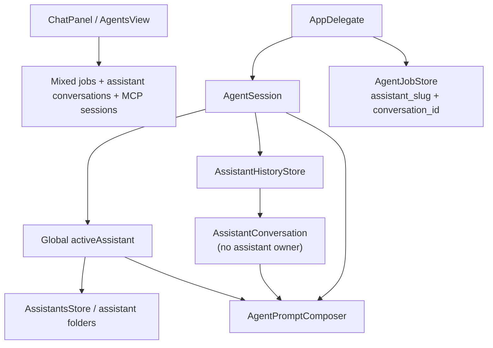
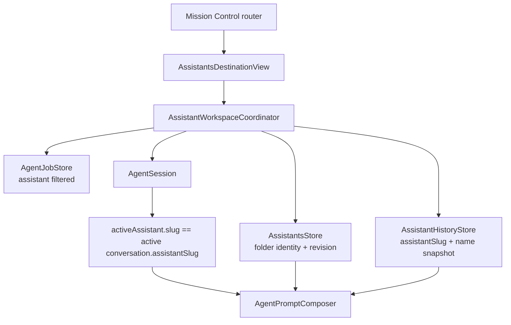
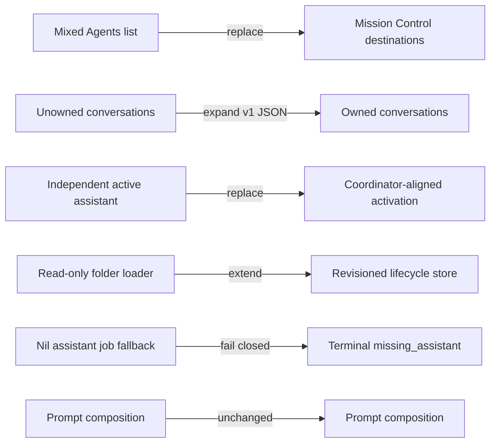

# Assistants destination — implementation specification

Status: design only; no production Swift changed.  
Mockup: `design/agents-navigation/assistants-destination.png`

## Target

**GIVEN goal:** under Mission Control, make a persistent assistant a first-class destination that can be found, understood, opened, configured, and safely managed without mixing it with individual conversations or automations.

The implementation passes when:

1. every visible conversation has one deterministic assistant owner after relaunch;
2. opening an assistant takes one click from the Assistants directory and no assistant workspace section is more than one additional click away;
3. switching conversations also switches the prompt identity, memory, skill projection, working directory, TTS voice, and wake-routing identity to the conversation's persisted assistant owner;
4. configuration and memory edits cannot silently overwrite external or agent-authored edits;
5. create, duplicate, and delete cannot cross the assistant folder boundary or destroy conversation history as an incidental side effect.

Blast radius: **10 production seams, 4 persisted data shapes, 3 storage boundaries**.

- UI: `Panel.swift`, `AgentsView.swift`, net-new `AssistantsDestinationView.swift`
- orchestration: `App.swift`, `Agent.swift`, net-new `AssistantWorkspaceCoordinator.swift`
- assistant folder model: `Assistants.swift`, `AgentCapabilities.swift`
- canonical history: `AssistantHistory.swift`
- durable jobs: `AgentJobStore.swift`, `AgentRuntimeJobExecutor.swift`
- prompt behavior: `AgentPromptComposer.swift` remains behaviorally unchanged
- storage: assistant folders, `assistant-sessions.json`, `agent-jobs.sqlite`

## Current — verified facts

| Fact | Evidence |
|---|---|
| An assistant is a folder containing `assistant.md`, memory, and workspace. | **VERIFIED** `swift/Assistants.swift:6-14`: “An assistant IS its folder…” and replication is currently described as copying the folder. |
| The definition contains slug, name, description, voice, instructions, directory, and selected skill names. | **VERIFIED** `swift/Assistants.swift:AssistantDefinition@16-28`. |
| The store only scans/loads; it has no create, update, duplicate, delete, or revision API. | **VERIFIED** `swift/Assistants.swift:AssistantsStore@75-178`; public behavior is `load()`, `assistant(slug:)`, and `base`. |
| Loading silently skips unreadable definitions and scaffolds FLORA whenever no valid definition is found. | **VERIFIED** `swift/Assistants.swift:load@94-118`; `loadDefinition` returns nil at line 123 and `scaffoldFlora()` runs when `found.isEmpty` at lines 106-110. This can overwrite an invalid existing `flora/assistant.md`. |
| Conversations currently have no assistant owner. | **VERIFIED** `swift/AssistantHistory.swift:AssistantConversation@37-66`; there is no `assistantSlug`. |
| Conversation state is canonical, value-copied, lock-serialized, atomically persisted, capped at 100 conversations and 200 messages each. | **VERIFIED** `swift/AssistantHistory.swift:115-127`, `193-213`, `392-410`, `483-502`. |
| Repeated create presses reuse the active blank draft globally, not per assistant. | **VERIFIED** `swift/AssistantHistory.swift:createConversation@198-213`; covered by `tests/assistant_history/main.swift:85-95`. |
| Deleting the last conversation creates an unowned replacement. | **VERIFIED** `swift/AssistantHistory.swift:delete@226-241`. |
| `AgentSession.activeAssistant` is global and independent of the active conversation. | **VERIFIED** `swift/Agent.swift:120-148`; `activateConversation` at lines 178-185 does not update `activeAssistant`. |
| A runtime turn composes the global `activeAssistant`, its folder, memory, and skills into the request. | **VERIFIED** `swift/Agent.swift:runOpenCodeTurn@548-583` and `runCodexTurn@708-734`. |
| Jobs already persist `assistantSlug` and `conversationID`. | **VERIFIED** `swift/AgentJobStore.swift:AgentJob@30-79` and schema `612-630`. |
| A missing job assistant currently degrades to nil identity and a default directory instead of failing closed. | **VERIFIED** `swift/AgentRuntimeJobExecutor.swift:execute@23-52`; assistant lookup at line 28 is optional and request construction accepts nil. |
| Memory already has revision checks, character caps, secret detection, and atomic replacement. | **VERIFIED** `swift/AgentCapabilities.swift:AgentMemoryStore@108-178`; covered by `tests/agent_capabilities/main.swift:35-63`. |
| Skill validation and projection are assistant-folder scoped and projection swaps atomically under one static lock. | **VERIFIED** `swift/AgentCapabilities.swift:AgentSkillStore@199-290`; concurrent projection is covered at `tests/agent_capabilities/main.swift:96-115`. |
| Prompt order is system role → persona → memory → skills/handoff → task and should not change for this UI feature. | **VERIFIED** `swift/AgentPromptComposer.swift:21-69`; covered by `tests/agent_prompt/main.swift:26-41`. |
| Current Agents UI mixes new-assistant, new-automation, jobs, assistant conversations, and MCP sessions in one list. | **VERIFIED** `swift/AgentsView.swift:buildList@300-338`. |
| ChatPanel uses a boolean `assistantOpen` and a separate assistant header rather than a navigable assistant workspace. | **VERIFIED** `swift/Panel.swift:60-64`, `450-469`, `512-527`, `812-880`. |

## First-principles elimination

| Candidate | Elimination |
|---|---|
| Keep conversations as the Assistants destination | **Goal-fit:** a conversation is activity, not the durable identity/memory/skills object the user is trying to manage. |
| Infer ownership from whichever assistant is active when a row opens | **Hard constraint:** current global `activeAssistant` can diverge from restored history and would compose the wrong persona and folder. |
| Store assistant metadata inside `assistant-sessions.json` only | **Goal-fit:** folder-defined assistants, wake matching, jobs, memory, skills, and working directories would still have a second competing identity source. |
| Put all assistant settings in one large creation wizard | **Simplicity:** it raises creation cost and duplicates Memory & Skills and Settings. |
| Copy the entire folder for Duplicate | **Risk:** it clones durable memory, workspace data, `.opencode` projections, and possibly unintended working files. |
| Cascade-delete conversations and jobs with an assistant | **Risk:** deleting an identity would silently erase distinct activity objects and is difficult to roll back atomically across JSON, SQLite, and filesystem storage. |
| **Survivor: folder-backed assistant directory + persisted conversation ownership + coordinator facade** | One canonical identity remains the folder; history and jobs carry stable foreign keys; the coordinator aligns the stores and UI. |

The result is order-robust: hard ownership and folder-boundary constraints eliminate the unsafe candidates before visual preference matters.

## Destination hierarchy and interaction contract

### Global navigation

The existing Mission Control rail remains visible:

`Now · Assistants · Automations · Threads · Search`

- `Assistants` uses the short amber underline.
- Clicking the already-selected `Assistants` item from a workspace returns to the Assistants directory.
- `Escape` or `⌘[` moves up exactly one level; it never closes the panel until the directory root is reached.
- Leaving via another global destination discards the workspace route but preserves directory scroll for the panel lifetime.
- Reopening an assistant always starts on Overview; local tab selection is not persisted across launches.

### Assistants directory

Header: `ASSISTANTS N` and contextual `+ New`.

Each assistant is one full-width, entirely clickable row:

- name; `Default` as quiet text when applicable;
- description;
- `N conversations · N automations · N skills`;
- one current state: `N waiting`, `QA running`, or `Active 18m ago`;
- chevron.

Ordering:

1. configured default assistant;
2. assistants with waiting work, then running work;
3. remaining assistants by most recent owned conversation/job activity;
4. name as stable tie-breaker.

Hover reveals a trailing `•••` with `Open`, `New conversation`, `Duplicate`, and `Reveal in Finder`. Delete never appears in the root menu.

### Assistant workspace

Header:

- breadcrumb `‹ Assistants`;
- assistant name and current state;
- primary `+ Conversation`;
- overflow `Duplicate`, `Reveal in Finder`.

Local tabs:

`Overview · Conversations · Memory & Skills · Settings`

#### Overview

- `Current work`: one waiting/running item, otherwise `Nothing active`.
- `Continue`: three most recently updated owned conversations; `See all` opens Conversations.
- `Automations`: counts for waiting/running/scheduled/disabled; selecting a row deep-links to the global Automations detail.
- `Memory & Skills`: core-memory character count, last update, selected skill count; opens that local tab.
- No runtime, model, trust profile, raw path, job ID, or conversation ID appears here.

#### Conversations

- Header count and `+ New`.
- Rows sorted by `updatedAt` descending: title, one-line preview, relative time, and exactly one state (`Reply needed`, `Working`, `Interrupted`, `New`, or neutral).
- Empty: `No conversations yet` and `Start a conversation`.
- Clicking a row activates its owner and conversation together, restores the canonical transcript, marks replies seen only after display, and focuses the composer.
- Context menu: `Open`, `Rename`, `Move to assistant…`, `Delete conversation…`.
- Delete is disabled while that conversation has `turnState == .running`; a non-empty conversation requires confirmation. Deleting an empty draft is immediate.
- Moving a conversation changes `assistantSlug`, updates its assistant-name snapshot, dirties all runtime bindings, and forces the next turn to reseed from canonical history.

#### Memory & Skills

Memory uses two local selectors: `Core` and `Ledger`.

- Core counter: `used / 12,000`; Ledger: `used / 24,000`.
- Markdown editor is plain text and preserves all content verbatim.
- `Save` calls the existing expected-revision update. On mismatch show: `Memory changed while you were editing.` Actions: `Reload` and `Copy my edits`; never merge automatically.
- Missing files open as empty and are created on first successful save.
- Secret and oversize errors are inline and keep the draft intact.
- If a file was already over the visible cap, editing is read-only until `Open in Editor`; saving a clipped document is forbidden.

Skills:

- discover all `skills/<name>/SKILL.md` packages inside this assistant folder;
- valid rows show name, description, and selected toggle;
- invalid rows show one concise validation error and cannot be selected;
- one atomic `Save skills` updates only the `skills:` frontmatter value, preserving unknown frontmatter fields and instruction body;
- changes apply to the next turn. Saving selection is disabled while this assistant's foreground turn is preparing/running.

#### Settings

Editable fields:

- `Name` — 1…64 characters. Also acts as the wake phrase for non-default assistants.
- `Description` — 0…240 characters.
- `Reply voice` — optional known Voice Flow TTS voice; preserve an unknown existing value but label it unavailable.
- `Instructions` — 0…12,000 characters.
- `Use as voice default` — writes `default_assistant_slug`; the default assistant answers to the global Settings wake phrase.

The folder slug is immutable and never shown in the normal UI. Renaming changes display/wake name, not directory identity, conversation ownership, job ownership, or working path.

Save is revision-checked against the hash of `assistant.md`. Unknown frontmatter keys survive. A conflict shows `Assistant changed on disk` with `Reload` and `Copy my edits`; there is no last-writer-wins path.

Secondary actions: `Reveal folder`, `Duplicate assistant`. Destructive area: `Delete assistant…`.

## Lifecycle flows

### Create

In-panel sheet, not `NSAlert`:

1. `Name` (required), `Description`, `Instructions` (optional).
2. Slug is derived invisibly: lowercased, diacritics folded, non-alphanumerics collapsed to `-`, max 64 characters; empty becomes `assistant`; collision adds `-2`, `-3`, … deterministically.
3. `Create assistant` writes into `assistants/.creating-<UUID>/`, creates `assistant.md`, empty scaffolded core/ledger, `workspace/`, and `skills/`, then atomically renames staging to the final slug.
4. Reload store, open the new Overview. Do not create a conversation until the user chooses `+ Conversation`.

Validation: path separators and `..` never enter the slug; duplicate display names are allowed only if the generated slug is distinct; duplicate wake names are rejected because wake routing would become ambiguous.

### Duplicate

Action label: `Duplicate as template`.

- Name is prefilled `<Name> Copy` and editable.
- Copy: description, instructions, voice, selected skill names, and the selected skill source directories.
- Start empty: core memory, ledger, workspace, conversations, automations, runtime bindings, `.opencode`, and generated files.
- Use the same staging/rename transaction as Create.

### Edit

- Save only `assistant.md`; preserve unknown frontmatter keys.
- On success reload `AssistantsStore` and rebind the foreground `AgentSession` if it owns this assistant and is idle.
- If a turn is running, keep the draft and show `Wait for this turn to finish before saving identity changes.`
- Voice changes update `AgentReplySpeaker.voiceOverride` when this assistant becomes active.

### Delete

Confirmation states the exact effects:

`Move this assistant's folder to Trash, disable N automations, and keep N conversations read-only in Threads.`

Rules:

1. The final remaining assistant cannot be deleted: `Create another assistant first.`
2. Delete is blocked while an owned foreground turn or background job run is active.
3. In one SQLite transaction, capture existing job states and disable every non-running job for the slug. Add an index on `agent_jobs(assistant_slug, state)`.
4. Move the folder with `FileManager.trashItem`; do not recursively delete it.
5. If the move fails, restore captured job states in one transaction and leave the assistant loaded.
6. If the deleted assistant was active, activate the most recent conversation owned by the default surviving assistant, or create its blank draft.
7. Owned conversations remain in Threads, labeled from `assistantNameSnapshot`, read-only while the owner folder is absent. They are not shown in the Assistants destination.
8. A restored folder becomes available again on Retry/reload; matching read-only conversations become editable without rewriting history.

## Data contracts and exact actions

### Persisted history expansion

Extend `AssistantConversation` with optional fast-path mirror fields:

```swift
var assistantSlug: String?
var assistantNameSnapshot: String?
var assistantOwnerWasInferred: Bool?
```

- Keep envelope version `1`; older builds ignore unknown JSON keys and continue reading mirrored `codexThreadId`.
- Unknown keys are decoder-compatible but not rollback-durable: an older build can rewrite the file from its older struct and drop ownership. Use the versioned per-conversation `assistant-thread-metadata/<conversation-id>.json` sidecar defined by `threads-destination-spec.md` as canonical for owner/archive metadata. Upgraded load repopulates missing mirrors from it; old-build activity newer than the sidecar reopens an archived conversation.
- After `AssistantsStore.load()` and before `AgentSession` construction, migrate nil owners to the current default assistant and set `assistantOwnerWasInferred = true`.
- Every new conversation writes slug/name and `false`.
- `createConversation(force:assistant:)` reuses a blank draft only when its `assistantSlug` matches.
- Changing owner dirties every runtime binding and leaves transcript/messages unchanged.

### Folder document contract

Net-new:

```swift
struct AssistantDocument {
    let definition: AssistantDefinition
    let fields: [String: String]
    let fieldOrder: [String]
    let revision: String
}

struct AssistantDraft {
    let name: String
    let description: String
    let voice: String?
    let instructions: String
    let selectedSkills: [String]
}
```

`AssistantsStore` actions:

```swift
func snapshot() -> AssistantsLoadSnapshot
func document(slug: String) throws -> AssistantDocument
func create(_ draft: AssistantDraft) throws -> AssistantDefinition
func duplicate(slug: String, name: String) throws -> AssistantDefinition
func update(slug: String, draft: AssistantDraft,
            expectedRevision: String) throws -> AssistantDefinition
func moveToTrash(slug: String) throws
func reload() -> AssistantsLoadSnapshot
```

All mutation paths share one store lock and use `AgentPathBoundary`-equivalent canonical-root validation. `loadDefinition` becomes throwing and produces typed `AssistantLoadIssue` records instead of silently dropping folders.

### Coordinator / view seam

Net-new `AssistantWorkspaceCoordinator` is the only UI-facing lifecycle facade. It joins value snapshots from folders, history, and jobs and exposes:

```swift
func directory() throws -> [AssistantSummary]
func workspace(slug: String) throws -> AssistantWorkspaceSnapshot
func createAssistant(_ draft: AssistantDraft) -> Result<String, AssistantWorkspaceError>
func duplicateAssistant(slug: String, name: String) -> Result<String, AssistantWorkspaceError>
func updateAssistant(slug: String, draft: AssistantDraft,
                     expectedRevision: String) -> Result<Void, AssistantWorkspaceError>
func deleteAssistant(slug: String) -> Result<Void, AssistantWorkspaceError>
func createConversation(assistantSlug: String) -> Result<String, AssistantWorkspaceError>
func openConversation(id: String) -> Result<AssistantConversation, AssistantWorkspaceError>
func moveConversation(id: String, to assistantSlug: String) -> Result<Void, AssistantWorkspaceError>
func readMemory(slug: String, kind: String) -> Result<AgentMemoryDocument, AssistantWorkspaceError>
func saveMemory(slug: String, kind: String, content: String,
                expectedRevision: String) -> Result<AgentMemoryDocument, AssistantWorkspaceError>
func setSelectedSkills(slug: String, names: [String],
                       expectedRevision: String) -> Result<Void, AssistantWorkspaceError>
```

All returned models are fresh value snapshots. UI code never holds a mutable `AssistantDefinition` across a reload.

### Default assistant

Add `UserSettings.defaultAssistantSlug`, encoded as `default_assistant_slug`. Missing values migrate in memory to `flora` when present, otherwise the first valid assistant. `AssistantsStore.base` resolves that slug then uses the existing fallback.

## Transformation by file

| File | Disposition | Required change |
|---|---|---|
| `swift/Assistants.swift` | **Replace loader contract / extend store** | Typed load issues, document revision/serializer, mutation APIs, safe first-run scaffold, configured default resolution. |
| `swift/AssistantHistory.swift` | **Expand persisted model** | Optional ownership mirrors, scoped queries, owner-aware create/delete/move, and sidecar reconciliation. |
| `swift/AssistantThreadMetadata.swift` | **NET-NEW** | Per-conversation owner/archive sidecars that survive an older build rewriting Assistant history. |
| `swift/Agent.swift` | **Replace activation seam** | Conversation activation resolves and aligns its owner; owner-aware creation; no independent global assistant/conversation mutation. |
| `swift/AssistantWorkspaceCoordinator.swift` | **NET-NEW** | Join folders/history/jobs; serialize lifecycle actions and rollback job disable on delete failure. |
| `swift/AssistantsDestinationView.swift` | **NET-NEW** | Directory, workspace header, four local sections, forms, and state rendering. |
| `swift/AgentsView.swift` | **Refactor container** | Stop rendering assistant conversations/jobs/MCP in one list; route Mission Control destinations to dedicated views. |
| `swift/Panel.swift` | **Replace `assistantOpen` routing** | Route enum with global destination, assistant slug, local section, and conversation; preserve visible-conversation routing invariant. |
| `swift/App.swift` | **Rewire callbacks** | Construct coordinator after assistant load/job store, ownership migration before AgentSession, refresh wake/TTS/session projections after mutations. |
| `swift/AgentCapabilities.swift` | **Extend** | Skill discovery and shared per-assistant memory/config locks; reuse existing revision/secret/cap logic. |
| `swift/AgentJobStore.swift` | **Extend** | Assistant-filtered query, active-run test, transactional disable/restore snapshot, assistant-state index. |
| `swift/AgentRuntimeJobExecutor.swift` | **Fail closed** | Missing assistant becomes terminal `missing_assistant` before beginning a history turn. |
| `swift/AgentPromptComposer.swift` | **Unchanged** | Existing layer order remains the behavioral contract. |
| `swift/Core.swift` | **Expand settings** | Persist `default_assistant_slug`. |

## First vertical slice

Implement **Create FLORA Watcher → open workspace → create owned conversation → send first turn** first.

1. `AssistantsDestinationView` sends `AssistantDraft` to coordinator.
2. Store stages and atomically creates `flora-watcher/`.
3. Directory snapshot shows the new identity with zero counts.
4. `+ Conversation` calls owner-aware history create.
5. Coordinator sets `activeAssistant` and `currentSessionId` together.
6. First turn reaches `AgentPromptComposer` with FLORA Watcher persona, its empty memory, selected skills, and its folder as working directory.
7. Relaunch restores the same owner and transcript.

Reusable core: safe folder transaction, owner-aware history, coordinator activation, directory snapshots. Later slices first exercise memory conflicts, invalid skills, duplicate exclusions, and delete rollback.

## Failure and recovery states

### Directory

- Initial load: show definition rows immediately; counts may display `—` until the history/job snapshot joins.
- No assistant directory on genuine first run: scaffold FLORA once.
- Assistant folders exist but none validate: do **not** scaffold or overwrite. Show each broken folder as `Couldn’t load assistant` with `Reveal` and `Retry`.
- Root unreadable: full error `Assistants folder isn’t available` with `Retry` and `Reveal parent folder`.
- Partial job-store failure: assistants/conversation counts remain usable; automation count shows `Unavailable` and one quiet warning.

### Workspace

- Assistant disappears externally while open: return to directory, preserve no stale controls, show `Assistant folder moved or deleted.`
- Conversation owner missing: read-only in Threads, never open under another persona.
- Memory read failure: inline error in that editor only.
- Skill discovery failure: preserve current selection and disable Save.
- Configuration conflict: retain draft; never auto-reload over it.
- Create/duplicate staging failure: remove staging, leave no directory row, keep form values.
- Delete job-disable succeeds but Trash move fails: restore job states; assistant remains available.

## Diagrams

### Current



### Target



### Delta



## Coverage and validation contract

Add the new tests to `scripts/test-agent-harness.sh --unit` and `tests/test_registry.json`; update `tests/capabilities.json` with assistant-directory and ownership IDs.

| Executable case | Pre-change result | Required post-change result |
|---|---|---|
| `tests/assistant_history/main.swift`: create conversations for `flora` and `voice-flow`, reload, activate each | No owner exists; active assistant may remain global | Each conversation retains its slug/name; activation aligns owner; transcript and runtime bindings remain unchanged. |
| Same test: decode a current v1 fixture with no owner | Owner absent | All legacy rows migrate to configured default with `assistantOwnerWasInferred == true`; `codexThreadId` remains serialized. |
| Same test: move a conversation between assistants | No operation | Owner changes, messages stay byte-equivalent, every binding becomes dirty, next preparation requires a fresh session. |
| `tests/assistants/main.swift`: place malformed `assistants/flora/assistant.md`, call load | Current loader may overwrite via scaffold | File digest is unchanged; load returns one issue and no valid assistant. |
| Same test: create name `../FLORA watcher`, duplicate, and inspect tree | No mutation API | Final path remains below root; duplicate contains identity/selected skill sources and empty memory/workspace; no `.opencode`. |
| Same test: update with stale `assistant.md` revision | No mutation API | Returns `invalidRevision`; external content remains unchanged. |
| `tests/agent_capabilities/main.swift`: two independent memory-store instances save from one revision | Instance locks do not coordinate | Exactly one save succeeds; the other receives `invalidRevision`; secret/size tests still pass. |
| `tests/agent_jobs/main.swift`: disable all jobs for an assistant while another worker tries to claim | Only per-job disable exists | Transaction either reports active run and changes nothing, or disables the set and no later claim succeeds; restore recreates exact prior states. |
| `tests/agent_runtime_job_executor/main.swift`: execute job with missing assistant slug | Runs with nil persona/default folder | Fails terminal `missing_assistant` before appending a user message or creating a runtime session. |
| `tests/agent_prompt/main.swift`: owner-switch prompt markers | One global marker can leak | Each prompt contains only the activated conversation owner’s persona/memory/skills; existing layer-order assertions still pass. |
| `e2e:assistants_destination`: open Agents → Assistants, snapshot, open FLORA, navigate four tabs, Back | Mixed list only | Directory shows assistant rows only; one-click workspace; back restores scroll; 400×520-point panel remains unclipped. |
| `e2e:assistant_create_delete`: create, relaunch, delete with jobs, restore folder | No UI lifecycle | Created assistant survives; delete blocks during active run; successful delete disables jobs, preserves read-only conversations, and restored folder re-enables conversation access. |

Commands:

```bash
./scripts/test-agent-harness.sh --unit
./scripts/test-agent-harness.sh --e2e
```

GOAL assertion: the e2e test must traverse `Assistants directory → FLORA workspace → Conversations` using two row/tab activations, then verify the opened conversation’s persisted slug equals the prompt identity slug.

Security assertions:

- create/update/duplicate reject absolute paths, `..`, and symlink escapes;
- memory secret rejection remains active through the UI facade;
- deleted/missing assistants cannot run foreground or background turns;
- no raw slug, runtime, model, trust profile, or filesystem path appears in directory accessibility labels.

## Rollback

- Keep `assistant-sessions.json` envelope version 1 and `codexThreadId`; old builds decode the file, while the sidecar preserves owner/archive facts across an older rewrite.
- Downgrade is history-readable but feature-degraded: the old build cannot honor per-conversation ownership or Done state. Returning to the new build restores preserved metadata and treats newer old-build activity as a reopen.
- New directory UI is reversible by routing Agents back to the old list while leaving owner fields inert.
- Folder writes remain ordinary markdown and directories; no proprietary migration is introduced.
- The assistant-slug SQLite index is additive.
- Trash-based deletion is recoverable outside the app. Conversation history is deliberately retained.

## Open risks and assumptions

1. **Legacy ownership cannot be recovered perfectly.** Existing history records no assistant slug. Assigning all legacy rows to the configured default is deterministic but may misclassify conversations created after a wake-routed variant. `Move to assistant…` is the correction path.
2. **Current memory locking is per store instance.** The UI and agent tools can instantiate different stores; the shared assistant/file lock is required before claiming cross-surface conflict safety.
3. **Assistant deletion spans SQLite and filesystem state.** The chosen order can roll back job state if Trash fails, but it is not a single ACID transaction. Retaining conversations and using Trash bounds the damage.
4. **The current loader’s scaffold behavior is destructive around malformed FLORA.** Typed load issues and “scaffold only when the root has no assistant directories” are release blockers for the new editor.
5. **Default-assistant semantics are currently implicit.** The mockup’s `Default` label requires the new `default_assistant_slug` setting; otherwise the UI must not offer `Make default`.
6. **Conversation/job count snapshots can race active work.** Counts are advisory UI state; actions must revalidate against the stores at execution time.
7. **Assumption:** selected skills remain assistant-local packages. This plan does not introduce a global skill marketplace or copy external skill symlinks during Duplicate.

## Exact ImageGen prompt

```text
Use case: ui-mockup
Asset type: polished high-fidelity portrait product-design mockup for the Voice Flow native macOS app

Primary request: Create the Assistants destination reached from the locked Voice Flow Mission Control v2 navigation. This is a durable directory of persistent assistant identities/workspaces, not an activity feed and not a list of conversations. Each assistant owns conversations, automations, memory, skills, and workspace state. The still should make it obvious that clicking one assistant enters its workspace.

Input images:
- Image 1: visual reference only for the real Voice Flow panel proportions, header chrome, warm-dark palette, typography and row density.
- Image 2: visual reference only for existing session-row typography and status styling.
- Image 3: authoritative reference for Mission Control v2 layout, exact top chrome, global Agents navigation rail, spacing, scale and visual language. Preserve its global navigation; change only the destination content below it. None of the inputs are edit targets.

Canvas and framing: one straight-on portrait screenshot of the rounded floating macOS panel, same aspect ratio and physical scale as Mission Control v2, filling the canvas. No device frame, desktop, perspective, or hands.

Preserve exactly from Mission Control v2:
- Header title "Voice Flow" at upper left and the same five thin line icons at upper right.
- Existing wide switcher: "Inbox 9", selected amber "Agents 3", music-note button.
- Global Agents rail: "Now 2", "Assistants", "Automations", "Threads 3", search icon.
- In this image, "Assistants" is selected with a short amber underline. "Now 2" is inactive. Keep the other rail items quiet taupe.

Destination content:
1. A compact title row with uppercase section title "ASSISTANTS 3" and a small amber text action "+ New" at far right.
2. Directly below, one quiet explanatory line: "Persistent identities with their own memory, skills, and work."
3. A single continuous warm-charcoal list surface with exactly three spacious assistant workspace rows separated by thin hairlines. Do not make a card grid and do not put cards inside cards.
4. Row one:
   - left: refined Voice Flow waveform glyph inside a subtle warm-gray ring
   - title "FLORA"
   - small muted word "Default" beside the title, not a pill
   - description "Personal operations & knowledge"
   - ownership metadata "4 conversations · 2 automations · 6 skills"
   - right state "1 waiting" in amber, then a thin chevron
5. Row two:
   - same restrained assistant glyph
   - title "Voice Flow"
   - description "Build, test & ship the app"
   - metadata "7 conversations · 3 automations · 4 skills"
   - right state "QA running" with a tiny amber live dot, then chevron
6. Row three:
   - same restrained assistant glyph
   - title "Pantrella"
   - description "Product, retention & growth"
   - metadata "3 conversations · 1 automation · 3 skills"
   - right state "Active 18m ago" in muted taupe, then chevron
7. Under the list, a restrained footer hint with a small folder symbol and exact text "Assistants are stored as editable folders on this Mac". Keep it secondary and compact.

Interaction affordance in the still: the FLORA row has a barely lighter hover-ready background, while other rows remain flat. Entire rows are clickable. "+ New" is the only creation action. No per-row overflow menus visible until hover.

Style: true native AppKit screenshot fidelity, SF Pro-like typography, SF Symbols-like icons, warm dark Voice Flow aesthetic, precise alignment, generous breathing room, compact native controls.
Palette: nearly black #171715, warm charcoal #24221f, cream #f2eadf, taupe #a79783, amber/gold #d9aa4d, subtle warm-gray borders.
Text: render all quoted labels verbatim and legibly. Do not invent or duplicate labels.
Avoid: bright white, blue, purple, green, gradients outside the existing amber Agents selector, glassmorphism, neon, illustrations, robots, faces, avatars, generic SaaS dashboard, sidebar, bento cards, oversized type, excessive pills, large empty areas, dense technical metadata, raw slugs, runtime/model labels, hidden text, or content outside the panel.
```

Mockup QA notes:

- Text is accurate and legible; the global Mission Control rail and selected Assistants underline are preserved.
- The generated image is 1141×1378 rather than the reference’s exact raster size, but it preserves the portrait composition and can be downscaled without reflow.
- The Voice Flow waveform glyph is a generated approximation, not the exact existing `WaveformIconView` path.
- The screenshot shows only the directory root; the workspace/detail states are specified above rather than composited into one unreadable board.
