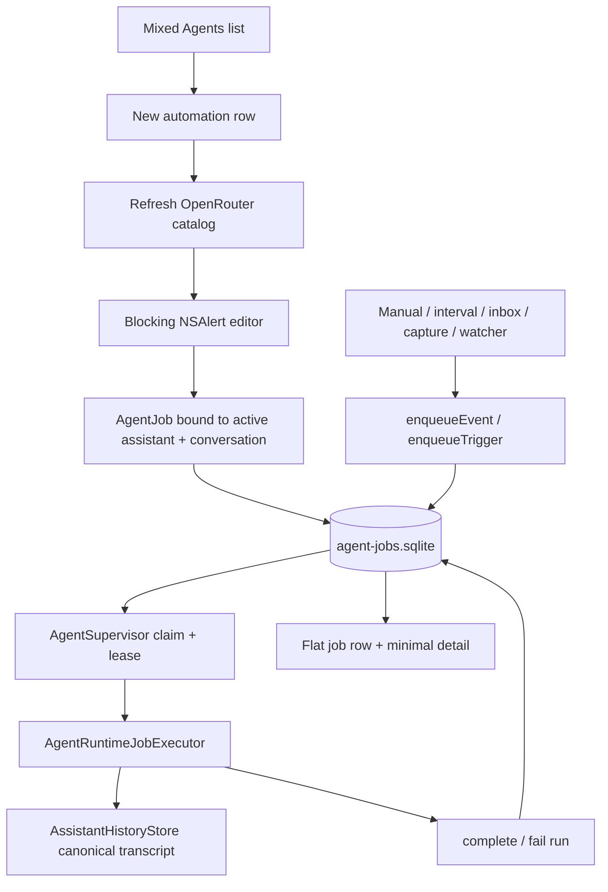
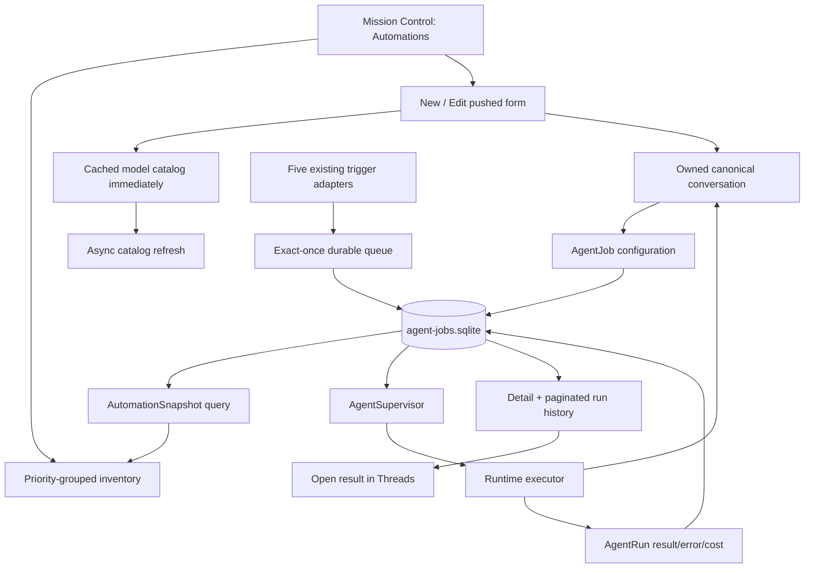
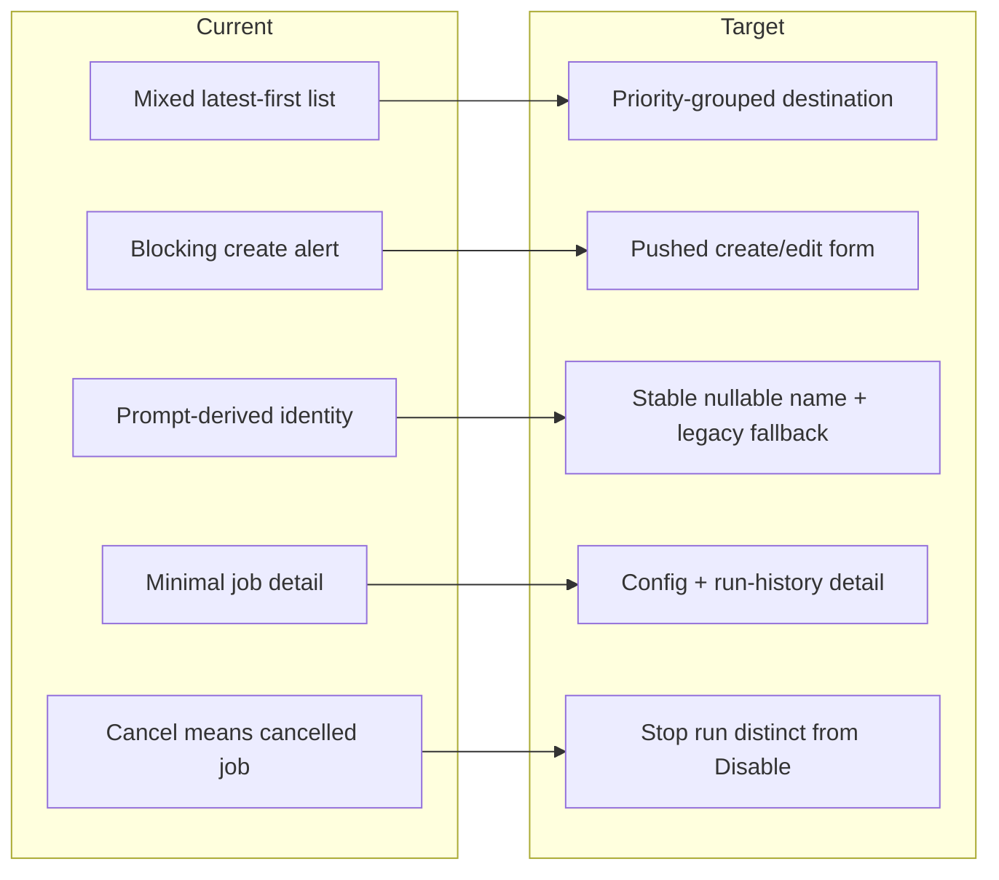

# Automations destination — implementation-grade specification

Status: design only; no production Swift changed.  
Mockup: `design/agents-navigation/automations-destination.png`

## Target

**Goal (GIVEN):** From the Automations destination, the user can identify every automation that needs intervention, is executing, is scheduled, is listening for an event, or is disabled; create or edit one without knowing the job/runtime implementation; and reach the exact run result or failure in at most one row selection.

**Measurable contract:** at the reference 400×520pt panel size, the selected destination, creation action, search/filter controls, two attention rows, and at least three active/upcoming rows are visible without nested scrolling. Every durable job state has one deterministic presentation state and action set.

**Hard constraints**

- Keep the existing Voice Flow top chrome and the locked Mission Control local navigation.
- Use the existing durable `AgentJob`/`AgentRun` execution system; the UI may not invent a second scheduler.
- Preserve exact-once event intake, concurrency/exclusion, leases, retry limits, budget enforcement, process-tree cancellation, and per-job model pinning.
- Assistants, Automations, and Threads remain separate destinations.
- OpenRouter credentials remain in Keychain and never enter the job database.
- No production change is part of this design deliverable.

**Blast radius:** 9 production modules (8 existing, 1 net-new), 3 data shapes, 2 persistence files, and 4 test surfaces. The runtime loop itself remains unchanged.

## First-principles elimination trail

| Candidate | Elimination |
|---|---|
| Keep jobs mixed into the current latest-first Agents feed | **Goal-fit:** jobs, conversations, and creation actions remain indistinguishable; current `buildList` literally appends jobs and sessions into one list. |
| Card grid per automation | **Hard constraint:** 397pt usable width and 520pt height cannot carry state, trigger, next run, and actions without low-density cards. |
| One flat list sorted only by update time | **Goal-fit:** a completed edit can outrank a blocked job, hiding the next action. |
| Separate tabs for every job state | **Cost:** seven states create navigation overhead and empty surfaces; state is a filter, not a destination. |
| Wizard creation | **Goal-fit:** runtime/model, trigger, and budget are coupled; hiding earlier choices makes correction and comparison harder. |
| Cron/calendar expansion now | **Risk:** the durable model has only `intervalSeconds`; promising cron semantics would require a new scheduler and migration unrelated to the navigation goal. |
| Reuse whichever conversation happens to be active | **Risk:** unrelated automations inherit and serialize on accidental context through `conversationID`. |
| Ask the user to choose a conversation | **Goal-fit:** exposes an execution implementation object rather than the intent “run this assistant.” |
| Dedicated automation-owned canonical conversation | **Survivor:** preserves transcript/results, gives stable exclusion, and hides conversation mechanics. It requires explicit retention/reconciliation described below. |
| Derive every title from the prompt forever | **Goal-fit:** editing the task silently renames the automation and long imperative prompts scan poorly. |
| Add a nullable durable `name` with legacy prompt fallback | **Survivor:** one additive column; legacy rows remain readable and new rows gain stable identity. |
| Global Create menu | **Goal-fit:** loses destination context and duplicates navigation. Creation belongs in the Automations header. |
| Block the editor while refreshing the model catalog | **Cost:** the catalog already supports cache/fallback. Render cached data immediately and refresh in place. |

## Current — verified implementation

### Data and state

- `AgentJob` currently persists assistant, conversation, runtime, optional model pin, trigger, prompt, trust profile, state, next/interval timing, concurrency key, per-job daily budget, duration, attempts, and timestamps (`swift/AgentJobStore.swift:AgentJob@30-79`).
- Job states are `queued`, `running`, `blocked`, `failed`, `completed`, `cancelled`, and `disabled`; run states additionally distinguish `interrupted` and `cancelled` (`swift/AgentJobStore.swift@12-28`).
- SQLite stores jobs, runs, and processed-event idempotency keys, with due/active indexes (`swift/AgentJobStore.swift:migrate@607-662`).
- The store exposes job listing and only active/single-run reads; there is no public per-job run-history query, edit contract, or delete contract (`swift/AgentJobStore.swift@166-185,421-433`).
- Admission is capped at three globally, two Codex, and three OpenCode runs, with conversation/concurrency-key exclusion (`swift/AgentJobStore.swift@111-113,259-280`).
- Attempts are counted since the latest successful run and the job fails at the cap (`swift/AgentJobStore.swift@281-290`). Per-job spend is summed from today's runs and transitions the job to `blocked` once the recorded spend is already at the budget (`swift/AgentJobStore.swift@292-299`).
- Event intake is exactly once and an event received while running coalesces into one pending follow-up (`swift/AgentJobStore.swift@187-217,222-257`).
- Interval completion schedules the next run after completion; retryable failure schedules bounded backoff; terminal failure remains failed (`swift/AgentJobStore.swift:finish@435-490`).

### Execution

- `AgentSupervisor` admits jobs every 500ms, owns live tasks, emits state updates, and starts at most the store's global cap (`swift/AgentSupervisor.swift@104-124`).
- It heartbeats leases, races execution against `maxDurationSeconds`, and forcibly cancels a runtime that does not observe task cancellation (`swift/AgentSupervisor.swift@126-168`).
- Runtime failures inherit `AgentRuntimeFailure.retryable`; other non-supervisor errors retry with deterministic jitter, while timeout/missing-conversation failures are terminal (`swift/AgentSupervisor.swift@178-200`).
- Cancellation first resolves active run handles, marks durable runs cancelled, then cancels and joins every executor task (`swift/AgentSupervisor.swift@87-101`).
- The executor requires the canonical conversation, begins a runtime turn with the job prompt, composes the selected assistant, and pins the OpenCode job model instead of the global model (`swift/AgentRuntimeJobExecutor.swift@23-57`).
- Runtime output is committed into Assistant history and the message ID is written into the run record; errors leave the binding dirty/interrupted rather than fabricating a final reply (`swift/AgentRuntimeJobExecutor.swift@69-95`).

### Current UI and actions

- The current Agents root places `new automation`, every job, and every session in one list (`swift/AgentsView.swift:buildList@300-333`).
- Current job rows expose state/runtime/trigger/model as a concatenated preview; their title is the first 48 prompt characters (`swift/App.swift:agentJobRows@4765-4783`).
- Current detail shows only state/runtime/trigger/model, full prompt, Run Now, Cancel, and Enable/Disable. It has no edit, history, delete, search, or filtering (`swift/AgentsView.swift:buildJob@177-267`).
- Actions are fire-and-forget protocol calls; UI-visible errors are transient and not bound to the destination (`swift/AgentsView.swift@50-66,675-690`; `swift/App.swift@4786-4810`).
- Creation is a blocking `NSAlert` accessory. It refreshes the model catalog before showing, binds the current assistant and current conversation, fixes max runtime/attempts, and creates interval jobs queued while every other trigger starts as completed (`swift/App.swift:createAgentJob@1071-1157`).
- The existing editor already implements the five real triggers, runtime-dependent model enablement, searchable exact model IDs, interval minutes, and daily budget (`swift/AgentJobEditor.swift@3-20,79-109,114-155`).
- Settings and the editor share `OpenRouterModelComboBox`; it searches name/ID and accepts an offline manual `provider/model` ID (`swift/OpenRouterModelPicker.swift@41-64,72-85`).
- Catalog refresh filters to tool-capable text-output models and falls back to cache or explicit IDs without persisting credentials (`swift/OpenRouterModels.swift@171-206,209-251`).
- ModelGateway allows model IDs found in persisted jobs, so changing the global default does not invalidate their pins (`swift/App.swift@684-703`).

### Current flow



**RENDER NOT PERFORMED:** no Mermaid renderer is installed in the workspace. The source was linted manually: every node has an edge, and every edge maps to a verified seam above.

## Target information architecture

### Destination shell

Pinned under the existing outer Agents selector:

`Now | Assistants | Automations | Threads | Search`

- `Automations` is selected with the same amber underline as Mission Control v2.
- Header: `Automations` and trailing `+ New`.
- Second row: local search field plus a single filter menu. The global Mission Control search remains available; this field filters only the visible automation inventory.
- One root scroll view; no independently scrolling cards or groups.

### Inventory grouping

Default `All` view renders each automation exactly once:

1. **Needs attention** — blocked, then failed.
2. **Active & upcoming** — running, due/queued, then scheduled.
3. **Ready** — event-driven listeners, then completed manual automations.
4. **Disabled** — disabled plus legacy cancelled; collapsed by default.

Sort rules:

- Blocked before failed; newest `updatedAt` first within each state.
- Running oldest active `startedAt` first, so a potentially stuck run rises.
- Queued earliest `nextRunAt` first.
- Scheduled earliest `nextRunAt` first.
- Ready: inbox, capture, watcher, manual; newest `updatedAt` first inside each trigger.
- Disabled newest `updatedAt` first.

Filter menu values:

- All
- Needs attention
- Running
- Queued
- Scheduled
- Event-driven
- Manual
- Disabled

Search is case-insensitive over durable name, prompt, assistant display name/slug, and pinned model ID. Search and filter compose with AND semantics. Section headers with zero matches disappear.

### Row contract

Every row is 52–58pt, fully clickable, and contains:

- 18pt state glyph.
- Primary: stable automation name, one line, tail truncation.
- Secondary: `{Assistant name} · {semantic state phrase}`.
- Trailing: next time, elapsed time, age, or quiet state action.
- Hover/focus: overflow menu; keyboard focus uses the full row target.

No runtime, raw trigger enum, model ID, budget limit, prompt excerpt, or internal state string appears in the default row unless it explains attention.

## Deterministic presentation states

Add a pure `AutomationPresentationState.resolve(job:activeRun:latestRun:spentToday:now:)` mapper. UI never branches directly on raw state in multiple places.

| Durable input | Presentation | Row phrase | Primary action |
|---|---|---|---|
| `.running` + active run | Running | `Running · {elapsed}` | Stop |
| `.queued`, `nextRunAt <= now` | Queued | `Queued · waiting to start` | Disable |
| `.queued`, interval, `nextRunAt > now` | Scheduled | `Every {interval} · next {time}` | Run now |
| `.queued`, retry future | Queued | `Retrying in {duration}` | Disable |
| `.blocked` | Budget reached | `Budget reached · {spent} / {limit}` | Increase budget |
| `.failed` | Failed | latest redacted run error, else `Retries exhausted` | Retry |
| `.completed`, manual | Completed | `Completed · last ran {age}` or `Never run` | Run again |
| `.completed`, inbox/capture/watcher | Listening | `{trigger label} · Listening` | Run now |
| `.disabled` | Disabled | `{trigger summary} · Disabled` | Enable |
| legacy `.cancelled` | Disabled | `{trigger summary} · Stopped` | Enable |

`pending_trigger_at` becomes `hasPendingFollowUp` on the read snapshot. A running row then says `Another run queued`; repeated events remain coalesced, matching the store invariant.

## Create and edit flow

Use a pushed full-destination form, not a modal alert or wizard. Header is `Cancel | New automation | Create` or `Cancel | Edit automation | Save`.

### Task

- **Name** — required, trimmed, 1–80 characters. New storage column; legacy fallback is the normalized first prompt line.
- **Assistant** — required dropdown from `AssistantsStore.assistants`.
- **Instructions** — required multiline text; stored verbatim after outer whitespace trim.

On create, generate the job UUID first and create one non-active canonical conversation owned by that job. The user never selects a conversation. On edit, Assistant is read-only because swapping persona inside an already-bound transcript could resume an external runtime primed for another identity. `Duplicate` is the supported way to move an automation to another assistant.

### Trigger

The UI labels and exact persistent mapping are:

| UI label | Stored trigger | Configuration | Initial enabled state |
|---|---|---|---|
| Manual | `.manual` | none | `.completed`, no `nextRunAt` |
| Every… | `.interval` | value + Minutes/Hours/Days, normalized to `intervalSeconds` | `.queued`, `nextRunAt = now + interval` |
| Inbox message | `.inbox` | none; every `MessageInbox.onAdded` event | `.completed`, listening |
| Capture completed | `.capture` | none; every `CaptureStore.onFinalized` event | `.completed`, listening |
| Watcher action | `.watcher` | none; `stream == "actions"` only | `.completed`, listening |

Interval range is 1 minute through 30 days. Do not offer cron, time-of-day, weekday, or event filters until the scheduler/data model supports them.

An `Enable after creating` checkbox defaults on. Off creates `.disabled` with no `nextRunAt`.

### Run with

- **Runtime:** Codex or OpenCode.
- **Model:** visible and required only for OpenCode. Reuse `OpenRouterModelComboBox`.
  - Render cached catalog immediately; refresh asynchronously.
  - Preserve an existing pin even when absent from the live catalog.
  - Live/cache/fallback status stays immediately under the control.
  - Codex saves `modelID = nil` and explains that Codex owns model choice.
- **Daily job budget:** visible for OpenCode; USD 0–10,000, default $1.00. At $0 show `This automation will block before starting.`
  - Copy must say: `Stops new runs after today's recorded cost reaches this amount. One run can cross the limit.`
  - Global Settings budget remains a separate provider-wide guardrail.

If the OpenRouter key is absent, an OpenCode draft can be saved only with `Enable after creating` off. Show `Add OpenRouter key in Settings` rather than creating an enabled job guaranteed to fail.

### Advanced disclosure

- **Access policy:** Observe / Workspace / Unattended, default Unattended. Show the real permission summary from `AgentPermissionPolicy`; do not imply Unattended grants shell or computer control.
- **Maximum runtime:** 1 minute–4 hours, default 15 minutes.
- **Retry attempts:** 1–10, default 3. Copy: `Consecutive failures; a successful run resets the count.`
- **Concurrency group:** optional, 80 characters maximum. Same nonempty group never overlaps. Default remains the dedicated conversation ID.

### Save semantics

Add `AgentJobStore.updateConfiguration`, never reuse the generic `put` upsert from UI:

- Preserve `id`, `createdAt`, active run rows, and current live state.
- While running, show `This run keeps its current configuration. Changes apply to the next run.`
- Disabled/cancelled stays disabled.
- Blocked/failed stays terminal until explicit Retry.
- Otherwise changing to interval schedules `now + interval`; changing away from interval becomes completed/listening with nil `nextRunAt`.
- Changing runtime/model/prompt/access affects only future turns.

## Automation detail

Selecting a row pushes a detail view with:

1. Header: back, name, overflow menu.
2. Compact current-status band with primary action.
3. **Task:** full selectable instructions and Assistant.
4. **Trigger:** human trigger summary, next run/listening state.
5. **Run with:** runtime, pinned model when applicable, access policy, today's spend/budget, max duration, retries, concurrency group.
6. **Run history:** newest first, 20 per page, `Load older` cursor by `(startedAt,id)`.

Run row fields:

- State icon and started timestamp.
- Duration (`finishedAt - startedAt`, or live elapsed).
- Attempt number.
- Recorded cost for OpenCode when nonzero.
- Failed/interrupted rows expand to the redacted `error`.
- Completed rows with `resultMessageID` expose `Open result`, routing to the job's canonical conversation and message.
- Cancelled rows say `Stopped by user`; interrupted rows say `Worker interrupted`.

Do not fabricate progress after relaunch. `AgentJobStatusUpdate.message` may be shown live in memory, but durable detail falls back to state + elapsed because progress text is not persisted.

## Actions and safety

| State | Available actions | Confirmation / invariant |
|---|---|---|
| Running | Stop; Queue another run; Edit; Disable; Duplicate | Stop confirms partial work may be lost and keeps automation enabled. Queue another coalesces to exactly one follow-up. Disable confirms `Stop this run and disable future runs?`. |
| Queued | Edit; Disable; Duplicate; Delete | Disable removes the due run. No separate “cancel queue” state. |
| Scheduled | Run now; Edit; Disable; Duplicate; Delete | Run now shifts the next interval to be relative to this completion; explain in tooltip. |
| Listening | Run now; Edit; Disable; Duplicate; Delete | Run now is an explicit test run; future events remain enabled. |
| Completed manual | Run again; Edit; Disable; Duplicate; Delete | No confirmation for Run again. |
| Budget reached | Increase budget; Retry; Disable; Duplicate; Delete | Retry disabled while `spentToday >= dailyBudgetUSD`; explain `Try tomorrow or increase budget.` |
| Failed | Retry; Edit; Disable; Duplicate; Delete | Retry enters the same durable queue; no direct runtime bypass. |
| Disabled / legacy cancelled | Enable; Edit; Duplicate; Delete | Enable does **not** run immediately: interval schedules `now + interval`; event jobs listen; manual becomes ready. |

Delete always confirms with the automation name and run-history count. Running deletion uses `Stop & Delete`, joins the executor, then deletes run rows and the job in one SQLite transaction. The canonical conversation/results remain and lose only their automation ownership marker.

### Correct stop/disable semantics

The current `cancel(jobID:)` permanently leaves the job `.cancelled`. Add supervisor-owned operations:

- `stop(jobID:, keepEnabled: true)` — atomically makes the run inadmissible, cancels and joins its executor, then settles interval jobs to scheduled and manual/event jobs to completed/listening.
- `disable(jobID:)` — makes the job disabled before cancellation, cancels and joins, and remains disabled.

This preserves “stop this run” versus “turn this automation off” as distinct user intents.

## Loading, empty, and error states

- **First load:** one centered `Loading automations…` row; never skeleton fake jobs.
- **No jobs:** `No automations yet` + `Run an assistant manually, on a schedule, or from an event.` + `Create automation`.
- **No filter results:** `No automations match these filters` + `Clear filters`.
- **Store unavailable:** persistent inline `Automations unavailable` with the typed database error, `Retry`, and `Open data folder`. Do not misrepresent failure as an empty list.
- **List/detail read error:** preserve last successful snapshot with a warning strip and Retry.
- **Catalog refreshing:** cached rows stay interactive with a small spinner.
- **Catalog offline with cache:** amber `Using cached models` status; creation remains available.
- **Catalog unavailable without cache:** exact `provider/model` entry remains available.
- **Missing OpenRouter key:** existing enabled OpenCode jobs show a warning and `Open Settings`; new enabled jobs are blocked at validation.
- **Missing assistant:** runtime must fail terminally instead of silently composing without persona. Detail offers `Duplicate with another assistant` and Disable.
- **Missing conversation:** terminal `Conversation missing`; detail offers `Repair conversation`, which creates a new owned conversation and resets runtime bindings before Retry.
- **Pinned model absent from catalog:** warning only; preserve the exact ID because persisted pins are an allowed fallback.

## Transformation

| File/seam | Disposition | Exact target |
|---|---|---|
| `swift/AgentsView.swift` | Replace destination routing | Remove job rows/detail from mixed `buildList`; host Mission Control destinations and forward to Automations. Preserve thread behavior. |
| `swift/AutomationsView.swift` | **NET-NEW** | Destination list, filters/search, pure presentation mapper, detail/history, action confirmations, loading/error states. |
| `swift/AgentJobEditor.swift` | Replace | Replace fixed 590×216 alert accessory with pushed create/edit form; reuse model combo. |
| `swift/AgentJobStore.swift` | Extend | Nullable name migration; summary/history/spend queries; `updateConfiguration`; state-aware enable; stop settlement; delete transaction; pending-follow-up projection. |
| `swift/AgentSupervisor.swift` | Extend | Separate stop, disable, retry/run-now commands while preserving cancellation join and admission. |
| `swift/AgentRuntimeJobExecutor.swift` | Extend | Treat missing assistant as terminal; otherwise execution path unchanged. |
| `swift/AssistantHistory.swift` | Extend | Optional `automationJobID`; non-active owned conversation creation; prune protection; ownership clear/repair/reconcile APIs. |
| `swift/App.swift` | Replace UI adapter | Replace `AgentJobRow` mapping and void actions with typed automation snapshots/details/action results; render cached catalog before refresh; perform cross-store create compensation/reconciliation. |
| `swift/Panel.swift` | Extend | Wire selected Automations destination and refresh hooks; existing panel size remains 400×520pt (`swift/Panel.swift@46-48`). |
| `swift/OpenRouterModels.swift` / `OpenRouterModelPicker.swift` | Unchanged reuse | Existing cache/fallback/search contracts already fit exact pinned IDs. |
| `swift/Settings.swift` | Unchanged | Remains the global default/model/budget source; automation values are per-job pins. |

### Target data contracts

```swift
struct AgentJobConfiguration {
    let name: String
    let runtime: AgentRuntimeKind
    let modelID: String?
    let trigger: AgentJobTriggerKind
    let prompt: String
    let trustProfile: AgentTrustProfile
    let intervalSeconds: TimeInterval?
    let concurrencyKey: String
    let dailyBudgetUSD: Double
    let maxDurationSeconds: TimeInterval
    let maxAttempts: Int
}

struct AutomationSnapshot {
    let job: AgentJob
    let assistantName: String?
    let activeRun: AgentRun?
    let latestRun: AgentRun?
    let spentTodayUSD: Double
    let runCount: Int
    let hasPendingFollowUp: Bool
}

struct AutomationRunPage {
    let runs: [AgentRun]
    let nextCursor: AutomationRunCursor?
}
```

`name` is stored as nullable `TEXT`; decode nil/empty as `displayName = first nonempty prompt line` for legacy rows. Errors crossing into UI are `AgentJobStoreError` or typed action errors, never discarded strings.

### Cross-store creation contract

SQLite and `assistant-sessions.json` cannot share a transaction:

1. Generate job ID.
2. Create a non-active `AssistantConversation(automationJobID: jobID)`.
3. Insert job referencing that conversation.
4. If insert fails, delete the still-empty owned conversation.
5. At app startup, reconcile ownership: clear/delete empty owned conversations whose job is missing; mark jobs whose conversation is missing as failed and repairable.

Pruning must exclude conversations with non-nil `automationJobID`; otherwise the existing 100-session cap can silently break a durable job (`swift/AssistantHistory.swift:pruneLocked@483-491`).

## Target flow



## Delta



**RENDER NOT PERFORMED:** no Mermaid renderer is installed. Manual lint confirms five current nodes map one-to-one to five target deltas and all target flow edges land on specified seams.

## First slice

Build one **enabled interval automation** end to end:

1. Select Automations and press `+ New`.
2. Enter name, Assistant, instructions, `Every 1 hour`, OpenCode pinned model, $1 budget.
3. Create an owned canonical conversation and persist the named job.
4. Render it under Active & Upcoming as `FLORA · Every hour`, with exact next time.
5. Press Run now; observe Queued → Running → Scheduled.
6. Open detail; show the completed run's duration, attempt, cost, and Open result link.
7. Relaunch; prove name, schedule, model pin, conversation, and run history remain identical.

This slice exercises every shared surface: form validation, model catalog, cross-store ownership, durable scheduling, supervisor, executor, status mapping, history, result linking, and restart. Event-specific fanout is already covered by existing trigger tests and is the next instance.

## Feasibility checks

| Seam | Falsifying observation sought | Result |
|---|---|---|
| Per-job model pin | Executor ignores `job.modelID` | Falsified: executor uses job pin before global fallback (`AgentRuntimeJobExecutor.swift@53-57`). |
| Run history | Runs do not retain error/result/cost/time | Falsified: `AgentRun` stores all fields (`AgentJobStore.swift@82-97`). Only a public query is missing. |
| Stable scheduler | UI would need a second timer | Falsified: interval completion already reschedules durably (`AgentJobStore.swift@473-475`). |
| Stop safety | Supervisor cannot join processes | Falsified: current cancel already resolves handles and joins executor tasks (`AgentSupervisor.swift@87-101`). |
| Event listener status | Event jobs cannot remain enabled while idle | Falsified: non-interval creation uses completed/nil timing and typed events requeue it (`App.swift@1133-1147`; `AgentJobStore.swift@226-257`). |
| Offline model picker | Catalog outage prevents form | Falsified: catalog returns cache/fallback and picker accepts exact IDs (`OpenRouterModels.swift@194-205`; `OpenRouterModelPicker.swift@59-64`). |
| Dedicated conversation retention | History protects job-owned conversations | **Not currently true:** pruning removes oldest non-active sessions. Target explicitly extends this seam. |

## Coverage audit

| Re-derived surface | Included? |
|---|---|
| `AgentsDataSource` job rows/actions | Yes — replaced with typed automation data source. |
| `ChatPanel.onNewAgentJob` and refresh wiring | Yes — `Panel.swift`/`App.swift`. |
| Store job schema, admission, completion, cancel, enable | Yes. |
| Inbox/capture/watcher trigger adapters | Yes; unchanged execution, new labels. |
| Assistant canonical history and runtime bindings | Yes; ownership/repair added. |
| OpenRouter catalog, Settings default, ModelGateway allowlist | Yes; reuse/pin invariants preserved. |
| Unit, signed E2E, visual and accessibility evidence | Yes; cases below. |
| Secrets/trust boundary | Yes; no key fields enter job/editor snapshots. |

The highest-risk claim is that a dedicated conversation can remain a stable durable job target. It is false before the specified prune-protection and startup reconciliation; those changes are therefore part of the first slice, not deferred.

## Validation contract

All commands are run from the repository root.

### Unit/store

Extend `tests/agent_jobs/main.swift` and run:

```bash
./scripts/test-agent-harness.sh --unit
```

Required assertions:

1. Legacy database without `name` migrates; `displayName` equals prompt fallback. New name round-trips unchanged.
2. Presentation mapper covers every durable state and the time boundary `nextRunAt == now` resolves Queued, not Scheduled.
3. Enabling a manual or event job yields completed/listening with nil `nextRunAt`; it does not execute immediately.
4. Enabling an interval job yields queued with `nextRunAt == now + interval`.
5. Stop-running interval joins and returns scheduled; stop-running event joins and returns listening; disable-running joins and remains disabled.
6. Updating configuration while running preserves the current run/state; the subsequent run uses the new prompt/model.
7. `runs(jobID:limit:cursor:)` is newest-first, stable for equal timestamps, and never leaks another job's runs.
8. `spentToday` excludes yesterday and includes completed recorded cost today.
9. Delete removes job and its run rows transactionally but not its Assistant conversation.
10. Repeated Run Again while running produces exactly one `hasPendingFollowUp`.

### Supervisor/runtime

Extend `tests/agent_supervisor/main.swift`:

1. Stop and Disable both call executor cancel and do not return before unwind.
2. Stop settles enabled state by trigger; Disable cannot be overwritten by the cancelled task's catch path.
3. Missing assistant and missing conversation are terminal, redacted failures with no leaked active lease.

Existing concurrency, cancellation, timeout, retry, budget, idempotency, migration, and model-pin assertions must remain green (`tests/agent_jobs/main.swift@90-136,144-234`; `tests/agent_supervisor/main.swift@31-143`).

### Editor and presentation

Extend `tests/openrouter_model_picker/main.swift` and add a deterministic AppKit destination test:

1. Codex hides/disables Model and persists nil.
2. OpenCode requires exact selected/manual model ID.
3. Cached/fallback catalog renders before refresh completion.
4. Trigger choice reveals interval controls only for Every.
5. Name, Assistant, instructions, runtime, model, budget, and accessibility labels are all reachable by keyboard.
6. At 400×520pt the unfiltered fixture exposes the header, toolbar, two attention rows, and three active/upcoming rows in the first viewport; no nested scroller.
7. Search + filter uses AND semantics and never duplicates a job across sections.

### Signed E2E

Extend `tests/e2e_agent_harness.py` and run:

```bash
./scripts/test-agent-harness.sh --e2e
```

Cases:

1. Create named interval automation through the real UI, snapshot it, run it, open history/result, relaunch, and verify the same name/model/schedule/history.
2. Create inbox/capture/watcher listeners; trigger each adapter and verify Listening → Queued/Running → Listening.
3. Exhaust budget and retries; verify rows appear under Needs attention with Increase budget/Retry actions.
4. Stop a live run and prove the automation remains enabled; Disable another and prove later events do not revive it.
5. Change global model and relaunch; existing automation retains its pin (preserve existing `verify_job_model_pinning`, `tests/e2e_agent_harness.py@1257-1308`).
6. Catalog offline uses cached/manual ID without losing the saved pin.
7. Delete confirms, removes job/history rows, and leaves result conversation readable.
8. VoiceOver/accessibility inventory contains all filter, creation, editor, row, detail, and confirmation controls.

Register new evidence IDs beside existing JOB-01…13 and UI-06/UI-09 contracts in `tests/capabilities.json` and `tests/test_registry.json`.

## Failure modes and risks

1. **Cross-store orphaning:** JSON conversation creation and SQLite insertion are not atomic. Compensation plus startup reconciliation is mandatory.
2. **Pruning breaks jobs:** current 100-session pruning knows nothing about job references. Owned conversations must be protected.
3. **Stop/disable race:** a cancelled task can attempt `store.fail` after state transition. Store operations must be idempotent and tests must prove final state cannot revert.
4. **Budget wording:** the store checks spend before a new run; one run may cross the limit. UI must not promise a hard per-run ceiling.
5. **Global vs job budget:** ModelGateway's global cap can fail a job even when its per-job budget remains. Detail should preserve the provider error instead of mislabeling it job-budget blocked.
6. **Event fanout has no filters:** every matching event trigger currently runs every enabled job of that kind. UI must not imply sender/path/content filters.
7. **Runtime permission wait:** an unattended run may remain running while an allowed-once prompt waits. Running detail should surface the live status message when available, without persisting sensitive prompt detail.
8. **Pinned model disappears:** catalog absence is not proof the ID is invalid. Preserve pins and warn.
9. **Legacy cancelled semantics:** map cancelled to Disabled in presentation; do not silently auto-enable old rows.
10. **Schema compatibility:** additive nullable columns and optional JSON fields keep rollback readable; do not rewrite or drop old columns.

## Reversion

- UI is a two-way door: keep the existing `AgentsView` job rendering behind one feature flag until signed E2E passes.
- Schema additions are nullable/additive and may remain unused on rollback.
- New owned-conversation metadata is optional; an older build ignores it.
- Do not delete or transform existing jobs/runs during rollout.

## Exact ImageGen prompt

```text
Use case: ui-mockup
Asset type: polished high-fidelity portrait product UI mockup for a native macOS app
Primary request: Design the Automations destination inside Voice Flow’s locked Mission Control navigation. This is a new interface design, not an edit or collage. Show a compact, information-dense automation inventory that makes attention, active work, schedules, event listeners, and disabled items easy to scan.
Input images: Image 1 and Image 2 are the current Voice Flow panel references. Image 3 is the approved Mission Control v2 reference. Use all three only for exact visual language, proportions, top chrome, palette, typography, and navigation continuity.
Canvas: portrait floating macOS panel, approximately 794 by 1134 proportions, full-frame front-on screenshot, no device mockup, no surrounding desktop.
Top chrome: preserve “Voice Flow” at upper left, the existing small toolbar symbols at upper right, then the existing outer segmented control with “Inbox 9” and “Agents 3” selected in amber, plus the music-note symbol. Below it reproduce the Mission Control local navigation: “Now 2”, “Assistants”, “Automations” selected with an amber underline, “Threads 3”, and a search icon.
Destination header: compact row titled exactly “Automations” with a small amber “+ New” button on the right.
Toolbar: one compact search field reading “Search automations” and an adjacent filter control reading “All”.
Main content: use one flat grouped list with section labels and hairline separators, not large cards and not a dashboard.
Section 1 label exactly “NEEDS ATTENTION  2”. Two rows:
- “Voice Flow release QA” with supporting text “FLORA · Budget reached · $1.00 / $1.00”, amber warning icon, trailing “Review”.
- “P001 research” with supporting text “FLORA · Retries exhausted · 6m ago”, amber failure icon, trailing chevron.
Section 2 label exactly “ACTIVE & UPCOMING  3”. Three rows:
- “Screenwatch daily review” with supporting text “FLORA · Running · 8m”, small amber live pulse, trailing subtle “Stop”.
- “Daily transcript triage” with supporting text “FLORA · Every day”, clock icon, trailing “21:37”.
- “Ticket intake” with supporting text “FLORA · Inbox message · Listening”, inbox-bolt icon, trailing chevron.
At the bottom show one compact collapsed group row “DISABLED  2” with a disclosure chevron. Do not show disabled automation contents.
Row geometry: roughly 52–58pt high at macOS point scale, entire row clickable, two text lines maximum, tail truncation, trailing controls visually quiet. Section headings are small uppercase bronze text. Keep all important content visible without clipping.
Style/medium: shippable native macOS AppKit UI, warm near-black charcoal background, soft sand primary text, muted bronze secondary text, amber-gold accent, thin warm borders, restrained rounded grouping, precise SF-style symbols. Dense, calm, and practical.
Typography: native macOS sans serif, crisp readable text, hierarchy through weight and spacing. Render all specified labels verbatim and do not invent extra copy.
Color palette: #171714 background, #24221E list surface, #F3E9DB primary text, #9A8770 secondary text, #DDAE52 amber accent, #403A32 hairlines.
Constraints: preserve the approved Mission Control navigation and existing Voice Flow chrome; no sidebar; no giant cards; no inventory-number tiles; no gradients; no glassmorphism; no neon; no bright red; no bottom tab bar; no watermark; no logo redesign; no phone bezel; no clipped text; no duplicate rows. Make it visibly implementable in the current app.
```

Generated with the built-in ImageGen tool using the two supplied screenshots and `mission-control-v2-focused-operations.png` as style references.

### Visible mockup defects

- The generated selected Agents segment has a slight gradient despite the flat-color constraint.
- The `DISABLED 2` disclosure points downward while the rows are visually collapsed; implementation should use a right-pointing chevron until expanded.
- The render is 1050×1498 rather than the exact 794×1134 reference resolution; AppKit geometry must be specified in points, not copied as pixels.
- Several toolbar/list glyphs are approximations; implementation must use the existing symbols/assets.
- The exterior pill visible in the supplied captures is omitted from this cropped destination mockup.

## Open questions

None required to implement this branch. Cron schedules, per-trigger content filters, and bulk actions are explicitly deferred because the current durable model does not support them and they are not needed to satisfy the goal.

## Assumptions

- The locked parent navigation uses the Mission Control v2 labels `Now`, `Assistants`, `Automations`, and `Threads`.
- The root integration owner supplies destination selection and global search routing; this branch owns all Automations content beneath that navigation.
