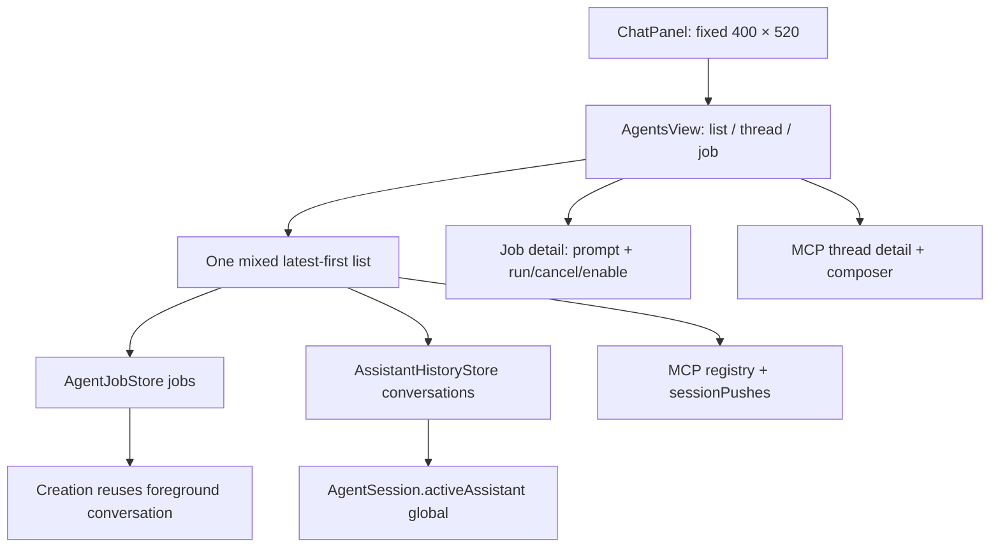
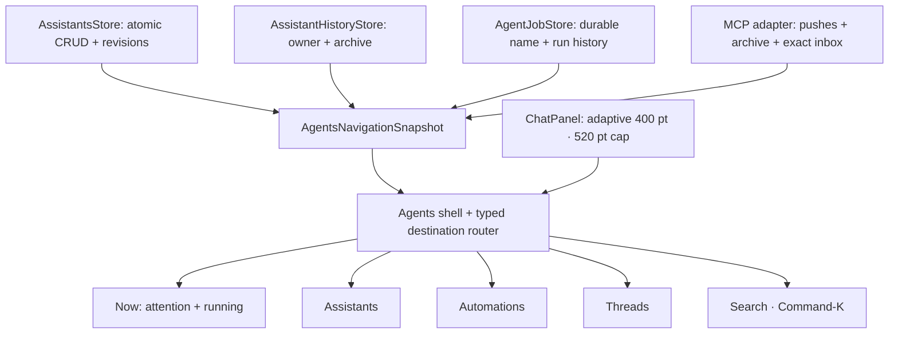
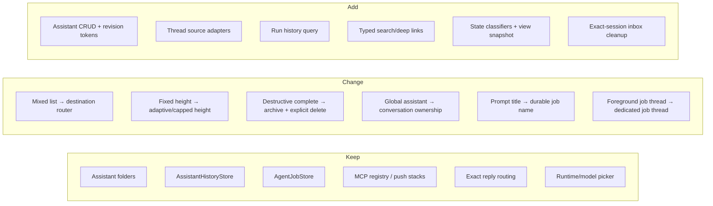

# Agents Mission Control — implementation plan

Status: design contract, before production implementation  
Surface: the Agents tab inside the 400 pt Voice Flow panel  
Decision owner: Voice Flow product design  

## Outcome

Replace the current vertically mixed Agents list with a small navigation system that answers four different questions without conflating their data:

1. **Now** — what needs the user and what is currently running?
2. **Assistants** — which persistent identities exist, and how are they configured?
3. **Automations** — what durable background work exists, what will run next, and what failed?
4. **Threads** — which conversations are unread, live, recent, or archived?

Search is a cross-destination command, not a fifth inventory page. The root is intentionally operational rather than exhaustive.

## Product philosophy

- **Orient first, then act.** Opening Agents must reveal exceptions and live work before inventory.
- **One object, one home.** Assistants, automations, and threads each have a canonical destination. Now and Search only deep-link to those homes.
- **State is prose, not decoration.** Every operational row says what it is, who owns it, its state/progress, and when it changed or will run.
- **Consequential actions live in context.** Root rows navigate. Reply, stop, disable, archive, delete, and configuration changes happen on a detail screen that names the target.
- **Reversible before destructive.** Archive and disable are routine. Delete is explicit, separately confirmed, and never masquerades as completion.
- **Compact does not mean flat.** The panel stays narrow, so hierarchy comes from destinations, grouping, disclosure, and stable row grammar rather than nested cards.

## First-principles choice

The option space was not “which tab bar looks nicest”; it was which information architecture preserves object identity and state semantics in a 400 pt transient panel.

| Candidate | Kept? | Elimination test |
|---|---:|---|
| One latest-first mixed list | No | Forces users to infer object type and urgency from icons; current failure mode. |
| Dashboard with full inventory totals and shortcuts | No | Repeats destination inventories and spends scarce height on facts that do not change the next action. |
| Persistent side rail | No | At 400 pt it takes width away from the row grammar and thread composer. |
| Assistant-centric workspaces only | No | Automations and external MCP threads can span or outlive one assistant identity. |
| Four local destinations plus global search | **Yes** | Separates user questions while preserving one compact shell and typed deep links. |

## Grounded current system

### Current UI and navigation

- `ChatPanel` is fixed at 400 × 520 pt and always positions using that size (`swift/Panel.swift:46-47`, `swift/Panel.swift:208-226`).
- The outer panel exposes Inbox and Agents; the Agents tab swaps between the mixed list, an Assistant conversation, or Speech (`swift/Panel.swift:416-468`, `swift/Panel.swift:722-809`).
- `AgentsView` currently has only `list`, `thread`, and `job` modes (`swift/AgentsView.swift:68-84`).
- Its root renders “new assistant”, “new automation”, every job, then every local and MCP session in a single vertical sequence (`swift/AgentsView.swift:300-338`).
- Opening an MCP thread immediately marks every push seen (`swift/AgentsView.swift:145-149`, `swift/App.swift:4903-4912`).
- Typed MCP messages resolve a pending ask or queue to the exact session; the visible answer is attached to the newest push (`swift/App.swift:4914-4947`).
- Current “complete thread” is destructive: it cancels a pending interaction, removes the stack, cancels the waiter, removes overlays, and closes the session (`swift/App.swift:4955-4973`).

### Current assistants

- A persistent assistant is already a folder containing `assistant.md`, memory, skills, and workspace; the store scans folders and scaffolds FLORA when empty (`swift/Assistants.swift:3-14`, `swift/Assistants.swift:75-118`).
- The store is load-only. It has no create, edit, duplicate, revision, archive, or delete contract (`swift/Assistants.swift:75-136`).
- Assistant conversations persist runtime bindings, messages, title, and turn state, but not owning assistant identity or archive state (`swift/AssistantHistory.swift:37-66`).
- `AgentSession.activeAssistant` is one mutable global identity. Creating or selecting a conversation loads runtime state but does not restore an assistant owner (`swift/Agent.swift:120-175`, `swift/Agent.swift:178-185`, `swift/Agent.swift:233-253`).

### Current automations

- Durable jobs already store assistant slug, conversation ID, runtime/model pin, trigger, state, budget, retry, concurrency, and timestamps (`swift/AgentJobStore.swift:30-79`).
- Job states are queued, running, blocked, failed, completed, cancelled, and disabled; triggers are manual, interval, inbox, capture, and watcher (`swift/AgentJobStore.swift:4-20`).
- The store lists jobs by last update and can run, cancel, enable/disable, and list active runs (`swift/AgentJobStore.swift:175-184`, `swift/AgentJobStore.swift:350-427`).
- Jobs have no durable human name and no per-job run-history query. The UI derives a title from the prompt and shows only prompt/state metadata (`swift/App.swift:4765-4783`, `swift/AgentsView.swift:177-267`).
- Creating a job currently pins it to the active assistant and the current foreground conversation (`swift/App.swift:1096-1145`).

### Current thread sources

- Local Assistant conversations come from `AssistantHistoryStore`; MCP threads come from picker/session push state. `agentSessionRows()` concatenates adapters without merging their stores (`swift/App.swift:4813-4897`).
- MCP rows already preserve picker numbering, queued overflow, ghosts, unread, and consumed history semantics (`swift/App.swift:4835-4885`).
- Local conversations have `seen` cursors for Assistant replies but no pending-ask model, completion timestamp, or owning assistant slug (`swift/AssistantHistory.swift:15-35`, `swift/AssistantHistory.swift:75-87`).

## Target navigation contract

The local nav is always visible on Agents inventory screens:

`Now [attention count] · Assistants · Automations · Threads [unseen count] · Search`

- **Now badge**: unresolved dependencies only — blocked/failed automations and exact-session pending asks. It is not a total object count.
- **Threads badge**: threads with unseen content. Multiple unseen messages in one thread count once.
- **Search**: button and Command-K. It opens one query field and grouped typed results. Escape returns to the previous destination before it dismisses the panel.
- **Back behavior**: detail → owning destination with previous query/filter/scroll restored; destination → Now; outer tab remains Agents.

## Screen contracts

### Now

Only two sections are allowed:

1. **Needs you** — pending asks, blocked jobs, failed jobs. Sort severity, then recency.
2. **Running now** — running jobs and running local conversations. Sort most recently active.

If both are empty, show one quiet “All clear” state and the last meaningful activity time. Do not replace the space with inventory cards. Each row deep-links to the object detail; no root click directly replies, runs, stops, disables, archives, or deletes.

### Assistants

Assistants are persistent identities, never a synonym for conversation.

- **List**: name, one-line purpose, activity summary, and counts for live conversations/automations only when non-zero. Primary action: New.
- **Detail**: Overview, Conversations, Memory & Skills, Configuration. The header exposes New thread and Edit.
- **Create/Edit**: in-panel form for name, purpose, instructions, optional voice, and selected skills. Slug is generated once and remains stable after rename.
- **Duplicate**: copies identity text, configuration, and selected skill source references; never copies core memory, ledger, workspace contents, conversations, runtime bindings, or jobs.
- **Concurrent edits**: assistant.md, memory, and skills use separate revision tokens. A stale editor must reload or explicitly overwrite; it never silently replaces newer agent-written memory.
- **Delete**: unavailable while that assistant has running work. Confirmation names the assistant; owned jobs are disabled; the folder moves to Trash; conversations remain read-only history rather than disappearing.

### Automations

- **Groups**: Needs attention → Active & upcoming → Ready → Disabled.
- **List row**: durable name, assistant owner, state/progress, trigger/next run, updated time. Local query plus one state/trigger filter menu.
- **Create/Edit**: one pushed form, not a detached alert. Fields: name, assistant, task prompt, runtime, conditional OpenCode model, current five triggers, interval when relevant, daily budget, and maximum duration.
- **Conversation ownership**: creation allocates a dedicated automation conversation owned by the selected assistant. It never reuses the foreground chat implicitly.
- **Detail**: summary, configuration, and paginated run history. Actions are Run now, Edit, Stop current run, Disable/Enable. Stop and Disable are different commands.
- **Legacy migration**: existing jobs keep a prompt-derived fallback display name until saved; no eager rewrite is required.

### Threads

One screen is backed by two adapters; storage remains separate.

- **Open groups**: Needs you → Unread → Live → Recent. A separate Done disclosure contains archived threads.
- **Normalized row**: title, source/owner, exact state, preview, time, unread. MCP slot numbers remain secondary continuity metadata, not primary identity.
- **Detail shell**: common back/title/status/action layout, with an Assistant transcript adapter and an MCP push-stack adapter. Composer routing stays source-specific.
- **Archive**: Complete becomes non-destructive archive for both sources. Archived content remains searchable and restorable.
- **Delete**: destructive, separately confirmed, and source-specific. For MCP it may close the session and remove overlays; for Assistant it uses the history-store delete contract.
- **Queued replies**: archive/delete must cancel or preserve exact-session queued inbox state according to the confirmation copy; this requires an exact-session inbox mutation instead of broad queue side effects.

### Search

- Query assistant names/descriptions/instructions, automation names/prompts, and thread titles/previews.
- Results are grouped by canonical destination and carry typed IDs: assistant slug, job ID, or thread source + ID.
- Selecting a result opens the canonical detail. Returning restores the query and highlighted result.
- Empty, no-result, archived-result, deleted-between-search-and-open, and duplicate-title states are explicit.
- Search does not index raw core memory, ledger, attachment file contents, credentials, or workspace files.

## State and action matrix

| Object/state | Now | Destination group | Primary detail action | Forbidden shortcut |
|---|---|---|---|---|
| Pending MCP ask | Needs you | Threads / Needs you | Reply | Root reply without opening context |
| Unread thread | — | Threads / Unread | Open | Mark seen during list refresh |
| Running local conversation | Running now | Threads / Live | Open/Stop in conversation | Complete/delete while running |
| Running job | Running now | Automations / Active | Stop run | Treat Stop as Disable |
| Blocked/failed job | Needs you | Automations / Needs attention | Review | Blind rerun from root |
| Queued interval job | — | Automations / Active & upcoming | Open/Edit | Show as “running” |
| Manual ready job | — | Automations / Ready | Run now | Auto-run on row click |
| Disabled job | — | Automations / Disabled | Enable | Run without resolving disabled state |
| Archived thread | — | Threads / Done | Restore | Delete as a side effect of archive |

## Current architecture

## Target architecture

## Structural delta

## Data and migration design

### Assistant conversations

Add optional `assistantSlug`, `assistantNameSnapshot`, and `archivedAt` fields to `AssistantConversation`, plus versioned per-conversation files under `assistant-thread-metadata/`. The sidecar is canonical only for owner/archive metadata; Assistant history remains canonical for transcript/runtime state. This mirror is required because an older build can decode unknown JSON keys and then drop them when it rewrites its older struct. Missing legacy ownership migrates to the loaded base assistant once both stores are available. Creation always supplies an owner. Selecting a conversation resolves and restores its assistant before composing the next prompt. A downgraded build remains history-readable but cannot honor the new ownership/archive behavior; the sidecar restores those facts on the next upgraded launch and newer downgraded activity reopens an archived thread.

### Assistant folders

Add explicit `create`, `update`, `duplicate`, and `moveToTrash` contracts to `AssistantsStore`. Writes use sibling temporary files/directories followed by atomic replacement. Revision tokens are content digests scoped to each edited file. Slugs accept lowercase ASCII letters, digits, and hyphens; collisions gain a numeric suffix. Rename changes the display/wake name, not the slug.

### Agent jobs

Add nullable `name` to the SQLite table and `AgentJob`. Migrate with `ALTER TABLE` only when absent. Add `runs(jobID:limit:before:)` ordered newest-first. Creation allocates a hidden/dedicated owned conversation and stores its ID. Existing conversation IDs remain valid and are not rewritten.

### MCP thread archive

Persist archive metadata separately from the live `sessionPushes` payload so rollback can still read pushes. Archiving removes the item from quick picker eligibility without deleting content. Restore re-enters the eligible queue subject to the existing slot allocator. Destructive delete retains current close/overlay cleanup behavior behind explicit confirmation. Add exact-session inbox remove/cancel operations for delete policy.

## Implementation slices and commit boundaries

1. **Plan and visual contract** — commit this plan plus verified destination mockups.
2. **Pure navigation model** — typed destinations, object IDs, state classifiers, snapshot/search projections, and unit tests. No UI mutation.
3. **Assistant ownership expansion** — optional conversation mirrors, rollback-surviving owner/archive sidecars, migration, owner restoration, lifecycle tests.
4. **Assistant folder editing** — revisioned atomic CRUD/duplicate/trash contracts and filesystem tests.
5. **Automation persistence expansion** — durable name, run history query, dedicated conversation creation, migrations/tests.
6. **Thread archive/inbox seams** — reversible archive, restore, explicit delete, exact-session inbox mutation and tests.
7. **Agents shell + Now** — local nav, badges, operational sections, typed deep links, adaptive height.
8. **Assistants destination** — list/detail/editor and lifecycle actions.
9. **Automations destination** — grouped list/detail/pushed editor/run history.
10. **Threads destination + Search** — adapters, normalized grouping, archive/delete, Command-K, restoration.
11. **Signed-app invalidation** — install, isolated QA, visual snapshots, accessibility, restart, routing, dictation/TTS/pill regression.

Each slice is independently buildable and committed even if the next slice is unfinished.

## Validation contract

### Unit and migration

- Legacy assistant-history JSON decodes unchanged; missing owner is assigned once and persisted.
- Simulating an older encoder that drops unknown conversation fields still restores owner/archive from the sidecar; newer old-build activity clears archive.
- Switching between two conversations restores different assistant personas, directories, memories, voices, and selected skills.
- Duplicate assistant excludes memory, ledger, workspace contents, conversations, bindings, and jobs.
- Stale assistant/memory revision cannot overwrite a newer file.
- Assistant slug collision and invalid-name handling are deterministic.
- Legacy job database migrates nullable name without changing runtime/model/trigger/budget/conversation IDs.
- New automation gets a dedicated owned conversation; existing automation keeps its existing conversation.
- Run history is stable, newest-first, bounded, and paginated without duplicates.
- Thread classifiers cover pending, unread, running/live, ghost, completed/archived, and deleted-between-refresh states for both sources.
- Archive/restore is idempotent. Delete is idempotent after confirmation.
- Exact-session inbox cleanup cannot remove another session’s queued message.
- Typed search returns correct destination/entity IDs even when titles collide.

### UI behavior

- Now renders only Needs you and Running now; no inventory totals or creation tiles appear.
- Root rows navigate without side effects.
- Local nav and badges remain correct after background updates, archive/restore, and app restart.
- Destination query/filter/scroll survives detail round trips.
- Thread composer draft and focus survive refresh, preserving the current guarantee (`swift/AgentsView.swift:151-174`).
- Opening a thread marks it seen only after detail disclosure, never during list/search rendering.
- Pending asks get the attached answer composer; normal messages use the general composer.
- Stop run and Disable are visibly and behaviorally distinct.
- Destructive actions name their target and require confirmation.
- Empty, one-row, overflow, long-title, multiline-prompt, loading, failure, stale-result, and corrupt-record states fit without horizontal growth.
- Keyboard: Command-K search, Escape unwind, Return send/submit, Option-Return newline, and full tab traversal.
- VoiceOver labels contain destination, object name, state, owner, and action.

### Space and visual QA

- Width stays 400 pt.
- Sparse Now content reduces panel height; dense lists grow only to 520 pt and then scroll.
- Placement remains on the pill’s display and inside visible frame.
- Text never drops below the existing 10.5 pt metadata floor.
- A 390+ pixel signed snapshot remains non-blank at each destination; sparse-height assertions use the reported dynamic height rather than assuming 500+.
- Verify at 1× and 2× backing scale, long accessibility text, and reduced-motion settings.

### Regression and adversarial invalidation

- Run the full unit/contracts harness before and after each persistence migration.
- Run signed isolated E2E with existing assistant runtime/model picker coverage.
- Restart during: assistant edit, automation running, pending MCP ask, queued reply, archived ghost thread, and open search result.
- Inject duplicate names, invalid UTF-8 replacement text, 10,000-character prompts, 100 conversations, 500 jobs, nine slotted MCP sessions plus overflow, and missing assistant folders.
- Verify Inbox, Dictations, Speech/TTS, pill picker numbering, unread ring, capture routing, overlay scoping, pending asks, and hotkeys are unchanged.
- Compare data files and SQLite rows before/after navigation-only actions to prove root/list/search clicks are read-only.
- Reinstall the signed app and repeat the critical visual/routing checks against persisted production-compatible fixtures.

## Exit criteria

The redesign is complete only when every screen and state above exists, all migrations are rollback-readable or explicitly justified, the validation contract passes, the signed app has been visually inspected, and no known regression is hidden behind an updated test expectation.
