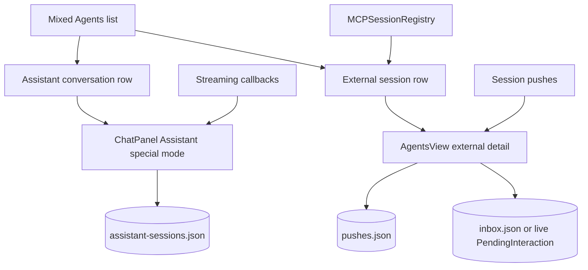
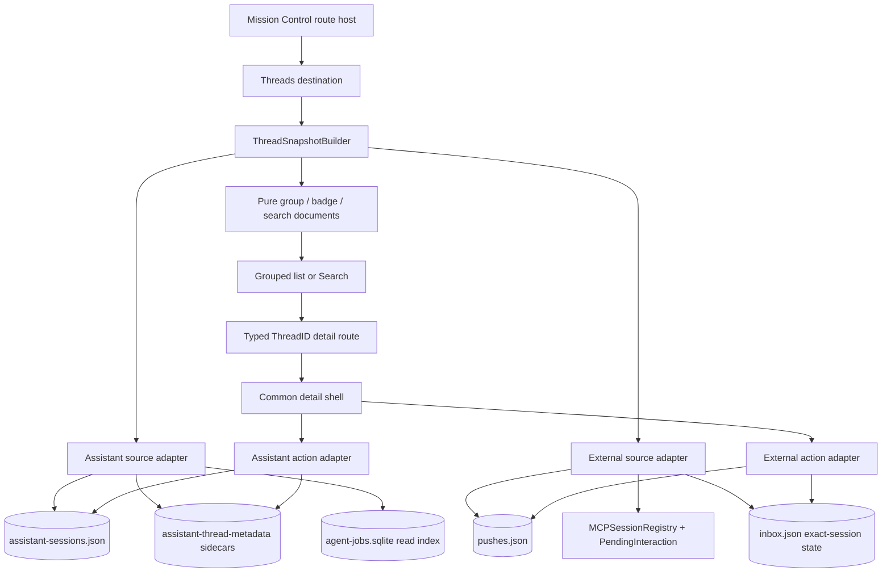
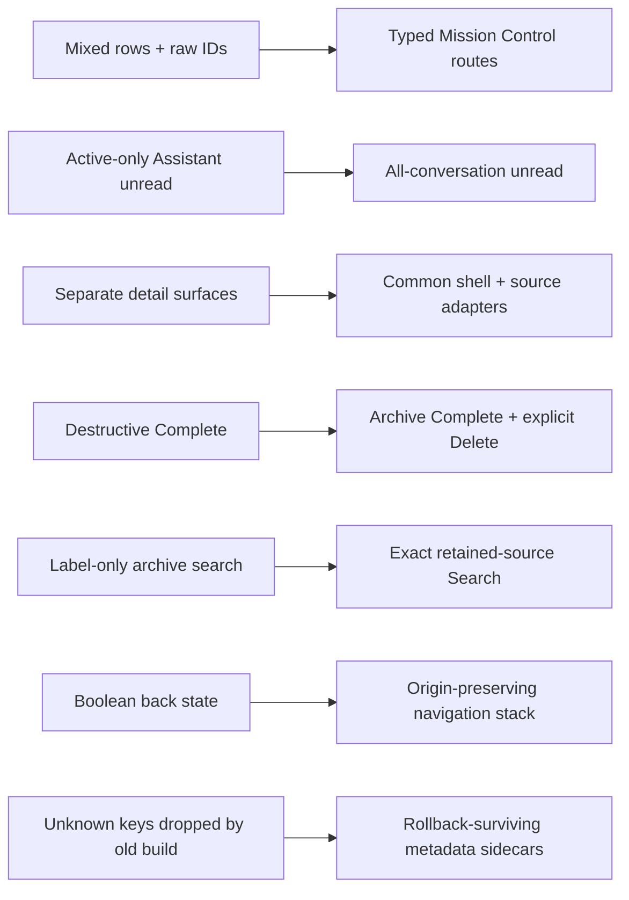
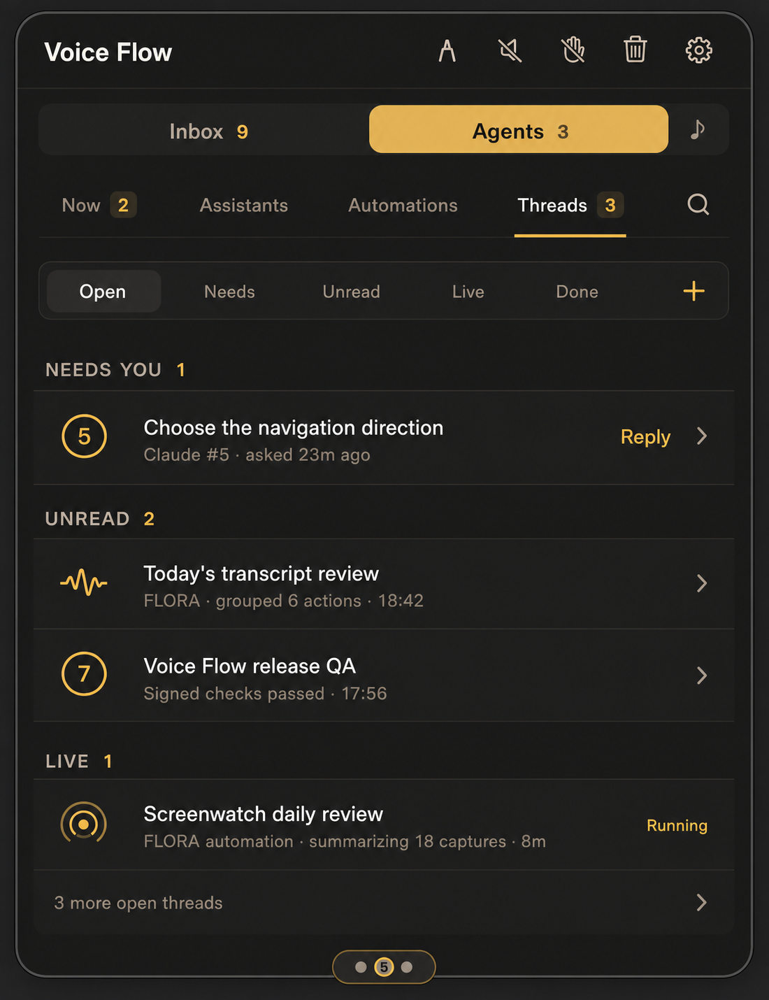

# Threads destination — implementation-grade specification

Status: design only; no production Swift changed.  
Mockup: `design/agents-navigation/threads-destination.png`

## Target

**GIVEN goal:** Under the locked Mission Control navigation, make every durable local Assistant conversation and every engaged external agent thread easy to find, understand, resume, answer, hear, complete, and delete without exposing the two storage/runtime implementations.

The destination passes when:

1. `Threads` is a unified inventory over both canonical sources, not a third copy of their data;
2. a thread that needs an answer, has unread output, or is currently live is visible in one deterministic group and can be opened in one click;
3. exact thread identity survives equal-looking raw IDs, filtered lists, global search, back navigation, relaunch, external disconnects, and Assistant switching;
4. `Complete` is recoverable archive semantics and `Delete` is the only destructive action;
5. detail, reply, read-aloud, capture focus, and seen state always apply to the thread visibly on screen;
6. global search deep-links to the exact Assistant, automation, thread, or retained message and returns to the exact query and selection on Back.

**Hard constraints**

- Keep the current 400×520pt ChatPanel, outer `Inbox / Agents / Speech` selector, and locked Mission Control local navigation.
- `AssistantHistoryStore` remains canonical for local conversations; `sessionPushes` plus `MCPSessionRegistry` remain canonical for external threads.
- Do not merge the two stores, fabricate a shared transcript, or introduce a second persistent search database.
- Preserve capability-first capture routing: viewing a historical thread must not silently steal the user's contextual voice target.
- Preserve the existing pending-interaction contract: only a currently blocked `PendingInteraction` is an answerable live ask.
- Preserve bounded retention and survive an older build rewriting Assistant history without silently losing new ownership/archive metadata.
- No provider, runtime, MCP, model, trust-profile, raw session ID, or implementation label appears in the default inventory.

**Blast radius:** 11 production seams, 4 persisted shapes, and 5 test surfaces.

- net-new pure model/search layer: `swift/Threads.swift`
- net-new list/detail/search UI: `swift/ThreadsView.swift`
- net-new rollback-surviving metadata store: `swift/AssistantThreadMetadata.swift`
- destination shell and routing: `swift/AgentsView.swift`, `swift/Panel.swift`
- source adapters and actions: `swift/App.swift`, `swift/Agent.swift`
- local conversation archive/identity: `swift/AssistantHistory.swift`
- config path for the metadata sidecar: `swift/VoiceFlowPaths.swift`
- exact queued-message cleanup/read state: `swift/Inbox.swift`
- job-to-conversation enrichment/reference checks: `swift/AgentJobStore.swift`
- registry: `swift/MCP.swift` read only unless a snapshot helper is extracted
- archive-only Messages tab: `swift/UI.swift` behaviorally unchanged and excluded from deep-link search

## Current — verified implementation

| Fact | Evidence |
|---|---|
| ChatPanel is fixed at 400×520pt. | **VERIFIED** `swift/Panel.swift:46-47`. |
| Contextual focus distinguishes unkeyed local Assistant content from keyed external sessions. | **VERIFIED** `swift/Panel.swift:93-99`; `ConversationFocus` is defined in `swift/CaptureRouting.swift:20-24`. |
| Assistant and external thread presentation are separate routes today. | **VERIFIED** `swift/Panel.swift:503-527`; Assistant uses its own special mode, while `openAgentThread` opens an external session detail. |
| Assistant history restores an ordered canonical transcript into ChatPanel. | **VERIFIED** `swift/Panel.swift:281-305`. |
| Assistant detail has a separate header with runtime, delete, and speak controls. | **VERIFIED** `swift/Panel.swift:812-880`. |
| The current UI row can represent either an Assistant conversation or MCP session, but carries only a loose `assistant` flag plus raw ID. | **VERIFIED** `swift/AgentsView.swift:18-36`. |
| The current root mixes create-assistant, create-automation, job, Assistant-conversation, and external-session rows in one vertical feed. | **VERIFIED** `swift/AgentsView.swift:300-338`. |
| Selecting an Assistant row routes out through ChatPanel while selecting an external row stays inside AgentsView detail. | **VERIFIED** `swift/AgentsView.swift:426-430`. |
| External detail renders retained pushes, derives whether the composer is answering an ask, and attaches the submitted answer to that push. | **VERIFIED** `swift/AgentsView.swift:460-614`; Return submits and Option-Return inserts a newline at `706-729`. |
| Refresh already preserves an external composer draft and first-responder state. | **VERIFIED** `swift/AgentsView.swift:151-175`. |
| `SessionPush` persists ID, date, title, body, hint, ask/seen/answer/spoken/resume/done state. | **VERIFIED** `swift/App.swift:64-97`. |
| External stacks persist atomically, keep at most 8 active pushes and 40 retained items, and survive relaunch. | **VERIFIED** `swift/App.swift:111-119`, `1653-1686`. |
| A persisted unanswered ask cannot remain live across process restart and is deliberately degraded to an ordinary message. | **VERIFIED** `swift/App.swift:153-167`. |
| Marking an external stack done already retains completed history rather than deleting it. | **VERIFIED** `swift/App.swift:171-184`. |
| The picker projects the current local Assistant as `assistant:<slug>` but only the current conversation; it also retains unread/active external ghosts. | **VERIFIED** `swift/App.swift:1410-1497`. |
| External session slots are sticky, capped at nine, and stored separately. | **VERIFIED** `swift/App.swift:1506-1545`. |
| Unread and ask semantics are computed while growing a stack; consumed finished ghosts are retired to panel history. | **VERIFIED** `swift/App.swift:1760-1805`. |
| While the panel is open, a session hotkey deep-links to an external thread; selecting the local Assistant opens the current Assistant conversation. | **VERIFIED** `swift/App.swift:1815-1827`. |
| Closing a live external session leaves unread content as a ghost; periodic sweep retires only consumed ghosts and cleans labels/overlays. | **VERIFIED** `swift/App.swift:3891-3949`. |
| `PendingInteraction` is the canonical live ask; when it resolves or times out, the push must no longer act as a blocked question. | **VERIFIED** `swift/App.swift:4300-4338`. |
| Current unified-row construction marks local Assistant unread only when that conversation is active. Inactive conversations with unseen Assistant output are therefore undercounted. | **VERIFIED** `swift/App.swift:4813-4896`, specifically the active-only condition at `4831`. |
| External send either resolves a live pending ask or queues into `MessageInbox`, then attaches the answer and marks the thread done. | **VERIFIED** `swift/App.swift:4914-4947`. |
| Current external `completeThread` is destructive: it removes the stack, closes the session, and removes overlays. | **VERIFIED** `swift/App.swift:4951-4973`. |
| Assistant messages have an optional `seen` bit, and `markSeen` supports any conversation without changing recency. | **VERIFIED** `swift/AssistantHistory.swift:15-35`, `363-376`. |
| Assistant conversations persist ID, title, messages, runtime bindings, timestamps, and turn state, but no assistant-owner snapshot or completion timestamp. | **VERIFIED** `swift/AssistantHistory.swift:37-76`. |
| Assistant history is lock-serialized, atomically persisted, sorted newest-first, capped at 100 conversations and 200 messages, and recovers running turns as interrupted after relaunch. | **VERIFIED** `swift/AssistantHistory.swift:115-127`, `193-195`, `442-458`, `483-501`. |
| Jobs already persist both `assistantSlug` and `conversationID`; background runs write through the same Assistant history. | **VERIFIED** `swift/AgentJobStore.swift:30-47`; `swift/AgentRuntimeJobExecutor.swift:23-35,84-94`. |
| `MCPSession` exposes stable session ID, slot number, last-seen time, name, engaged state, and a user-facing label; registry sessions become stale after two hours. | **VERIFIED** `swift/MCP.swift:11-47,119-145`. |
| `MessageInbox` supports broad matching, add, drain, and waiter cancellation, but has no exact-session queued-message deletion API. | **VERIFIED** `swift/Inbox.swift:51-105`. |
| `messages.json` entries persist a session label rather than stable thread ID and are capped at 200; they cannot support exact deep links. | **VERIFIED** `swift/UI.swift:2700-2715`. |

### Current flow



**RENDER NOT PERFORMED:** no Mermaid renderer is installed in the workspace. The source was manually linted: every node participates in a path and each edge maps to a verified seam above.

## First-principles elimination trail

| Candidate | Elimination |
|---|---|
| Physically merge Assistant history and external pushes into one database | **Hard constraint:** the sources have different ownership, lifecycle, reply, retention, and recovery semantics. A migration would add risk without improving navigation. |
| Copy both sources into a new thread database | **Risk:** creates dual truth; seen, ask, streaming, completion, and deletion would need fallible two-way synchronization. |
| Keep separate `Assistant` and `External` tabs under Threads | **Goal-fit:** the user still has to know what created the conversation before finding it. |
| Flatten both sources into one lowest-common-denominator message type | **Goal-fit:** loses local user/assistant/note roles, external attached answers, live asks, slot identity, and ended-session semantics. |
| Sort one flat inventory only by recency | **Goal-fit:** a recent neutral conversation can hide an older blocking ask or unread result. |
| Give each state its own tab | **Cost:** most surfaces would be sparse and a multi-dimensional thread could appear in several tabs. |
| Persist a full-text search index now | **Cost/risk:** retained data is tightly bounded; an index adds migration, consistency, privacy, and corruption paths with no demonstrated scale need. |
| Search `messages.json` as if it were canonical | **Hard constraint:** it has only a display label, no stable session/conversation ID, so an exact result cannot be opened. |
| Reuse the current untyped raw string ID everywhere | **Risk:** an Assistant conversation and external session can share the same raw value and route to the wrong source. |
| Two unrelated detail screens | **Goal-fit:** back, speak, complete, delete, state, and focus behavior would drift again. |
| **Survivor: typed source IDs + one normalized read facade + a common detail shell with source adapters + ephemeral search snapshots** | Preserves each canonical store while giving navigation one exact, testable contract. |

The survivor is order-robust: storage/lifecycle hard constraints eliminate physical unification; exact-navigation and state-priority requirements eliminate separate/flat presentation; bounded data eliminates persistent indexing.

## Product philosophy

**Mission Control organizes by intent, not implementation.** A row answers four questions in one scan: What is this? Who owns it? Does it need me? What happened most recently?

Consequences:

- identity is typed internally and source-neutral visually;
- attention outranks recency;
- a thread appears once in the default inventory;
- `Complete` means “file it”; `Delete` means “destroy it”;
- selecting a result is navigation, not an implicit state mutation;
- state changes only when their evidence changes, not because a row happens to refresh;
- the visible thread is the only thread eligible for reply, speak, or contextual focus.

## Normalized read contract

Add pure value models in `swift/Threads.swift`. Raw source models do not enter view code.

```swift
enum ThreadID: Hashable, Sendable {
    case assistantConversation(String)
    case externalSession(String)
}

enum ThreadLifecycle: Equatable, Sendable {
    case open
    case completed(at: Date?)
}

enum ThreadAttention: Equatable, Sendable {
    case none
    case needsAnswer(pushID: UUID)
    case interrupted
}

enum ThreadPresence: Equatable, Sendable {
    case idle
    case running(progress: String?)
    case connected
    case listening
    case ended
}

struct ThreadCapabilities: OptionSet, Sendable {
    static let reply: Self
    static let speak: Self
    static let complete: Self
    static let delete: Self
}

struct ThreadSummary: Identifiable, Equatable, Sendable {
    let id: ThreadID
    let title: String
    let owner: String
    let preview: String
    let updatedAt: Date
    let slot: Int?
    let lifecycle: ThreadLifecycle
    let attention: ThreadAttention
    let presence: ThreadPresence
    let unreadCount: Int
    let capabilities: ThreadCapabilities
}
```

`ThreadID` is the only identity accepted by routes/actions. Code must never compare or store the associated raw string without its enum case.

The source adapters also produce a normalized detail snapshot:

```swift
enum ThreadMessage {
    case assistant(AssistantHistoryMessage)
    case external(push: SessionPush)
}

struct ThreadDetailSnapshot {
    let summary: ThreadSummary
    let messages: [ThreadMessage]
    let composer: ThreadComposerState
    let linkedAutomationIDs: [String]
}
```

The common shell owns navigation/header/actions/composer placement. The Assistant adapter owns role rendering, activation, runtime streaming, and canonical send. The external adapter owns push rendering, live-ask resolution, queued replies, slot labeling, and attached answers.

## Exact state semantics

State is multi-dimensional; UI grouping is a derived view, not stored state.

| Dimension | Assistant conversation | External session |
|---|---|---|
| Title | persisted conversation title; fallback `New conversation` | session display label, then newest push title, then `Agent thread` |
| Owner | persisted assistant-name snapshot, then resolved assistant name, then `Unknown assistant` | registry/session label with implementation words removed; fallback retained label |
| Updated | conversation `updatedAt` | newest retained push `at`, else registry `lastSeen` |
| Unread | count every assistant-role message where `seen != true`, including inactive conversations | count every retained push where `seen == false` |
| Needs answer | never inferred from prose | `PendingInteraction.session == id` and its current push is still unanswered |
| Interrupted | `turnState == .interrupted` | not used; an ended external session is not automatically an error |
| Running | `turnState == .running`; enrich with linked job progress when available | not inferred merely from connection |
| Connected | not used | engaged non-stale registry session exists |
| Listening | not used | exact-session waiter exists in `MessageInbox`; add a read-only exact waiter query |
| Ended | assistant missing is shown as owner unavailable, not ended | no registry session but retained pushes remain |
| Completed | `completedAt != nil` | every retained push is `done`, and the stack remains retained |

Rules:

1. A persisted `isAsk` bit alone never means Needs You after relaunch. Only the live `PendingInteraction` can be answered synchronously.
2. A live ask that resolves, times out, is completed, or loses its waiting call becomes an ordinary retained message immediately.
3. An unread ended external thread remains Open and groups under Unread. UI copy says `Ended`, never `ghost`, `dead`, or `MCP`.
4. A connected external session is Live, not Running. `Running` is reserved for evidence of active work.
5. New local user/assistant activity clears `completedAt`; beginning a foreground or job runtime turn reopens the conversation before setting Running.
6. A new external push has `done = false`, reopens a completed retained stack, and can re-adopt a previously ended session through the existing registry self-heal path.
7. Marking seen never changes `updatedAt`, sorting, completion, or the search result's route.

## Threads destination hierarchy

The locked local navigation remains directly below the outer selector:

`Now 2 · Assistants · Automations · Threads 3 · Search`

- `Threads` uses the short 2pt amber underline.
- Its badge is the number of **unique open threads** with either Needs You or Unread state. A live neutral thread does not inflate attention.
- Selecting the already-selected `Threads` item from detail returns to the Threads root and restores the last filter/row/scroll anchor.
- `+` creates a new conversation for the currently selected/default Assistant; if there are multiple Assistants, a compact chooser appears before creation.

### Filter strip

One horizontal control, no page title:

`Open · Needs · Unread · Live · Done                                     +`

- `Open` is the default.
- Filter state is retained for the panel lifetime, not persisted across launches.
- Filters are predicates over state dimensions, not separate collections.
- `Needs`, `Unread`, and `Live` may contain the same thread across separate filters. The default Open grouping still renders it exactly once.

### Default Open grouping

Group precedence is deterministic:

1. **NEEDS YOU** — live external asks, then interrupted local conversations.
2. **UNREAD** — remaining threads with unread content.
3. **LIVE** — remaining running local conversations, listening external sessions, then connected sessions.
4. **RECENT** — every remaining open thread.

Sort within groups:

- Needs: live asks oldest first, then interrupted newest first.
- Unread: newest unread message/push first.
- Live: running first; oldest active start first where known; then listening, then connected; `updatedAt` descending inside each state.
- Recent: `updatedAt` descending.
- Stable tie-breaker: source case, then raw ID.

The same row never appears twice in Open. The pure grouper consumes a unique `[ThreadSummary]` and returns ordered sections plus one badge count.

### Dedicated filter ordering

- Needs: same order as Needs You.
- Unread: newest unread evidence first, whether or not the thread also needs an answer.
- Live: Running → Listening → Connected; recency inside each.
- Done: `completedAt`/latest activity descending; ended external threads show `Ended`, local conversations show their owner. No Needs/Unread badge is shown inside Done.

### Row contract

One full-width 47–52pt row with a 44pt minimum click/focus target:

- source glyph: Assistant waveform for a local conversation; sticky numbered ring for an external thread;
- primary: title, one line, tail truncation;
- secondary: `{owner} · {state/evidence} · {relative time}`;
- trailing: exactly one high-value action or chevron;
- title is semibold when unread; amber is reserved for Needs, Unread, or Live evidence;
- completed/neutral metadata is taupe; ended is quiet, not error red;
- hover/focus reveals overflow only when an action does not already occupy the trailing edge.

No avatar, provider badge, model/runtime label, raw ID, separate state-pill stack, nested card, or independent section scroll view.

## Thread detail behavior

### Common shell

Header:

- back chevron;
- exact thread title and one concise state line;
- speaker button when a speakable reply exists;
- `Complete` for Open threads or `Reopen` for Done threads;
- overflow with `Delete thread…`.

Body:

- one chronological transcript scroll view;
- local messages preserve user/assistant/note roles;
- external pushes show title/body/hint and any attached answer without pretending it is a local model transcript;
- opening on a search message anchor scrolls to and briefly highlights that exact retained message;
- unread is marked seen only after the detail is attached, visible, and scrolled to its initial anchor—not when a row/search result is merely selected.

Composer:

- remains anchored below the transcript;
- drafts are keyed by `ThreadID` for the panel lifetime;
- refresh, incoming pushes, streaming deltas, and state changes may not replace the editor or first responder;
- Return submits; Option-Return inserts a newline, preserving current behavior;
- send failure keeps the draft and shows an inline retryable error.

Back restores the exact origin route, filter/query, selected `ThreadID`, and scroll anchor. Clicking a different Mission Control destination intentionally discards the detail origin and enters that destination root.

### Assistant adapter

Opening:

1. Read any Assistant conversation snapshot without first mutating global selection.
2. Attempt to activate its persisted Assistant owner and conversation before enabling composer, contextual capture, or runtime controls.
3. If a foreground run prevents activation, keep detail readable, set contextual focus to `.none`, and show `Another conversation is working. Wait for it to finish before replying.`
4. If the owner Assistant folder is unavailable, show read-only history with `Assistant unavailable`; Complete/Reopen/Delete remain subject to automation-reference checks.
5. Once activation succeeds, `ChatPanel.conversationFocus` may expose the current `.assistant` route. A non-active historical Assistant detail must never claim contextual focus under the current unkeyed enum.

The first implementation should **not** broaden `ConversationFocus` merely for navigation. If product later requires dictating into an arbitrary non-active Assistant detail, migrate to `.assistant(conversationID:)` end-to-end in a separate capability-routing change with dedicated correlation tests.

Reply:

- call the existing canonical Assistant send path after activation;
- `turnState == .running` disables the composer with current activity/progress;
- a background job using the same conversation may be viewed but cannot accept a competing foreground turn;
- stream-start, delta, activity, final, and error callbacks from `swift/App.swift:847-959` must forward to the selected Assistant thread detail as well as existing surfaces;
- final output remains committed by `AssistantHistoryStore`; the view only renders snapshots/events.

Speak:

- default: most recent assistant-role message;
- if multiple unseen assistant replies exist, read oldest unseen through newest unseen and mark `spoken` only if that field is later added; speaking alone does not mark the text seen;
- reuse the existing `AgentReplySpeaker`/TTS path; no new audio engine.

### External adapter

Opening:

- render the retained stack even when the registry session has ended;
- selecting a numbered session remains compatible with current sticky slots;
- if `PendingInteraction` matches, `Reply` deep-link opens detail, scrolls to that push, and autofocuses the attached composer;
- without a live ask, composer sends a normal contextual message;
- if ended, composer remains available with `This will queue until the thread reconnects.`

Reply:

- a live ask fulfills exactly the matching `PendingInteraction` and attaches the answer to its push;
- otherwise enqueue for this exact session through `MessageInbox`;
- if the session dies between typing and submit, atomically fall back to exact-session queueing, attach the answer, retain the draft until success, and change state to Ended;
- incoming pushes may reorder the inventory but may not discard the open composer/draft.

Speak:

- reuse `speakAgentThread`: oldest unread/unspoken eligible push first, then replay current stack on an explicit second request;
- live ask text remains speakable; speaking does not answer it.

## Complete, reopen, and delete

### Complete — recoverable archive

Assistant:

- disabled while `turnState == .running`;
- set optional `completedAt = now`, mark existing messages seen, preserve all history/runtime bindings/owner, and return it only in Done;
- any next user send, runtime begin, background-job begin, or new assistant result clears `completedAt` before activity is committed.

External:

- if a live ask exists, confirm `Complete this thread and cancel its waiting question?`;
- set every retained push `done = true` and `seen = true` while keeping the stack and label;
- cancel the matching pending interaction, remove exact-session queued replies, close the live registry session, clear its overlays, and retarget if it owned the visible target;
- keep slot history until ordinary slot retention reclaims it; show the item in Done.

`Complete` must no longer call the current destructive stack-removal implementation.

### Reopen

- Assistant: clear `completedAt` and return to Recent unless another state dimension places it higher.
- External: set the newest retained push `done = false`; do not synthesize a connection or unread state. Reply queues until the external session reconnects.

### Delete — destructive

Always requires confirmation for non-empty history.

Assistant:

- disabled while its foreground/background turn is running;
- query all jobs whose `conversationID` matches, including disabled/completed jobs;
- block destructive deletion while any automation references it: `This conversation is used by N automations. Reassign or delete them first.` with `View automations` deep-link;
- after the reference set is empty, call `AssistantHistoryStore.delete`; the store's replacement-draft invariant remains intact.

External:

- permanently remove retained pushes, label, sticky slot, exact queued inbox messages, matching pending ask, overlays, and registry session;
- never remove inbox items whose `session == nil` or a different session merely because broad matching would have delivered them;
- move focus/target to the next eligible visible thread or `.none`.

After successful deletion, Back lands on the origin list/search with an inline `Thread deleted` notice. A stale detail action after source deletion becomes idempotent `No longer available`, not a crash or cross-source fallback.

## Cross-navigation and global search

### Route model

Use typed route values rather than a collection of booleans:

```swift
enum AgentsDestination: Hashable {
    case now
    case assistants
    case automations
    case threads(filter: ThreadFilter)
}

enum AgentsDetail: Hashable {
    case assistant(slug: String)
    case automation(jobID: String)
    case thread(id: ThreadID, anchor: ThreadAnchor?)
}

struct SearchOrigin: Hashable {
    let underlyingRoute: AgentsRoute
    let query: String
    let selectedResultID: SearchResultID?
    let scrollAnchor: SearchResultID?
}
```

`AgentsRoute` owns one destination plus optional detail; global search is an overlay route with a captured underlying route. A small navigation stack stores exact origins for pushed details. Do not infer Back from the currently selected tab.

### Search surface

`⌘K` or the local-navigation search icon opens a panel-width overlay below the locked local navigation. The previous destination stays visually underneath and is not reset.

Empty query shows, in order:

1. destination jumps: Now, Assistants, Automations, Threads;
2. up to five Needs You items across automations and threads;
3. five recently opened/updated exact destinations.

Non-empty query:

- case/diacritic-insensitive; whitespace-separated tokens use AND semantics across the document;
- search Assistant name/description/instructions summary, automation name/prompt/assistant/model ID, thread title/owner/preview, and retained canonical message bodies;
- search only retained Assistant history (100×200 bounded) and retained external stacks (40 per session); do not search `messages.json` because results cannot deep-link;
- build immutable `SearchDocument` snapshots on the main actor, filter/rank off-main after 120ms debounce, publish only if the query generation still matches;
- return at most 50 results with a quiet type label and one evidence snippet.

Ranking:

1. exact normalized title;
2. title prefix;
3. title contains all tokens;
4. owner/name match;
5. message/prompt/body match;
6. Needs/Unread boost within the same textual tier;
7. `updatedAt` descending, then typed stable ID.

Result routes:

| Result | Exact destination |
|---|---|
| Assistant | Assistants workspace Overview for that slug |
| Automation | Automations detail for that job ID |
| Thread | Threads detail for exact `ThreadID` |
| Retained thread message | Threads detail for exact `ThreadID`, anchored to exact message/push ID |
| Destination jump | destination root with its default/restored state |

Opening a result does not mark it seen. Once detail is actually visible, its ordinary visibility rule applies. Back from result detail restores Search with the exact query, selected result, and scroll. Escape from Search restores the captured underlying route. Clicking local navigation discards Search and goes directly to that destination root.

If a result becomes stale before open, retain Search and replace that row with `No longer available`; refresh snapshots on the next run-loop turn. Never reinterpret its raw ID as another result type.

## Keyboard, focus, and accessibility

- `⌘1` Now, `⌘2` Assistants, `⌘3` Automations, `⌘4` Threads.
- `⌘K` opens/focuses global Search; Arrow Up/Down changes result; Return opens; Escape returns to the underlying route.
- `⌘[` or the standard Back command pops one detail origin. At destination root it does nothing; it does not close the whole panel.
- Escape handling remains subordinate to Voice Flow's global safety path: pending annotation text commits first, then annotation/recording/computer-control/TTS panic behavior runs. Only when that handler declines may the destination close Search or pop detail.
- On list entry, restore focus to the previous typed row ID. If deleted, focus the next row in visual order, then previous, then the filter strip.
- On detail Back, restore exact filter, row, and scroll anchor. On Search close, restore the prior first responder.
- Reply deep-link autofocuses composer only for a live ask; ordinary row open keeps transcript focus so it does not unexpectedly capture typing.
- Tab order: local navigation → filter/search/create → section rows → detail header actions → transcript → composer.
- Each row exposes one accessibility element: `{title}, {owner}, {unread/needs/live/ended state}, updated {relative time}`. The numbered ring includes `External thread slot N`; the waveform includes `Assistant conversation`.
- Do not encode unread/live/error only by amber color. Semibold title, icon, text, and accessibility value carry redundant meaning.

## Empty, loading, and error states

| Surface | Exact state |
|---|---|
| Open empty | `No open threads` / `Start a conversation` |
| Needs empty | `Nothing needs you` |
| Unread empty | `You're caught up` |
| Live empty | `Nothing live` |
| Done empty | `No completed threads` |
| Search empty | `No results for “{query}”` |
| Ended external detail | `This thread ended. Replies will queue until it reconnects.` |
| Missing Assistant owner | `Assistant unavailable` / history remains selectable and read-only |
| Activation blocked | `Another conversation is working. Wait for it to finish before replying.` |
| Stale result/action | `No longer available` |

- Inventory data is local; take a synchronous snapshot and render immediately. Do not show a network spinner.
- While an off-main search generation is pending, show three quiet skeleton result rows only if the previous matching result set is unavailable for more than one frame.
- If one source fails to decode/snapshot, render the other source plus one inline warning: `Some threads couldn't be loaded` with `Retry`. Never replace a good source with an empty state.
- Keep the last good snapshot during transient action/search failures; inline errors stay adjacent to the action and preserve draft/focus.
- Corrupt persistence must be surfaced through a typed snapshot error. Current silent degradation is insufficient for a unified inventory because it could falsely claim `No open threads`.

## Persistence and source changes

### Assistant history and rollback-surviving metadata

Add optional fast-path mirrors to `AssistantConversation`:

```swift
var assistantSlug: String?
var assistantNameSnapshot: String?
var completedAt: Date?
```

- Keep the AssistantHistory envelope at version 1; new builds decode missing values as nil.
- **Unknown Codable keys are not rollback-durable.** An older Voice Flow build can decode the conversation, then rewrite `assistant-sessions.json` from its older struct and drop `assistantSlug`, `assistantNameSnapshot`, and `completedAt`. The embedded fields alone therefore do not satisfy rollback.
- Add a versioned sidecar directory that older builds do not know or rewrite: `~/.config/voice-flow/assistant-thread-metadata/<conversation-id>.json`.

```swift
struct AssistantThreadMetadata: Codable {
    let version: Int                 // 1
    let conversationID: String
    var assistantSlug: String?
    var assistantNameSnapshot: String?
    var completedAt: Date?
    var metadataUpdatedAt: Date
    var historyUpdatedAtAtWrite: Date
}
```

- `AssistantThreadMetadataStore` is canonical for only owner/archive metadata. Assistant history remains canonical for transcript, title, runtime bindings, seen state, and turn state. The embedded optional fields are a portability/crash-recovery mirror, not a competing authority.
- Write each sidecar with the same temporary-file plus atomic-replace pattern as other config JSON and mode `0600`; a per-conversation file avoids rewriting unrelated metadata.
- New conversation creation generates the conversation UUID before either write, writes the sidecar first, then commits history with the same ID and embedded mirror. If history commit fails, remove the orphan sidecar; any cleanup failure is harmless and pruned after the next successful full history load.
- Owner/archive mutations write the sidecar first and the embedded mirror second. A successful sidecar plus failed mirror still reloads correctly; retry the mirror on the next ordinary history mutation.
- On load, reconcile deterministically:
  1. matching sidecar exists → sidecar owner/archive wins and repopulates missing embedded mirrors on the next ordinary save;
  2. no sidecar but embedded values exist → create the sidecar from them;
  3. neither exists → infer the configured default Assistant, snapshot its name, and mark the result as inferred in memory until the next ordinary mutation creates the sidecar;
  4. sidecar exists but no conversation exists after a successful full history load → delete the orphan; never resurrect a conversation;
  5. `completedAt != nil` but `conversation.updatedAt > historyUpdatedAtAtWrite` → an older build appended activity, so clear completion and update the sidecar before grouping. New activity intentionally wins over archive.
- At runtime, the snapshot builder also treats a newer conversation timestamp as Open immediately, so a sidecar-write failure cannot leave fresh work hidden in Done.
- New conversations snapshot the active Assistant slug/name.
- Legacy nil owner resolves to the current/default Assistant for behavior and writes a sidecar on the next ordinary mutation; do not rewrite the whole history file solely for navigation.
- `AssistantHistoryStore` owns/injects the metadata store so `beginRuntimeTurn`, user send, or appended Assistant output clears sidecar completion before committing history inside one serialized operation. The two atomic files are not a filesystem transaction; the timestamp reconciliation above is the crash-recovery rule.
- Add `completeConversation`, `reopenConversation`, and all-conversation unread snapshot helpers. `markSeen` must remain non-recency-mutating.

**Bounded downgrade behavior:** while actually running an older build, that build cannot honor per-conversation Assistant ownership or Done state because its code predates both concepts. It may use its global active Assistant for a new turn, and it will show archived conversations as ordinary history. The sidecar prevents those metadata facts from being erased for the next upgraded launch; it cannot make downgraded behavior semantically safe. On return to the new build, preserved ownership is restored, archived threads remain Done unless the old build added activity, and old-build-created conversations are explicitly inferred. Release notes/tests should characterize downgrade as history-readable but feature-degraded, not fully behavior-compatible.

### External stack and inbox

- Keep `pushes.json` as the source. Do not create a separate completed-thread collection.
- Add source actions that mark retained stacks completed/reopened without removing them.
- Add `MessageInbox.removeQueued(exactSession:)` and `MessageInbox.hasWaiter(exactSession:)`. Both use strict equality; nil-addressed messages do not match deletion/read queries.
- Keep the restart ask-degradation invariant intact.

### Automation cross-index

- Add or expose `AgentJobStore.jobs(conversationID:)` for read-only thread enrichment and delete guards. Back it with an index on `agent_jobs(conversation_id)` if query plans show a scan; do not denormalize job state into Assistant history.
- The thread row may show `FLORA automation · summarizing…` from the currently active linked job, but navigation deep-links the automation using its typed job ID.

## Implementation seams

| File | Planned change |
|---|---|
| `swift/Threads.swift` (new) | `ThreadID`, normalized summary/detail/capabilities, source adapters, pure grouping, badge, search documents/ranking, presentation-copy helpers. |
| `swift/ThreadsView.swift` (new) | filter strip, grouped list, common detail shell, source renderers, keyed drafts, Search overlay, focus/scroll restoration. |
| `swift/AssistantThreadMetadata.swift` (new) | versioned per-conversation sidecar, atomic writes, reconciliation, orphan cleanup, old-build activity detection. |
| `swift/AgentsView.swift` | replace the monolithic mixed root and separate external detail mode with Mission Control route host; delegate Threads to `ThreadsView`. |
| `swift/Panel.swift` | replace boolean Assistant/external split with typed destination/detail route delegation; expose contextual focus only after exact activation; forward Assistant stream events. |
| `swift/App.swift` | build immutable source snapshots; implement typed actions, archive/delete semantics, pending-ask lookup, speaking, activation, cross-route search documents, and stream-event fanout. |
| `swift/AssistantHistory.swift` | optional owner/completion fields; all-conversation unread; complete/reopen/reopen-on-activity atomic actions. |
| `swift/VoiceFlowPaths.swift` | config-root-relative `assistant-thread-metadata/` path so isolated QA roots remain hermetic. |
| `swift/Agent.swift` | create owner snapshots; activation gate/results; send through exact selected conversation. |
| `swift/Inbox.swift` | exact queued deletion and exact waiter read API. |
| `swift/AgentJobStore.swift` | conversation-reference query and optional index; active-job progress projection only. |
| `swift/MCP.swift` | no behavior change expected; existing ordered/lookup registry snapshot feeds adapter. |
| `swift/UI.swift` | no Messages-store behavior change; explicitly not part of searchable exact history. |

### Target flow



### Delta



**RENDER NOT PERFORMED:** the Mermaid sources above were manually linted; every target node has an inbound or outbound edge and no persistence boundary is orphaned.

## First vertical slice

Implement one external live-ask path before broad visual migration:

1. `ThreadSnapshotBuilder` emits an `.externalSession` summary with Needs/Unread dimensions.
2. Now and Search both deep-link using the same typed `ThreadID` into Threads detail.
3. Detail becomes visible, then marks the stack seen without losing Needs.
4. Reply attaches to the exact push and fulfills the exact `PendingInteraction`.
5. Complete marks the stack retained/done, closes the session, and moves it to Done.
6. Reopen returns it to Recent; Delete performs strict-session cleanup.

This slice exercises typed identity, priority grouping, origin-preserving navigation, visibility-based seen state, live vs queued reply, common shell, archive vs delete, and one persistence boundary. The next slice substitutes the Assistant adapter into the same shell and proves inactive unread plus streaming fanout.

## Failure modes and required handling

| Failure | Required prevention/recovery |
|---|---|
| Assistant and external raw IDs collide | `ThreadID` enum is required at every route/action/cache boundary; add an explicit collision test. |
| Inactive Assistant output is invisible | derive unread across every persisted conversation, not only `activeID`. |
| Stale persisted ask appears answerable | Needs depends on live `PendingInteraction`, never `isAsk` alone. |
| External session ends while a reply draft is open | preserve draft; submit atomically falls back to exact queue; state becomes Ended. |
| Incoming push replaces composer/focus | keyed draft store and view reconciliation retain NSTextView/first responder. |
| Complete deletes history | separate archive and destructive APIs; no shared `completeThread` remover. |
| Exact external delete drains global inbox | strict-session remove explicitly excludes `session == nil`. |
| Assistant delete strands automations | block on every `conversationID` reference and deep-link to Automations. |
| Background job and foreground send race | canonical `beginRuntimeTurn` remains the lock/gate; UI disables based on snapshot but treats the store error as authoritative. |
| Streaming callback updates old surface only | fan out typed events to selected detail; final store snapshot remains canonical and idempotent. |
| Completed thread receives new activity | source mutation clears completion atomically before appending; regroup on next main-loop refresh. |
| Search result is stale | keep Search/query; show `No longer available`; never fall back by raw ID. |
| Back loses filter/scroll | origin stores typed selection and stable scroll anchor, not row index. |
| Search work returns out of order | query generation token discards stale background results. |
| One source is corrupt | partial snapshot error plus healthy-source results; never false-empty. |
| Archive caps hide old content | UI states retained scope honestly; no result promises beyond Assistant 100×200 and external 40/session caps. |
| Historical Assistant detail steals dictation | contextual focus remains `.none` until exact Assistant/conversation activation succeeds. |
| Older build rewrites history and drops unknown metadata keys | per-conversation sidecar remains canonical; upgraded load repopulates mirrors, treats downgraded activity as reopen, and prunes only confirmed orphans. |

## Executable validation contract

### Pure unit target — net-new `tests/threads/main.swift`

Add the target to `scripts/test-agent-harness.sh`, `tests/test_registry.json`, and `tests/capabilities.json`.

Required cases:

1. `.assistantConversation("same")` and `.externalSession("same")` produce two independent rows, routes, actions, and search results.
2. A Needs + Unread + Live thread appears once under Needs You in Open, but appears in all three dedicated filters.
3. Threads badge counts unique open Needs/Unread IDs and excludes neutral Live, Recent, and Done.
4. An inactive Assistant conversation with unseen assistant-role messages is Unread.
5. A persisted external `isAsk` without a live pending interaction is not Needs.
6. An unread ended external thread is Open/Unread with `presence == .ended`.
7. Completed threads are absent from Open, present in Done, and reopen on new activity.
8. Group and tie-break ordering are deterministic under identical dates.
9. Search ranks exact/prefix title over body, preserves typed result IDs, and returns exact message anchors.
10. A stale search generation cannot overwrite results for a newer query.

### Extend `tests/assistant_history/main.swift`

- optional assistant owner/completion fields round-trip and legacy JSON decodes nil;
- simulate an older encoder rewriting history without the new optional fields; sidecar restores owner/archive on upgraded load;
- old-build activity newer than the sidecar's history timestamp clears archive, while an untouched archived conversation remains Done;
- sidecar without a conversation is pruned only after a successful full history load;
- `completeConversation` retains messages/bindings and appears completed;
- `beginRuntimeTurn`, user append, and assistant completion clear `completedAt` in one serialized operation and recover correctly after an injected failure between the two atomic file writes;
- all-conversation unread includes inactive conversations;
- marking seen does not reorder conversations;
- a recovered interrupted conversation remains Needs after relaunch.

### Extend inbox/store tests

- `removeQueued(exactSession: "A")` removes A only and leaves B plus nil-addressed messages;
- `hasWaiter(exactSession:)` never broad-matches nil;
- job `conversationID` query returns active, completed, and disabled references;
- external Complete retains stack/label, removes exact queue/overlay, and Delete removes retained data.

### Signed E2E scenarios

1. Seed one local Assistant conversation and one external session with identical raw IDs; open each from Threads and verify correct detail/source glyph.
2. Deliver an external live ask. It appears under Needs You; opening from Now marks visible output seen but preserves Needs; Reply resolves the waiting tool call and returns the row to Recent.
3. End a session with unread content, relaunch the app, and verify it remains readable as Ended/Unread with no answerable ask.
4. Complete a local and external thread; both move to Done with content intact. Reopen restores them. Delete removes only the confirmed source and exact scoped side effects.
5. Produce an Assistant reply in an inactive/background conversation and verify Threads badge/grouping without first activating it.
6. Run an Assistant conversation while its detail is visible; streaming activity/deltas/final render once, composer stays disabled, and the final persists once.
7. Open `⌘K`; deep-link one Assistant, automation, thread, and retained message. Back restores exact query, selection, and scroll. Delete a result between snapshot/open and verify stale handling.
8. Type an external reply draft, deliver a new push, refresh/regroup, and verify draft plus first responder survive.
9. With annotation/recording/computer control active, Escape performs the existing panic/commit path before Search/Back navigation.
10. Capture the 400×520pt panel and assert local navigation, filter strip, Needs/Unread/Live groups, row click targets, and bottom disclosure remain inside bounds.

Commands:

```bash
./scripts/test-agent-harness.sh --unit
./scripts/test-agent-harness.sh --e2e
```

Goal-direct acceptance assertion:

> From Now, Threads, or Search, one click/Return opens the exact intended typed thread; equal raw IDs never cross sources; opening alone does not mutate the wrong thread; state regrouping is visible by the next main-loop refresh after canonical source mutation.

## Visual artifact



Visual QA:

- verified at 1100×1430px, matching the 400:520 panel ratio after generation refinement;
- all required destination/filter/section/row/action labels are present and legible;
- hierarchy matches Mission Control v2: persistent top chrome, compact local navigation, no page-title tax, one filter row, grouped full-width rows;
- the image is a design artifact only; exact SF Symbol rendering and the final three-dot pill offset must come from existing AppKit assets/geometry rather than raster imitation.

### Exact generation prompt

```text
Use case: ui-mockup
Asset type: polished high-fidelity native macOS product UI mockup for Voice Flow
Primary request: Generate a brand-new Threads destination screen inside the selected Voice Flow Mission Control v2 Agents-tab design. This is a shippable narrow AppKit interface showing one unified inventory of local Assistant conversations and external agent threads. It must look like the direct next screen after clicking “Threads” in the Mission Control v2 reference, not a dashboard and not an edit or collage.
Input images:
- Image 1: visual reference only for the real Voice Flow panel proportions, exact top chrome, palette, typography, and compact row density.
- Image 2: visual reference only for existing thread/session row density and numbered-ring language.
- Image 3: Mission Control v2 reference; preserve its compact local navigation, warm-dark surface treatment, and information density. Change only the destination content below the local navigation.
Canvas and framing: one straight-on portrait screenshot of the entire rounded Voice Flow floating panel, same proportions as the Mission Control v2 reference, including the tiny three-dot pill centered immediately below it. No desktop, device frame, perspective, or hands.
Preserve existing top chrome faithfully: “Voice Flow” at top left; the same five restrained line icons at upper right; thin divider; the rounded primary selector with “Inbox 9”, selected amber “Agents 3”, and the music-note icon.
Preserve the compact local navigation directly below: exact labels “Now” with amber badge “2”, “Assistants”, “Automations”, selected “Threads” with amber badge “3”, and a trailing search icon. Threads is selected with cream text and a short 2pt amber underline. No surrounding navigation card.
Threads destination toolbar immediately below the local navigation:
- one single compact horizontal filter strip, no page title
- exact filter labels “Open”, “Needs”, “Unread”, “Live”, “Done”
- “Open” selected with a restrained warm-charcoal fill and cream text; other filters quiet taupe
- compact trailing amber “+” button for a new conversation
- filters must fit legibly in the narrow panel without horizontal scrolling
Main content: a single dense full-width grouped list. No independent cards per thread. Each section is one subtle warm-charcoal group with full-width clickable rows and 1px hairline dividers.
Section 1 header exact text “NEEDS YOU” with amber count “1”.
- one row with a small amber numbered ring “5”
- primary exact text “Choose the navigation direction”
- secondary exact text “Claude #5 · asked 23m ago”
- compact trailing amber action exact text “Reply”
Section 2 header exact text “UNREAD” with amber count “2”.
- row 1: small amber waveform mark; primary exact text “Today’s transcript review”; secondary exact text “FLORA · grouped 6 actions · 18:42”; trailing chevron; title rendered semibold
- row 2: small amber numbered ring “7”; primary exact text “Voice Flow release QA”; secondary exact text “Signed checks passed · 17:56”; trailing chevron
Section 3 header exact text “LIVE” with amber count “1”.
- one row with a small amber pulse/radar glyph
- primary exact text “Screenwatch daily review”
- secondary exact text “FLORA automation · summarizing 18 captures · 8m”
- small trailing exact text “Running” in amber, no stop button
At the very bottom, show a quiet single-line disclosure exact text “3 more open threads” with a chevron. Do not show completed threads in the selected Open filter.
Information semantics visible in the still:
- waveform means a local Assistant conversation
- numbered rings mean external agent threads and retain the Voice Flow session-slot language
- amber title or count means unread, needs action, or live
- no labels such as MCP, Codex, OpenCode, provider, model, runtime, or server
- each row shows what the thread is, who owns it, its state, and recency
Style/medium: shippable hand-built native AppKit UI, exact Voice Flow warm-dark visual language, crisp SF Pro-like typography, SF Symbols-like line icons, subtle warm borders, compact but readable.
Geometry and density: real 400×520pt panel logic; 12pt outer content inset; section gaps 10–12pt; section headers 11–12pt; rows 47–52pt; primary row text 12.5–13pt; metadata 10.5–11pt. Keep every shown label legible and inside the panel.
Color palette: near-black #1C1A18 background, warm charcoal #24211E grouped surfaces, cream #F0E6D6 primary text, taupe #A79783 metadata, amber #D4A853 accent, low-contrast warm border. Solid fills only.
Constraints: render all quoted text verbatim and correctly spelled; preserve the entire top chrome and local navigation; keep all content inside the rounded panel; the result must look implementable in current AppKit; no watermark.
Avoid: dashboard tiles, bento layout, sidebar, giant page heading, large Create button, separate cards per row, avatars or faces, status-pill clutter, duplicated navigation, blue/purple/green accents, gradients, glow, glassmorphism, charts, illustrations, browser chrome, phone frame, clipped text, tiny illegible text.
```

### Exact geometry-refinement prompt

```text
Use case: precise-object-edit
Asset type: final native macOS UI mockup
Input image: Image 1 is the edit target, the generated Voice Flow Threads destination.
Primary request: Keep the existing Threads destination design, content, hierarchy, colors, typography, icons, filters, labels, rows, and top chrome unchanged. Change only the vertical geometry so the entire rounded panel matches the shorter portrait proportions of the supplied Mission Control v2 reference, approximately a real 400×520pt AppKit panel.
Required change: compact vertical gaps and row heights slightly, especially between the filter strip and section headers, so all existing content from “NEEDS YOU” through “3 more open threads” and the three-dot pill remain fully visible above the rounded bottom edge in the shorter panel. Use 47–50pt logical rows, 10pt section gaps, and disciplined bottom padding.
Text invariants: preserve every existing label verbatim, with no omissions, additions, spelling changes, or duplicated text.
Visual invariants: preserve the selected Threads underline, Open filter, numbered rings 5 and 7, FLORA waveform, Live radar glyph, Reply and Running actions, warm-dark palette, top toolbar, Inbox/Agents selector, borders, and straight-on framing.
Avoid: redesigning the UI, changing widths, cropping any content, removing rows, changing text, increasing density until text becomes illegible, device mockup, desktop background, watermark.
```

## Non-goals

- replacing Assistant history, external push persistence, or Messages archive;
- changing runtime/model selection or Assistant persona design;
- adding cross-device/cloud search;
- searching content that has already fallen outside bounded retention;
- turning historical selection into an implicit voice-target switch;
- redesigning the pill, Inbox, Dictations, Speech, or TTS engine;
- implementing the production Swift in this design pass.
