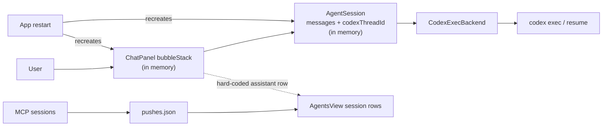
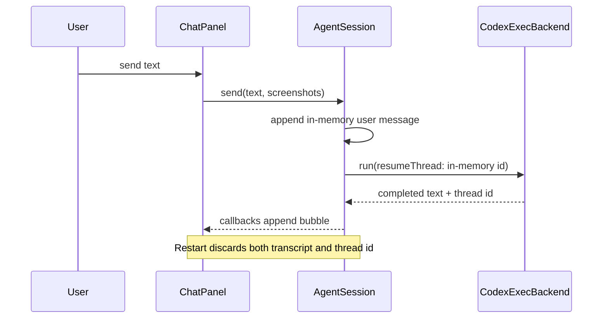
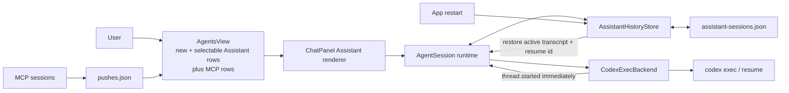
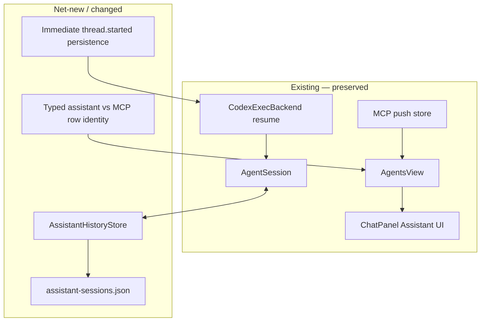

# Assistant Session History — Implementation Plan

## Target

**Change shape:** feature with a small persistence migration (empty in-memory state → versioned local store).

**Goal (inferred):** every in-app Assistant conversation is a durable, independently selectable session in the Agents tab; after an app restart, selecting it restores the exact visible transcript and the next message resumes the same Codex thread. The goal fails if a completed turn disappears, if two Assistant sessions share model context, or if selecting an MCP thread changes behavior.

**Blast radius:** 6 seams across 5 production modules plus focused tests:

1. Assistant persistence (`AssistantHistoryStore`, net-new).
2. Codex thread discovery (`CodexExecBackend.run`).
3. Runtime Assistant activation and message lifecycle (`AgentSession`).
4. Unified Agents-list row identity (`AgentsView` / `AgentsDataSource`).
5. Assistant transcript restoration and new-session action (`ChatPanel`).
6. App wiring and MCP-row preservation (`AppDelegate`).

### Architecture decision by elimination

Axes: source of truth (Voice Flow store / MCP pushes / Codex rollout files) × UI integration (separate Assistant surface / reuse MCP thread renderer) × session cardinality (one / many).

| Option | Result | Elimination |
|---|---|---|
| Do nothing / rely on current in-memory chat | Eliminated | **Goal-fit:** restart demonstrably recreates `AgentSession` and loses the only thread pointer and bubbles. |
| Persist only the latest `codexThreadId` | Eliminated | **Goal-fit:** it resumes one model thread but provides neither visible history nor selectable multiple sessions. |
| Treat Assistant messages as `SessionPush` records | Eliminated | **Hard constraint:** that model is one-way MCP pushes with optional attached answers and `seen/spoken/done`; Assistant chat is ordered user/assistant/note turns with a resumable model-thread identity. Forcing it into push semantics corrupts roles and lifecycle. |
| Reconstruct history from `~/.codex/sessions/*.jsonl` | Eliminated | **Risk:** rollout files are an implementation detail shared with unrelated Codex tasks; discovery by time/cwd can attach the wrong private thread and parsing changes outside Voice Flow's control. |
| Event-source every Assistant runtime event | Eliminated | **Simplicity:** replay adds machinery without a requirement that snapshots plus atomic writes cannot satisfy. |
| Versioned Voice Flow Assistant-session store, rendered by the existing Assistant surface and listed beside MCP sessions | **Survivor** | It preserves native user/assistant roles, uses the already-shipped Assistant renderer and Codex resume seam, keeps MCP lifecycle isolated, and is reversible by ignoring/removing one local JSON file. |

Order robustness: hard-constraint and goal-fit cuts leave the same survivor regardless of whether build cost, risk, or simplicity is considered next.

## Current

### Verified facts

- **VERIFIED** — `AgentSession` owns both API history and `codexThreadId` only in memory: `swift/Agent.swift:AgentSession@45-58` contains `private var messages` and `private var codexThreadId`.
- **VERIFIED** — the thread is assigned only after `codex.run` completes: `swift/Agent.swift:runCodexTurn@343-362` calls `run`, then sets `codexThreadId = result.threadId`.
- **VERIFIED** — the CLI already supports resuming: `swift/Codex.swift:CodexExecBackend.run@68-93` adds `exec resume <thread>` when `resumeThread` is present.
- **VERIFIED** — visible Assistant history is only AppKit views: `swift/Panel.swift:addUserMessage/beginAssistantMessage/finishAssistantMessage@171-203` appends labels to `bubbleStack`; no serialization occurs.
- **VERIFIED** — the Assistant is one hard-coded row, not a data-source session: `swift/AgentsView.swift:buildList@119-129` creates `assistant` before iterating MCP rows.
- **VERIFIED** — MCP rows read from `sessionPushes` and use push-specific actions: `swift/App.swift:agentSessionRows/agentThread/sendMessage@2889-2984`.
- **VERIFIED** — every launch creates a fresh runtime: `swift/App.swift:setupAgent@623` assigns a new `AgentSession`.
- **VERIFIED** — existing local stores use `Codable` plus atomic JSON replacement: `swift/App.swift:savePushes@105-108` and `swift/UI.swift:saveEntries@2157-2161`.

### Current component view



### Current touched flow



### Data-model inventory

| Model | Cardinality/key | Durable? | Fit for Assistant sessions? |
|---|---|---:|---|
| `AgentSession.messages` | one array per app runtime | No | Runtime API payload only; no stable session key. |
| `AgentSession.codexThreadId` | one optional value per runtime | No | Correct resume value, wrong lifetime/cardinality. |
| `ChatPanel.bubbleStack` | view list | No | Correct display, not a data model. |
| `[String: [SessionPush]]` | MCP session ID → pushes | Yes | Incompatible roles and lifecycle. |
| `messages.json` | flat MCP push archive | Yes | No conversation boundary or user turns. |

## Transformation

### Future data contract (NET-NEW: `swift/AssistantHistory.swift`)

`~/.config/voice-flow/assistant-sessions.json` is one atomically replaced JSON envelope:

```text
AssistantHistoryEnvelope {
  version: 1
  activeSessionId: UUID-string
  sessions: [AssistantConversation]
  legacyImportCompleted: Bool?              // one-time pre-store rollout bridge
}

AssistantConversation {
  id: UUID-string                         // unique primary identity
  codexThreadId: String?                  // absent until thread.started
  createdAt: Date
  updatedAt: Date
  title: String                           // first non-empty user text, compacted
  turnState: idle | running | interrupted
  messages: [AssistantHistoryMessage]
}

AssistantHistoryMessage {
  id: UUID
  at: Date
  role: user | assistant | note
  text: String
  attachmentNote: String?                 // absent when no attachment
}
```

Value semantics: store APIs return copies; callers cannot mutate shared arrays. Missing/corrupt files produce one new empty conversation and log the decode failure. On load, any `running` conversation becomes `interrupted` and receives one durable note; this transition is saved once. Writes are serialized by the store and use `.atomic`. No screenshot bytes are duplicated; Codex retains prior image context in its thread, while Voice Flow stores the same attachment description it currently displays.

### Per-part disposition

| Part | Disposition | Contract |
|---|---|---|
| `AssistantHistoryStore` | **NET-NEW** | Single writer for session metadata/messages; atomic durable snapshots; IDs never overlap MCP IDs because row kind is explicit. |
| `CodexExecBackend.run` | **REPLACE signature** | Add `onThreadStarted(String)`; fire exactly once when `thread.started` parses, before any agent text. Completion still returns `TurnResult`. |
| `AgentSession` | **REPLACE lifecycle** | Initialize from store; expose summaries/current transcript; `activate`/`create`/`delete`; persist user turn before launch, thread ID immediately, assistant result at completion, and terminal/interrupted state on every exit. Reject switching/deleting while running. |
| `AgentSession.messages` | **EXTEND use** | Rebuilt from the selected stored transcript for API fallback; notes excluded, attachment descriptions remain display-only. |
| `AgentSessionRow` | **REPLACE shape** | Add explicit `kind: assistant | mcp`; row IDs remain native IDs, avoiding prefix parsing. |
| `AgentsDataSource` / AppDelegate | **REPLACE contract** | Return a combined latest-first row list and route only MCP operations through push methods. Assistant selection bypasses MCP targeting. |
| `AgentsView` | **EXTEND** | A pinned “new assistant” action plus one waveform row per stored Assistant conversation; assistant rows call Assistant callbacks, MCP rows keep existing thread rendering/actions. |
| `ChatPanel` | **EXTEND** | Restore selected Assistant messages into `bubbleStack`; header shows the conversation title; clear starts a new Assistant session instead of destroying unrelated history. |
| MCP picker, push stacks, overlays, inbox | **UNCHANGED** | Assistant sessions are panel-local and never receive a ⌃⌥ number, overlay scope, or MCP inbox routing. |

Pattern: a small anti-corruption boundary keeps Assistant conversations out of `SessionPush`. Preconditions are distinct role/lifecycle models (verified above). Defeat condition: routing an Assistant row into `agentThread(for:)` or assigning it a picker number. Validation assertions below catch both.

### Future component view



### Delta overlay



## First slice

First instance: create Assistant session A, send one text turn, receive one response, restart the store/runtime, select A, and send a second turn using A's restored Codex thread ID.

Reusable core:

1. `AssistantHistoryStore` creates A and atomically persists it.
2. `AgentSession.send` appends the user display turn and marks A running before spawning Codex.
3. `thread.started` stores A's thread ID immediately.
4. completion appends exactly one assistant message and marks A idle.
5. a new runtime loads A, reconstructs display/API history, and supplies A's `codexThreadId` to `resume`.
6. AgentsView selects by typed row kind, never by parsing names or ID prefixes.

Per-instance fill-in: title/preview text and timestamps. Title derivation belongs in the store so every creation path behaves identically.

Not exercised by the first slice: deleting a non-active session, switching between two sessions, interrupted-turn recovery, API-key fallback, and preservation of MCP thread actions. Each receives an explicit validation below.

## Feasibility

| Seam | Falsifying observation sought | Result |
|---|---|---|
| Resume an arbitrary prior Codex thread | `CodexExecBackend` only supports a process-local continuation | Not found: it already constructs `codex exec resume <thread>` from a supplied string. |
| Capture a thread ID before completion | parser exposes only final text | Not found: `thread.started` is already parsed inside `processChunk`; adding a callback is local. |
| Repaint an Assistant transcript | bubbles cannot be removed/rebuilt | Not found: `clearConversation` already removes every arranged subview and the append methods accept display text. |
| Put Assistant rows in Agents list | list rows are hard-wired to MCP numbering | Not found: `makeRow` accepts any leading view/name/preview/time; only click routing is hard-coded and will be typed. |
| Durable local write | no established persistence convention | Not found: three stores already use Codable + atomic JSON replacement. |

No external service, secret, tenancy boundary, or network write is added. A one-time migration scans local Codex rollout files and imports only those whose first user message contains Voice Flow's explicit Assistant preamble; cwd and timestamps are never treated as identity. Storage volume is bounded by compact text; retain the newest 100 sessions and newest 200 display messages per session, pruning only after a successful replacement snapshot. Corrupt source data is never overwritten during the failing load; the app logs and starts an in-memory empty session until the next deliberate mutation.

## Coverage

Independent caller/import audit:

| Changed symbol/file | Importers/callers found | Plan coverage |
|---|---|---|
| `CodexExecBackend.run` | `AgentSession.runCodexTurn` only | Signature and immediate callback covered. |
| `AgentSession.reset/send/hasConversation` | `AppDelegate` setup, send paths, clear action | New/create/activate lifecycle and existing send paths covered. |
| `AgentSessionRow` | `AppDelegate.agentSessionRows`, `AgentsView` rendering | Typed row kind added at both declaration sites. |
| `AgentsDataSource` | `AppDelegate` conformance, `AgentsView` calls | Combined list plus unchanged MCP action methods covered. |
| `ChatPanel` Assistant methods | `AppDelegate` callbacks and `AgentsView.onOpenAssistant` | Restore/select/new callbacks covered. |

Highest-risk claim: persisting the ID at `thread.started` is early enough to resume after a restart. Verified because `CodexExecBackend.processChunk` observes that event directly from stdout before later `item.completed` events.

Out of scope: importing arbitrary Codex Desktop sessions that lack Voice Flow's explicit Assistant preamble. Heuristic discovery by timestamp or working directory could attach unrelated private threads and violates the identity invariant. Mobile Assistant-session sync is also out of scope; `SyncServer` currently handles its separate `mobile-chat.json` channel.

## Validation contract

1. **Store round trip (goal-direct).** New focused test: create A and B, append interleaved user/assistant messages, assign distinct thread IDs, reload from disk. Before: no store/API. After: two rows, exact ordered transcripts, distinct IDs, and the active ID survive.
2. **Restart interruption.** Persist A as `running`, reload. Expected: A is `interrupted`, its prior messages remain, and exactly one interruption note exists across repeated reloads.
3. **Immediate resume pointer.** Feed a synthetic `thread.started` before an unfinished turn (via an extracted event parser or injectable callback seam). Expected: store holds the ID without requiring `TurnResult` completion. Pre-change result: ID is assigned only after completion.
4. **Session isolation.** Activate A, append; activate B, append; return to A. Expected: transcripts and `codexThreadId`s never cross.
5. **UI row routing.** Assistant row selection invokes Assistant activation and never `onOpenSession`; MCP row selection preserves `onOpenSession` + MCP thread opening. “New assistant” creates a distinct ID.
6. **Delete/clear semantics.** Deleting A removes only A; clearing the visible Assistant creates a new session and preserves A in history. Deleting the final session creates one empty replacement so the Assistant always has a valid target.
7. **MCP regression.** Existing push rows retain number/ghost/completed state, replies still attach through `sendMessage(toSession:)`, and Assistant rows never get picker numbers.
8. **Build contract.** `swiftc swift/*.swift ... -o /tmp/vf` succeeds; existing capture-routing, display-context, window-placement, clipboard, and hotkey-precedence harnesses still pass.
9. **Persistence failure.** Point the store at an unwritable path. Mutation remains available in memory, logs the failure, and does not crash or truncate an existing file.
10. **Legacy recovery.** Give the store a rollout containing Voice Flow's preamble, one user turn, streamed agent pieces, and a task completion. Expected: one resumable session imports once, preamble text is stripped, streamed pieces form one visible reply, and empty scaffold drafts disappear.

Rollback is reversible: stop reading/writing `assistant-sessions.json` and restore the hard-coded Assistant row. The new file is additive; no existing persistent format is modified.

## Open questions

None blocking. Conservative defaults chosen: Assistant histories are panel-only (no pill numbering), title from the first user turn, latest-active first, explicit “new assistant” row, 100-session/200-message retention, and clear means “start fresh while preserving history.”

## Assumptions

- **INFERRED:** “pick Assistant sessions” means multiple local Assistant conversations, not adding the single Assistant to the MCP ⌃⌥ picker. This preserves the documented rule that picker numbers identify MCP routing targets.
- **INFERRED:** prior screenshot pixels need not be duplicated into the history store; the displayed attachment note and Codex's resumed context are sufficient. A future attachment browser can add durable paths as a separate feature.

## Diagram verification

**RENDER NOT PERFORMED:** no Mermaid renderer is installed in the workspace. Sources were linted manually: all node IDs are unique within diagrams, every edge lands on a declared node/participant, current and future node sets are both represented in the delta, and each edge maps to a verified or net-new seam above.
