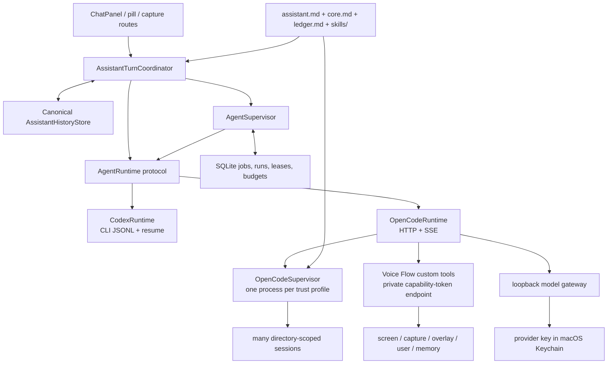
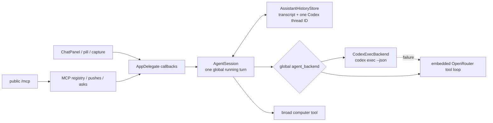
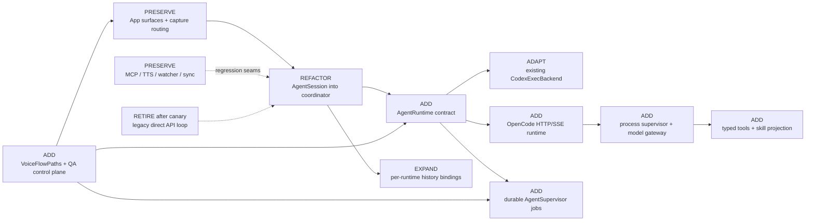

# Voice Flow dual-runtime agent harness

Status: implemented and release-validated in the workspace on 2026-08-02<br>
Decision: keep Codex CLI, add OpenCode, and allow a runtime choice per Assistant conversation<br>
Primary invariant: Voice Flow owns durable truth; runtimes are disposable execution engines

## Implementation outcome

The target architecture in this document is implemented. Codex remains a
first-class selectable runtime; pinned OpenCode 1.17.11 is bundled, supervised,
and selectable per conversation or automation. Voice Flow owns canonical
history, runtime bindings, prompts, skills, memory, custom tools, permissions,
model credentials and budgets, durable jobs, triggers, concurrency, recovery,
and user-facing status.

Release evidence:

- 139 capabilities across 17 areas are mapped one-to-one to 139 registered
  checks; all 15 public MCP tools are covered.
- Unit, contract, production/QA compile, pinned-manifest, live model-gateway,
  private tool-server, real OpenCode, real Codex, and shared canary gates pass.
- The signed desktop harness passes 21 high-level gates covering physical
  hotkeys, captures, runtime switching/reseed, tools, skills, memory,
  permissions, failure recovery, triggers, sync, TTS, public MCP, concurrency,
  budgets, visual states, secret containment, relaunch, persistence, and
  cleanup.
- Four-hour release evidence totals 14,466.58 seconds. The current full-depth
  segment completed 1,689 jobs on each of three independent lanes, with 1,623
  three-way-overlap samples (96.09%), bounded RSS (184,368–224,272 KiB),
  descriptors (106–114), and subprocesses (1–2).
- Six real UI screenshots were inspected for clipping, overlap, unreadable
  content, control loss, and panel geometry. Deliberately oversized synthetic
  job names use the intended ellipsis; no accidental visual defect remains.
- Desktop QA ignores all untagged physical keyboard input and hides its panel
  during unattended work, so validation does not consume the user's keyboard
  or intercept normal clicks.

Release installation is intentionally not performed by the harness. This Mac
currently has no valid codesigning identity, so replacing the daily-use app
with an ad-hoc build would reset macOS TCC grants. The isolated QA app is
ad-hoc signed and verified; install the production bundle only after a stable
Developer ID identity is available (or after the user explicitly accepts the
permission reset).

## Target

Voice Flow becomes the agent harness. It continues to support the existing Codex CLI path and adds a pinned, locally supervised OpenCode server. A conversation may use either runtime and can switch between them without losing its canonical transcript, assistant identity, skills, memory, or Voice Flow permissions.

The target is deliberately not “embed OpenCode as the app.” It is:

- one Voice Flow `AssistantTurnCoordinator` that accepts a typed turn and emits one normalized event stream;
- two adapters, `CodexRuntime` and `OpenCodeRuntime`, behind one `AgentRuntime` protocol;
- one canonical conversation/history store in Voice Flow, with independent synchronization bindings for each runtime;
- Voice Flow-owned tools, skills, memory, permission policy, provider credentials, schedules, budgets, and background-run state;
- a supervised OpenCode process shared by sessions in the same trust profile, with directory and session isolation;
- a Voice Flow supervisor for multiple foreground/background agents, rather than relying on a runtime's experimental subagent/background behavior;
- an autonomous validation harness that drives the signed macOS app, its hotkeys, UI, runtimes, model calls, tools, files, and failure modes in an isolated test home.

### User-visible result

Settings chooses the default runtime for new conversations. Each Assistant conversation also gets a compact runtime selector, `Codex ▾` or `OpenCode ▾`; its choice persists and is disabled while that conversation is running. Switching is allowed between turns. The existing transcript remains continuous even if the backing runtime session must be rebuilt.

Codex remains a first-class path and rollback escape hatch. OpenCode is initially opt-in. The old direct OpenRouter loop remains hidden behind a rollback flag for one release, then is removed after the OpenCode release gate passes.

### Target architecture



## Current

### Runtime and turn ownership

`AgentSession` currently owns UI callbacks, transient API-format messages, one running task, the current conversation, computer control, and a concrete `CodexExecBackend` (`swift/Agent.swift:AgentSession@34-62`). The runtime is chosen from one global string at send time (`swift/Agent.swift:send@273-332`), and `runLoop` hard-codes “Codex first, direct API fallback” (`swift/Agent.swift:runLoop@360-365`).

> `private let codex = CodexExecBackend()`
> `private var codexThreadId: String?`
> — `swift/Agent.swift:AgentSession@57-62`

The Codex adapter is already a useful seam: it discovers the CLI, starts `codex exec --json`, attaches screenshots, resumes a thread ID, applies a workspace-write sandbox, enables network, and explicitly neutralizes user MCP configuration (`swift/Codex.swift:CodexExecBackend.run@71-113`). Codex's official non-interactive contract supplies JSONL lifecycle events and `codex exec resume <SESSION_ID>`: [OpenAI Codex non-interactive mode](https://learn.chatgpt.com/docs/non-interactive-mode).

### Durable conversation truth

`AssistantHistoryStore` is already documented as the durable source of truth and atomically serializes value snapshots (`swift/AssistantHistory.swift:AssistantHistoryStore@81-109`). Each message already has a stable UUID; each conversation has one `codexThreadId`, title, turn state, messages, and unread reply state (`swift/AssistantHistory.swift:AssistantConversation@20-79`).

> `/// The durable source of truth for in-app Assistant conversations.`
> — `swift/AssistantHistory.swift:AssistantHistoryStore@89-90`

This is the correct owner to preserve. The missing concept is a per-runtime synchronization binding, not a second transcript.

### Assistant identity and memory

An assistant is already a canonical folder containing `assistant.md`, `memory/core.md`, `memory/ledger.md`, and `workspace/` (`swift/Assistants.swift:AssistantDefinition@1-37`). `core.md` is bounded and injected on every turn (`swift/Agent.swift:assistantMemoryBlock@131-136`); the persona and folder contract are currently assembled into the model prompt (`swift/Agent.swift:assistantPersonaBlock@113-128`).

> `// An assistant IS its folder under ~/.config/voice-flow/assistants/<slug>/`
> — `swift/Assistants.swift@4-14`

The folder remains canonical. OpenCode gets a generated projection of selected skills and a bounded memory snapshot; it does not become the owner of either.

### Tools and interaction surfaces

The in-app direct API loop has one broad `computer` tool in `AgentSession`, while Voice Flow's external MCP server exposes 15 named tools through `AppDelegate.handleMCPTool` (`swift/App.swift:dispatchMCPTool@3005-3027`; `swift/MCP.swift:tool definitions@362-696`). Public MCP sessions have deliberate product semantics: engagement creates picker identity, pushes, asks, unread state, and overlay ownership. An embedded OpenCode session must not accidentally enter that external session registry.

Capture routing is already capability-first and freezes a route, display, paste target, and UUID before asynchronous work begins (`swift/CaptureRouting.swift:CaptureRun@80-121`; `swift/CaptureRouting.swift:CaptureRouter@123-150`). That contract should remain above the new runtime seam.

The loopback server already includes a development endpoint specifically so an agent can open the panel for screenshot validation (`swift/TTS.swift:LocalAPIServer@1312-1345,1467-1503`). The autonomous QA control plane extends this established seam behind a compile-time flag rather than introducing production automation access.

### Current architecture



### Constraints preserved through the change

- Native AppKit and current pill/ChatPanel behavior remain the primary surface.
- Dictation, frozen capture routing, FLORA continuity, MCP session identity, TTS, overlays, watcher, and sync do not move under either runtime.
- Provider API keys remain in Keychain, never in generated config or logs.
- Public `/mcp` keeps its existing semantics and remains separate from embedded-runtime tool calls.
- Minimal production blast radius: isolate the new runtime plumbing instead of rewriting capture, TTS, watcher, sync, or MCP registries.

## Decision and elimination trail

The decision was evaluated from the hard requirements: two switchable runtimes, skills, memory, first-party tools, external MCP, image input, long-lived multi-agent operation, crash recovery, security, and a clean Mac distribution story.

| Decision | Candidates considered | Elimination | Survivor |
|---|---|---|---|
| Runtime integration | spawn `opencode run`; ACP; JS SDK in a sidecar; HTTP server + generated SDK shapes | Per-turn CLI wastes startup/session control; ACP adds another evolving protocol and incomplete Voice Flow-specific identity; a Node sidecar adds a second supervisor and deployment surface | OpenCode `serve` over loopback HTTP/SSE, wrapped in native Swift. Its official server exposes health, sessions, events, messages, abort, permissions, and directory scoping: [server](https://opencode.ai/docs/server/), [SDK](https://opencode.ai/docs/sdk/) |
| Process topology | process per turn; process per agent; one global process; one per trust profile | Per-turn loses warm state; per-agent multiplies memory/ports/processes; one global process crosses permission domains | One supervised process per trust profile, many directory-scoped sessions |
| First-party tools | public Voice Flow MCP; one giant custom tool; several custom tools; fork OpenCode | Public MCP would create user-visible MCP sessions; one giant schema is ambiguous; a fork creates permanent maintenance risk | Five narrow OpenCode custom tools calling a private Voice Flow endpoint; external services remain MCP |
| Screenshot result | base64 in custom result; custom attachment; private MCP screenshot; save path then built-in `read` | Large base64 pollutes context; current custom-tool registry does not propagate image attachments; private MCP duplicates identity/config | `voiceflow_computer` returns bounded geometry + absolute image path; its tool result directs the model to OpenCode's built-in `read`, which supplies the image attachment. Contract-test this pinned behavior against the [custom-tool registry](https://github.com/anomalyco/opencode/blob/dev/packages/opencode/src/tool/registry.ts) |
| Memory owner | runtime session only; OpenCode global instructions; a new vector database; Voice Flow folder | Runtime-only memory is lost on switch; global instructions cross assistants; vector storage is not required for current durable facts | Existing `core.md` and `ledger.md`, bounded and injected/projected by Voice Flow |
| Skills owner | runtime-global skills; duplicate Codex/OpenCode trees; Voice Flow folder projected to runtime | Global discovery leaks skills across assistants; duplicates drift | `assistants/<slug>/skills/<name>/SKILL.md` is canonical; generated `.opencode/skills` contains only the allowlist. OpenCode supports agent/project skill discovery and permission controls: [skills](https://opencode.ai/docs/skills/) |
| Provider credentials | put long-lived key in config; pass key as process env; let OpenCode auth persist it; loopback gateway | Config/persisted auth violates Keychain invariant; process env can leak to shell/MCP children | Voice Flow model gateway injects the Keychain credential and gives OpenCode only a revocable process capability token |
| Multi-agent owner | OpenCode `task`; one always-running model per agent; Voice Flow event/job supervisor | Runtime subagents make recursion, budgets, and durability opaque; idle model calls waste money and cannot survive restart cleanly | Voice Flow SQLite queue + leases + bounded workers; OpenCode `task` denied initially |
| Switch semantics | reuse stale runtime session; replay full transcript each turn; branch transcript per runtime; canonical transcript + dirty cursor | Stale resume omits turns from the other runtime; full replay grows without bound; branched transcripts create conflicting truth | Per-runtime binding with a clean/dirty synchronization cursor and bounded handoff reseed |

OpenCode configuration is merged across sources, so isolation is explicit rather than assumed: start with `--pure`, a generated highest-priority `OPENCODE_CONFIG_CONTENT`, selected providers only, `share: disabled`, explicit permission rules, skill allowlisting, disabled unselected MCP entries, auto-update disabled, and dedicated `XDG_CONFIG_HOME`, `XDG_DATA_HOME`, `XDG_CACHE_HOME`, and `XDG_STATE_HOME`. Relevant contracts: [configuration](https://opencode.ai/docs/config/), [permissions](https://opencode.ai/docs/permissions), [providers](https://opencode.ai/docs/providers/), [CLI](https://opencode.ai/docs/cli/).

## Transformation

### 1. Extract a runtime-neutral turn coordinator

Add `swift/AgentRuntime.swift`:

```swift
enum AgentRuntimeKind: String, Codable { case codex, opencode }

struct AgentTurnRequest {
    let turnID: UUID
    let conversationID: String
    let assistant: AssistantDefinition?
    let priorMessages: [AssistantHistoryMessage]
    let prompt: String
    let screenshots: [Data]
    let workingDirectory: URL
    let trustProfile: AgentTrustProfile
    let model: AgentModelSelection?
}

enum AgentRuntimeEvent {
    case started(externalSessionID: String)
    case activity(String)
    case textDelta(partID: String, delta: String)
    case permission(AgentPermissionRequest)
    case usage(AgentUsage)
    case completed(text: String)
    case failed(AgentRuntimeFailure)
    case interrupted
}

protocol AgentRuntime: AnyObject {
    var kind: AgentRuntimeKind { get }
    var capabilities: AgentRuntimeCapabilities { get }
    func status() async -> AgentRuntimeStatus
    func run(_ request: AgentTurnRequest,
             binding: RuntimeBinding?,
             emit: @escaping (AgentRuntimeEvent) -> Void) async throws -> AgentTurnResult
    func cancel(turnID: UUID) async
}
```

Refactor `AgentSession` into `AssistantTurnCoordinator` without changing its externally observed callbacks in the first phase. It owns canonical history, UI event reduction, persona/memory composition, binding state, and runtime selection. `CodexRuntime` wraps the present `CodexExecBackend`; the direct API loop is separated into a temporary `LegacyAPIRuntime` rollback adapter.

Only the coordinator may append canonical user/assistant messages. Adapters return events/results; they never write `assistant-sessions.json` or UI state.

### 2. Add safe per-runtime synchronization bindings

Extend `AssistantConversation` with optional fields while retaining the version-1 envelope for one rollback window:

```swift
struct RuntimeBinding: Codable, Equatable {
    var externalSessionID: String?
    var syncedThroughMessageID: UUID?
    var generation: Int
    var state: SyncState       // clean | dirty
    var runtimeVersion: String?
    var lastUsedAt: Date?
}

var preferredRuntime: AgentRuntimeKind?
var runtimeBindings: [AgentRuntimeKind: RuntimeBinding]?
// Keep codexThreadId mirrored during expand/contract rollout.
```

Turn-start transaction, before appending the new prompt:

1. Read the canonical last context message ID.
2. Resume only if the selected runtime binding is `clean` and `syncedThroughMessageID` equals that ID.
3. Otherwise create a fresh external session and seed it with a bounded handoff snapshot through that prior message. Send the current user prompt once, separately.
4. Atomically append the user message, set the selected binding `dirty`, and persist before starting the runtime.
5. On one authoritative final, append one assistant message and atomically set the binding `clean` through that new message ID.
6. On interrupt, process loss, malformed stream, timeout, or app crash, leave the binding dirty. The next turn reseeds instead of resuming uncertain state.

The handoff contains assistant identity, current memory snapshot, a structured summary, and the bounded recent transcript with stable message IDs. It is generated only for dirty/stale sessions, never added as a user-visible message.

Migration: a legacy `codexThreadId` becomes a dirty Codex binding. The first upgraded Codex turn safely reseeds from canonical history because earlier direct-API fallbacks may have made the external Codex thread stale. The old field remains mirrored so the previous app can still read the transcript after rollback. Remove it only in the later contraction release.

### 3. Implement and supervise OpenCode

Add `swift/OpenCodeRuntime.swift` and `swift/OpenCodeSupervisor.swift`.

`OpenCodeSupervisor`:

- resolves the exact bundled binary first and an installed binary only in developer mode;
- verifies the exact supported version and SHA-256 before start;
- allocates an ephemeral loopback port and random Basic-auth password;
- uses a separate generated runtime root per trust profile;
- launches `opencode --pure serve`, with auto-update and sharing disabled;
- polls `GET /global/health`, records stderr to a redacted rotating log, and applies capped exponential restart backoff;
- owns process-group termination so cancel/app quit does not leave children;
- reports `starting`, `healthy`, `degraded`, `crashed`, `versionMismatch`, and `stopped` states to Settings and the coordinator.

`OpenCodeRuntime`:

- scopes every request with the exact assistant working directory;
- creates or resumes `/session` according to the binding contract;
- subscribes to `/event` before posting the message;
- posts synchronous `/session/:id/message` while consuming SSE concurrently;
- filters events by exact directory and session ID;
- reduces `message.part.updated` deltas by part ID, ignores duplicates, logs unknown event kinds, and treats the POST response as the authoritative final;
- reconciles message/status state after an SSE reconnect;
- forwards permission requests to Voice Flow and calls the permission response endpoint only after policy/user resolution;
- calls `/session/:id/abort` on stop, then marks the binding dirty;
- handles 401, 404, 409, 429, timeouts, truncated SSE, and server death as typed failures, never as an empty successful reply.

The local feasibility probe on 2026-08-02 used installed OpenCode 1.17.11 with isolated XDG roots and `--pure`: unauthenticated health returned 401, authenticated health returned `{"healthy":true,"version":"1.17.11"}`, a directory-scoped session was created for this repository, and the server shut down cleanly. This validates the transport/process shape, not the eventual pinned version or model path.

Distribution: add `runtime/opencode/versions.json` with exact version, macOS architecture asset URL, and SHA-256; add a deterministic fetch/verify script; copy the verified arm64/x64 binary into the app Resources during `install.sh`. Disable runtime self-update. Official artifacts come from [OpenCode releases](https://github.com/anomalyco/opencode/releases).

### 4. Keep provider credentials behind Voice Flow

Add a private OpenAI-compatible streaming gateway to the loopback server:

- OpenCode is configured with `baseURL = http://127.0.0.1:<port>/internal/model/v1` and a random capability token.
- Voice Flow reads the long-lived OpenRouter credential from Keychain, injects it upstream, and never returns/logs it.
- The capability is scoped to one OpenCode process/trust profile, rotated on every launch, checked in constant time, and rejected outside loopback.
- The gateway enforces provider/model allowlists, max request body, max output, concurrency, per-run timeout, and configurable per-day budget before forwarding.
- Streaming cancellation propagates both directions; status/usage is reported to `AgentSupervisor`.
- Shell and external MCP children receive a sanitized allowlisted environment without the gateway token or unrelated app secrets.

This gateway is part of the first production slice, not postponed until after shell/tool access. A developer-only spike may pass the key in an environment variable only when shell, task, external MCP, and web execution are all denied and auth persistence is disabled.

### 5. Define tools at the correct boundary

Canonical first-party tools are OpenCode TypeScript custom tools generated into the isolated config directory. They call a compile-time-private route such as `/internal/agent-tools/call` with a short-lived capability and get their OpenCode `sessionID`, `messageID`, `directory`, and `worktree` from the custom-tool context. Voice Flow maps the runtime session to an exact conversation, assistant, trust profile, and active run.

| Tool | Responsibility | Hard boundaries |
|---|---|---|
| `voiceflow_computer` | screenshot, cursor position, click, move, type, key press, scroll | strict action enum; control denied unless profile permits; screenshot returns fixed geometry and path, then explicitly instructs `read` |
| `voiceflow_context` | latest/list captures, bounded recent dictations, capture metadata | pagination and byte/item caps; no arbitrary filesystem reads |
| `voiceflow_overlay` | show/update/remove/list guide, panel, annotations | runtime session stamped by Voice Flow; no cross-session ownership |
| `voiceflow_user` | report, check, and bounded wait for user input for unattended runs | exactly one conversation/run identity; no public MCP registry entry; max wait/response size |
| `voiceflow_memory` | read core/ledger and apply atomic bounded updates | assistant folder only; no secrets; size/revision precondition; returns new revision |

Every definition contains the complete “new-hire” contract: when to use it, when not to, argument units/coordinate system, side effects, permission behavior, exact error recovery, and result limits. Mechanics live here, not in the system prompt. Tool results return semantic IDs and concise summaries by default, with bounded detailed modes.

External integrations remain MCP. Voice Flow generates a deny-by-default MCP list for each trust profile and enables only user-selected servers. The public Voice Flow `/mcp` endpoint is never included in embedded OpenCode config, preventing false picker sessions and duplicated push/inbox ownership.

Initial OpenCode permissions:

- `task`: deny;
- shell/bash: ask or deny by trust profile, never global allow;
- filesystem writes: assistant folder and explicit task roots only;
- external directories, destructive commands, secrets, and network escalation: ask/deny;
- skills: deny all, then allow canonical selected skill names;
- external MCP: deny all, then allow selected server/tool pairs;
- first-party Voice Flow tools: profile-specific allow/ask policy.

### 6. Compose prompts, memory, and skills without duplication

Prompt layers:

1. Voice Flow system prompt: role, goal, hard safety/product constraints, judgment, and output contract only.
2. `assistant.md`: the user-authored persona and assistant-specific operating instructions.
3. `memory/core.md`: a bounded current durable-memory snapshot on every turn.
4. Handoff snapshot: only when a dirty/stale runtime binding is reseeded.
5. User task: only the current request and attachments.
6. Tool definitions: all mechanics and argument/result contracts.

Remove current tool mechanics from `assistantPersonaBlock` as each purpose-built tool becomes available. Keep durable memory policy at the system/assistant boundary, while the actual update mechanics live in `voiceflow_memory`.

Add `skills/` to each assistant folder. Validate each `SKILL.md`, normalize canonical names, and generate only selected skills into `.opencode/skills/`. Record a projection manifest `{skill, sourceDigest, projectedPath}` and rebuild atomically when files change. Never scan global `.claude`, `.agents`, or user OpenCode skills into an assistant implicitly.

Codex gets the same selected skill content through a bounded generated skills section until a stable CLI-level per-turn projection is available. This makes “has skill X” a Voice Flow capability, not an OpenCode-only accident.

### 7. Add durable multiple-agent scheduling

Add `swift/AgentSupervisor.swift` and `swift/AgentJobStore.swift`. `AgentSupervisor` is an actor that owns foreground and unattended run admission. Background agents are durable jobs that wake on a trigger; they are not permanently open model calls.

Use SQLite in WAL mode at `~/.config/voice-flow/agent-jobs.sqlite`:

- `agent_jobs`: assistant, conversation, runtime, trigger, prompt template, trust profile, state, next run, concurrency key, daily budget, max duration, attempts;
- `agent_runs`: turn, external session, state, lease owner/expiry, heartbeat, timestamps, usage, error, result message ID;
- `processed_events`: `(source,event_id)` primary key for exactly-once trigger intake.

Defaults: global concurrency 3; OpenCode trust-profile cap 3; Codex cap 2; one active run per conversation/concurrency key. Queued jobs use fair ordering, bounded retries with jitter, leases and heartbeats, and explicit budget/runtime limits. Expired leases become interrupted and are retried only when policy permits. A denied budget or permission creates a visible Voice Flow push; it is not silently retried.

Initial triggers are manual, interval/schedule, Voice Flow inbox/capture, and watcher event. External events enter through typed adapters with idempotency IDs. Do not expose arbitrary cron shell commands. The menu-bar app resumes the queue on launch; add a separate LaunchAgent only if observed uptime later proves necessary.

### 8. Add isolated paths and an autonomous QA control plane

Introduce `VoiceFlowPaths`, injected at app composition, because current stores hard-code `~/.config/voice-flow` across history, assistants, captures, overlays, inbox, watcher, sync, messages, and settings. Production defaults remain byte-for-byte equivalent. Tests pass a temporary root, so autonomous runs cannot alter real history, memory, messages, dictations, pushes, captures, or jobs.

Behind `#if VOICE_FLOW_QA`, extend `LocalAPIServer` with random-token, loopback-only `/__qa/*` endpoints:

- get a sanitized state snapshot and capability catalog;
- create/select/delete a conversation and assistant;
- choose Codex/OpenCode and trust profile;
- submit text/screenshots, await normalized events, interrupt, and approve/deny permission;
- inject fake runtime events and provider failures;
- kill/restart OpenCode and trigger/inspect jobs;
- open a specific panel/pill/settings state and request a screenshot.

The QA API is absent from release builds, refuses missing/wrong tokens, binds only to loopback, uses an isolated root, and cannot return secrets. Physical UI tests still use macOS Accessibility/CGEvent for hotkeys, clicks, typing, focus changes, Escape, and TTS barge-in; the QA API supplies deterministic setup and observability, not a substitute for using the real computer.

### Structural delta



## First vertical slice

Build one complete, production-shaped slice before broad tools or scheduling:

1. Add `VoiceFlowPaths`, the runtime protocol, coordinator, and version-1 optional binding migration.
2. Wrap the existing Codex backend with no behavior change and prove all current Assistant tests still pass.
3. Bundle/supervise one pinned OpenCode binary with isolated config, health/auth/version checks, and clean termination.
4. Add the loopback model gateway; run one OpenCode text turn through the existing Assistant panel and store one authoritative final.
5. Add image input and the `voiceflow_computer` screenshot → built-in `read` path; prove the model reports a deterministic visual marker.
6. Switch that same conversation OpenCode → Codex → OpenCode. Prove both stale bindings reseed from canonical history, the visible transcript contains each user/assistant message exactly once, and each final marks only its own binding clean.
7. Kill OpenCode mid-stream, restart it, and prove the binding remains dirty, the partial text is not committed as a final, and the next turn recovers through a fresh handoff.
8. Expose the per-conversation selector only after this slice passes fake-runtime contracts, real-runtime smoke, and signed-app screenshot verification.

This slice exercises the hardest reusable seams: process supervision, streaming, credentials, attachments, canonical history, switching, crash recovery, and actual UI reduction. Subsequent tools and background jobs reuse the same request/event/binding contracts.

## Feasibility walkthrough

For an OpenCode screenshot turn:

1. Existing `AppDelegate.sendToAgent` captures an optional current screen and invokes the coordinator (`swift/App.swift:sendToAgent@1879-1897`).
2. The coordinator snapshots prior canonical history, resolves the conversation's preferred runtime, checks the OpenCode binding cursor, and persists `dirty` with the new user message.
3. The supervisor confirms a healthy, authenticated process for the trust profile. A stale/missing binding causes a new directory-scoped OpenCode session plus bounded handoff; a clean exact cursor resumes.
4. `OpenCodeRuntime` subscribes to SSE, posts the message with image file parts, and normalizes text/tool/status events for the existing AppDelegate callbacks.
5. If the model requests a fresh screenshot, `voiceflow_computer` sends its exact OpenCode context and capability token to Voice Flow. Voice Flow validates conversation/run/profile, uses `ScreenCapture`, saves a bounded image in the isolated capture root, and returns path + coordinate geometry. The tool result directs OpenCode to call built-in `read` on that path.
6. The model gateway forwards the request with the Keychain-held provider credential while enforcing model, concurrency, size, time, and budget limits.
7. The POST final is reconciled with SSE output, emitted once, appended once to canonical history, and the OpenCode binding is atomically advanced to that assistant message UUID and marked clean.
8. The existing ChatPanel/pill/TTS callbacks receive the same normalized activity/start/delta/done lifecycle they receive today.

No unresolved dependency blocks this flow. Swift already has `URLSession`, process control, local sockets, and SQLite3 available; OpenCode exposes the required health/session/message/event/abort endpoints. The only version-sensitive behavior—the exact event schema, custom-tool registry, image-read bridge, and configuration precedence—is pinned and contract-tested before every binary upgrade.

## Coverage map

### Planned production blast radius

Existing files expected to change: `Agent.swift`, `Codex.swift`, `AssistantHistory.swift`, `Assistants.swift`, `Core.swift`, `Settings.swift`, `Panel.swift`, `App.swift`, `TTS.swift`, and `install.sh`. New isolated modules: `AgentRuntime.swift`, `OpenCodeRuntime.swift`, `OpenCodeSupervisor.swift`, `AgentTools.swift`, `AgentSupervisor.swift`, `AgentJobStore.swift`, `VoiceFlowPaths.swift`, and `QAControl.swift`, plus runtime manifests/scripts and tests.

`MCP.swift`, `CaptureRouting.swift`, watcher, overlay, sync, and TTS engine behavior should remain unchanged; they receive regression coverage because they share AppDelegate, local-server, path, hotkey, or presentation seams.

### Capability ledger

The implementation adds a machine-readable `tests/capabilities.json`. Every public hotkey, panel command, setting, runtime feature, tool, and job trigger has a stable ID, owner, risk, and at least one test ID. CI compares source catalogs and UI action registries with this ledger; adding or renaming a capability without coverage fails the build.

| IDs | Existing/new capability inventory | Autonomous evidence |
|---|---|---|
| `BLD-01..04` | deterministic Swift compile; install/sign; launch/relaunch; stable config migration | build runner, signature check, process launch, isolated-store diff |
| `DIC-01..09` | hold Dictate; double-press Inbox; Dictate+snapshot; continuous+deduped frames; annotation/Escape; longest-match hotkey precedence; frozen route; UUID correlation; paste fallback | synthetic audio/backend fixtures + real CGEvent hotkeys + focus changes + screenshot/files/clipboard assertions |
| `AST-01..09` | assistant create/select/delete; persistent restore; FLORA wake reuse/new/failure fallback; unread/seen; image turn; stop; error/note | store unit tests, fake runtime, real UI and runtime E2E |
| `RUN-01..12` | Codex discovery/auth/new/resume/image/interrupt; OpenCode discovery/version/auth/session/stream/image/abort/restart; per-conversation selection; cross-runtime reseed | fake CLI/server contracts plus low-cost live smoke on the pinned binaries |
| `MEM-01..05` | persona composition; bounded core injection; atomic memory update; ledger; no secrets/size cap | prompt snapshots, revision races, filesystem boundary and redaction tests |
| `SKL-01..05` | skill validation; allowlist; atomic projection; Codex/OpenCode parity; deny unselected/global skills | temp assistant folders, manifest digest checks, runtime tool/skill listing and behavior prompt |
| `TOL-01..10` | computer screenshot/read/cursor/control; context capture/dictations; overlay CRUD; user report/check/wait; memory CRUD; malformed args; cross-session denial; result caps; token expiry/replay; audit trail | schema snapshots, private endpoint contracts, actual screen/control E2E in disposable apps, security/fuzz tests |
| `MCP-01..15` | `set_session_name`, `report_to_user`, `check_messages`, `wait_for_message`, `get_latest_capture`, `list_captures`, `take_screenshot`, `show_guide`, `update_guide`, `show_panel`, `annotate_screen`, `clear_annotations`, `remove_overlay`, `list_overlays`, `get_recent_dictations` | one contract test per tool plus session engagement/isolation/UI regression |
| `PIL-01..09` | pill/flash/picker/grown; sticky slots; unread ring; ghost pushes; stack persistence; double-select speech; close/keep; trash/delete; background receipt | QA state setup + physical selection/click + screenshot/OCR + persistence assertions |
| `TTS-01..08` | pasted speech; voice/preset/speed; play/pause/seek; live reply chunks; speaker; no autoplay; barge-in; Escape panic | fake audio sink state + physical hotkey/barge-in + UI screenshot; no audible-output assertion alone |
| `OVR-01..05` | guide/panel/annotation files; polling; session scope; user close; coordinate mapping | temp filesystem edits + screenshot pixel/geometry comparison |
| `CAP-01..04` | capture bundle contents; frame dedupe; pruning; recent/list retrieval | deterministic image fixtures and isolated directory assertions |
| `WAT-01..07` | watcher active/idle/lock; metadata/frame dedupe; camera path; retention; review trigger; ledger threshold; menu/status | clock/input/app metadata fakes, short live capture, fixture-based review; never record real archive in QA |
| `SYN-01..04` | pairing consent; phone dictation ingest; dedupe/upsert; disconnected recovery | loopback client fixture and isolated history; no external device required for CI |
| `JOB-01..12` | manual/interval/inbox/capture/watcher triggers; fair concurrency; per-key exclusion; leases/heartbeat; crash recovery; retry; idempotency; cancel; budget; max runtime; visible blocked result | virtual clock + SQLite tests, fake runtimes, real three-agent concurrency/soak |
| `SEC-01..12` | loopback only; Basic auth; capability scoping; token rotation/replay; Keychain boundary; config isolation; env sanitization; path traversal; permission allow/ask/deny; MCP allowlist; log redaction; QA endpoints absent in release | socket/auth/process-env/filesystem attacks, release-symbol scan, log secret canaries |
| `UI-01..08` | Settings default; conversation selector; disabled-during-run; runtime health; permission prompt; job status; migration presentation; accessibility labels/keyboard | signed-app automation, AX tree assertions, screenshot review at compact laptop dimensions |

The ledger is complete only when every row expands to individual named entries in `tests/capabilities.json`; ranges here are the planning index, not permission to collapse several behaviors into one vague test.

## Autonomous validation contract

### Test environment and authority boundary

The runner uses the actual Mac and signed Voice Flow build wherever OS behavior matters:

- install the QA build under a distinct app name/bundle suffix but sign with the same stable identity, preserving reusable TCC grants;
- point all Voice Flow and OpenCode state to a fresh `mktemp -d` root through `VoiceFlowPaths` and the four XDG variables;
- use local fake Codex/OpenCode/provider/MCP services for deterministic contracts, then run a bounded live smoke against the actual pinned Codex and OpenCode binaries;
- drive global hotkeys, clicks, typing, focus changes, scrolling, Escape, and permission choices with Accessibility and CGEvent;
- capture the screen through Voice Flow/ScreenCaptureKit and inspect actual pixels, OCR text, bounds, focus, accessibility labels, filesystem state, process state, HTTP/SSE events, SQLite rows, and logs;
- use deterministic audio/image fixtures for recognition and screen-difference cases, while separately exercising real microphone/screen permissions once;
- never mutate the user's production `~/.config/voice-flow`, assistant memory, messages, dictations, pushes, captures, or jobs;
- never send external messages, purchase, delete external data, or grant a new macOS permission autonomously. TCC prompts, provider login, and billing consent are the only expected human checkpoints; the harness detects and reports them once.

### Validation layers

1. **Static and source inventory.** Compile, schema validation, `git diff --check`, forbidden-secret/log scans, release-build QA-symbol absence, runtime manifest checksum, and capability-ledger completeness.
2. **Pure unit tests.** Runtime binding/migration/cursor state machine; event reducer/deduplication; prompt layers; permission resolution; path containment; gateway limits; scheduler leases/idempotency/budgets.
3. **Contract doubles.** A fake Codex JSONL binary; fake OpenCode HTTP/SSE server; fake OpenAI-compatible upstream; fake MCP servers; custom-tool schema snapshot from `/experimental/tool`. Every protocol error is reproducible without spending model tokens.
4. **Real runtime smoke.** On this Mac, start the exact bundled OpenCode and installed/supported Codex. Verify auth, health, new/resume, text, image, custom tool, selected skill, permission deny/allow, cancel, server restart, and no orphan children. Use one low-cost deterministic model case and record version/model/usage.
5. **Signed-app end to end.** Launch the isolated build; use the QA API only for setup/observation; physically exercise the UI and hotkeys; compare canonical history, UI stream, screenshot, clipboard, overlays, audio state, and runtime traces.
6. **Failure injection.** Kill OpenCode mid-token and mid-tool; truncate/duplicate/reorder SSE; return 401/404/409/429/500; stall provider; deny permission; replay an expired tool token; corrupt binding/DB rows; make paths unwritable; restart the app during a dirty turn; disconnect/reconnect SSE.
7. **Concurrency and soak.** Run at least three agents across foreground/background queues for two hours in presubmit-nightly and four hours before release. Assert concurrency caps, fair admission, per-conversation exclusion, budgets, heartbeats, bounded CPU/RSS/file descriptors, no orphan processes, no cross-conversation text/tool leakage, and eventual idle state.
8. **Visual verification.** Screenshot every changed UI state—Codex/OpenCode selector, runtime starting/error, permission ask, background job queued/running/blocked, interrupted/recovered—at the real panel size and a small-laptop visible frame. Inspect images, not only accessibility labels.
9. **Canary and rollback.** Ship OpenCode default-off. Run the same local evaluation tasks through Codex and OpenCode, compare completion/tool/cost/error metrics, then enable per conversation. At any failure, stop OpenCode, choose Codex, and verify the next turn reseeds from canonical history with no transcript loss.

### Executable assertions

The implementation is not accepted by “the tests ran.” It is accepted only when these pre/postconditions are machine-checked:

| Assertion | Precondition | Action | Required postcondition |
|---|---|---|---|
| `BIND-SWITCH-01` | Conversation ends on Codex message UUID `M3`; OpenCode cursor is `M1/clean` | select OpenCode, send `M4` | fresh OpenCode session; handoff ends at `M3`; `M4` sent once; one assistant `M5`; OpenCode cursor `M5/clean`; Codex cursor unchanged |
| `BIND-DIRTY-02` | OpenCode turn persisted user `M6` and binding dirty | kill server before final; relaunch and send `M7` | no assistant final for failed run; new session/handoff includes `M6`; no duplicate `M6`; completion advances only new binding |
| `STREAM-ONCE-01` | fake SSE duplicates and reorders part deltas; POST returns authoritative final | run turn | UI may stream provisional text; canonical store appends exactly one byte-for-byte authoritative final |
| `IMG-READ-01` | screen contains generated nonce marker and known rectangle | request fresh screenshot tool | path is within capture root; dimensions/coordinates match; `read` receives image; model returns nonce; no base64 blob enters tool text result |
| `TOOL-ISO-01` | sessions A/B and token for A exist | call A tool with B IDs/path or replay expired token | 403 typed error; no UI/file/control side effect; security audit row records denial without secret |
| `PERM-01` | shell policy `ask`, no decision | request command | execution is suspended; user deny causes no child; allow-once runs exactly once and is not persisted as always-allow |
| `JOB-LEASE-01` | one due job, two workers | race acquisition | one run row owns one lease; exactly one prompt; second worker observes non-runnable state |
| `JOB-CRASH-01` | leased run heartbeat stops | expire virtual clock and restart app | run becomes interrupted; retry policy schedules at most one replacement; processed event remains idempotent |
| `SECRET-01` | Keychain contains unique canary key | text/tool/shell/error/crash flows | canary absent from config, SQLite, generated skills, process-child env, screenshots, and all logs |
| `REG-MCP-01` | public MCP session registry empty | embedded OpenCode uses every first-party Voice Flow tool | MCP registry/picker remains empty; embedded tool events map only to Assistant conversation |
| `REG-CAPTURE-01` | snapshot capture begins with app A focused, then focus/picker changes to B | release/complete transcription | frozen `CaptureRun` route and paste target A receive exactly one result; runtime refactor does not reroute it |
| `UI-SWITCH-01` | Assistant panel open and idle | switch Codex→OpenCode using actual selector | persisted preference changes; badge/status visible; selected conversation unchanged; screenshot matches approved geometry |
| `REL-QA-01` | release configuration | build and inspect binary/routes | no `/__qa/` route, QA token, or mutation handler is present; production root remains default |

The repository gets one deterministic entry point, `scripts/test-agent-harness.sh`, which selects the same Xcode SDK logic as `install.sh`, sets temporary Swift/Clang module caches, runs Swift and Python tests with explicit interpreters, then runs fake/live/E2E tiers according to flags. This fixes two current baseline inconsistencies observed during planning: the advertised `xcrun --show-sdk-path` can select the Command Line Tools SDK while the app needs the Xcode SDK, and `uv run pytest` currently selects an environment without the repo's NumPy/test combination.

Baseline evidence captured before implementation:

- full `swift/*.swift` compile succeeded using the Xcode macOS SDK and isolated module caches;
- `./.venv/bin/python tests/test_backend_protocol.py -q` passed all 5 tests;
- the live no-model OpenCode auth/health/session probe passed as described above;
- no production file was changed by the probe.

## Delivery phases and gates

### Phase 0 — deterministic harness and storage isolation

Add `VoiceFlowPaths`, deterministic test script, QA-only control plane, capability ledger, fake runtime/provider servers, and current-regression tests. Gate: all current high-risk capabilities in the ledger have a passing baseline or a documented hardware/manual checkpoint.

### Phase 1 — runtime extraction with Codex parity

Add the protocol/coordinator and wrap Codex without changing product behavior. Add optional history fields and migration. Gate: Codex new/resume/image/interrupt and all Assistant/pill/history tests are behaviorally identical; rollback build reads the expanded file.

### Phase 2 — OpenCode walking skeleton

Bundle/supervise the pinned binary, add isolated config, gateway, HTTP/SSE adapter, selector, and first vertical slice. Gate: all eight slice checks pass with fake and live runtimes; OpenCode remains default-off.

### Phase 3 — first-party tools, skills, memory, permissions

Add the five tool families, canonical skill projection, memory revisions, permission UX, external MCP allowlist, and audit trail. Gate: schema snapshots, every `TOL`, `MEM`, `SKL`, `SEC`, and `MCP` isolation test passes; screenshot/read behavior is re-proven against the exact pin.

### Phase 4 — multiple and continuous agents

Add SQLite jobs/runs/events, supervisor, triggers, budgets, leases, job UI/status, and `voiceflow_user` background interaction. Gate: scheduler model tests, process kill/restart, three-agent concurrency, two-hour soak, no orphan/cross-session leakage.

### Phase 5 — canary, hardening, contraction

Opt selected conversations into OpenCode, compare eval/error/cost/latency, run four-hour release soak, and practice one-click Codex rollback. After one stable release, remove `LegacyAPIRuntime` and legacy `codexThreadId`; keep the runtime protocol and Codex adapter permanently.

## Cutover and rollback

Feature flags are independent: `opencodeRuntime`, `agentTools`, `agentJobs`, and `modelGateway`. OpenCode starts only when a conversation/job selects it. Codex remains selectable throughout all phases.

Rollback procedure:

1. Stop admission of new OpenCode turns/jobs and cancel/lease-expire running ones.
2. Terminate supervised OpenCode process groups and revoke capability/gateway tokens.
3. Set affected conversations to Codex. Their Codex bindings are dirty/stale by construction if OpenCode added messages, so the next turn creates a fresh Codex session from canonical history.
4. Keep `assistant-sessions.json`, assistant folders, and `agent-jobs.sqlite`; do not convert or delete transcript/memory/job data.
5. A previous app version can read the version-1 envelope and mirrored `codexThreadId`. Optional new fields are ignored. Background jobs remain inert data until the new build returns.

No destructive migration runs during the canary. Contraction happens only after rollback has been rehearsed against a copy of real-shaped history.

## Open questions

These are implementation-time measurements, not architecture blockers:

- Which exact OpenCode release becomes the first pin? Choose the newest release that passes the complete contract suite, not simply the newest tag.
- Which provider/model becomes the default OpenCode pair? Keep it configurable; qualify image/tool/stream behavior and record cost/latency before defaulting.
- Should a power user enable project-local OpenCode instructions/plugins? Default is no. If later exposed, it must be an explicit trust-profile capability with a visible warning and separate tests.
- Is a separate LaunchAgent needed for scheduled agents? Defer until uptime telemetry shows the menu-bar app misses meaningful schedules.
- What is the right default daily budget? Start conservative and user-configurable after real usage measurements.

## Assumptions

- Voice Flow continues to be a personal macOS app installed by `install.sh`, not an App Store-sandboxed binary.
- The user will complete one-time macOS Screen Recording/Accessibility/Microphone permission grants and authenticate Codex/OpenRouter when required; automation cannot lawfully bypass those dialogs.
- OpenCode's HTTP server and custom-tool APIs remain versioned external dependencies; exact pins and upgrade contracts are mandatory.
- A single user may run several assistants concurrently, but the initial safe default is three total model turns, not unbounded fan-out.
- Existing Voice Flow MCP clients and capture semantics are compatibility contracts and must not be repurposed for embedded runtime identity.
