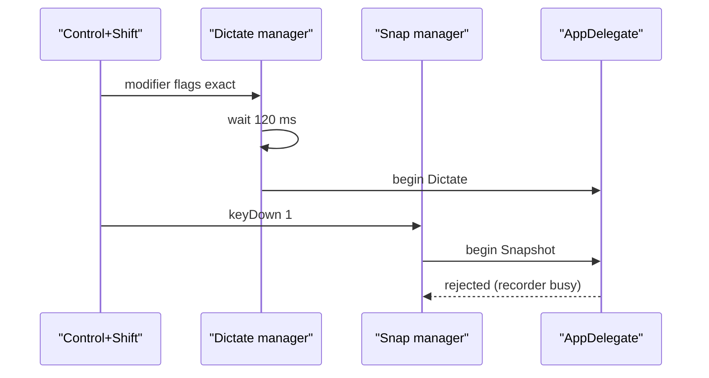
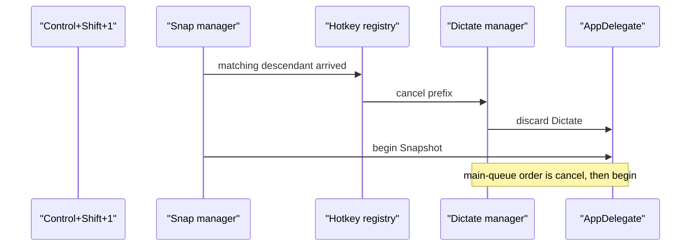

# Overlapping hotkey precedence

## Target

When a modifier-only hotkey is the prefix of another configured hotkey, the longer chord wins whenever its final key arrives while the prefix remains held. Example: Dictate = `Control+Shift`; Dictate + Snap = `Control+Shift+1`.

The observable contract is: pressing and holding `Control+Shift`, then pressing `1` at any later time, starts only Dictate + Snap. Releasing the keys must not subsequently stop or restart a different capture.

## Current

Verified blast radius: two runtime seams in two modules, plus one new pure precedence test.

- `swift/Core.swift:HotkeyManager.handleEvent` independently handles each manager's event tap. Modifier-only activation is delayed by `chordResolutionDelay = 0.12`, but a regular `keyDown` is ignored by a modifier-only manager.
- `swift/Core.swift:HotkeyManager.shouldDelayModifierActivation` detects configured descendants, but only decides whether to apply that fixed delay.
- `swift/App.swift:AppDelegate.beginCapture` rejects a second capture while `recorder.isRecording`, so a late `1` cannot replace Dictate with Dictate + Snap.
- `swift/Core.swift:AudioRecorder.stop` always drains and returns recorded audio; there is no discard path for a superseded prefix.

## Decision by elimination

| Option | Verdict | Grounded reason |
|---|---|---|
| Do nothing / document “press quickly” | Eliminated — goal-fit | Timing skill cannot guarantee chord behavior. |
| Increase the delay | Eliminated — goal-fit | Every finite delay still fails for a slower roll and adds Dictate latency. |
| Trigger modifier-only Dictate only on release | Eliminated — hard constraint | Hold-to-dictate must record while the keys are held. |
| Allow two simultaneous capture runs | Eliminated — risk | The app intentionally owns one microphone recorder and one active run; concurrent runs multiply routing and teardown races. |
| Longest-match supersession | Survivor | Reuses the configured-manager registry, preserves immediate Dictate, and deterministically transfers ownership when the longer chord becomes known. |

## Transformation

1. Add a pure `HotkeyPrecedence` comparison over two `HotkeySpec` values. A descendant must contain every effective modifier of a modifier-only ancestor and add either a regular key or another modifier.
2. Before a matching descendant calls `onPress`, synchronously cancel every currently pending/pressed modifier-only ancestor on the hotkey tap thread.
3. Add `HotkeyManager.onCancel`. Pending prefixes cancel silently; an already-active prefix invokes `onCancel` before the descendant's `onPress` is enqueued, preserving main-queue ordering.
4. Add `AudioRecorder.cancel()` to invalidate the current generation, stop the session, clear drain state, and discard audio. Bind incoming buffers to the active `AVCaptureAudioDataOutput` identity so a late callback from the cancelled session cannot contaminate its replacement.
5. Add `AppDelegate.cancelCaptureForHotkeySupersession()` to clear partial UI/timers, discard the active non-continuous run, and restore idle state. Wire it to Dictate and snapshot managers.

## Coverage and edge cases

- Regular-key descendants (`Control+Shift+1`) and modifier descendants (`Control+Shift+Option`) use the same comparison.
- An unrelated chord does not cancel Dictate.
- Exact duplicate modifier-only bindings do not supersede one another; they remain a settings conflict outside this change.
- Releasing the cancelled prefix is inert because its `pressed` state is cleared on the tap thread.
- Late audio buffers from a cancelled prefix are rejected unless their output identity matches the replacement capture.
- Continuous capture is not cancelled by this mechanism; only the manager whose held prefix is superseded invokes its own cancellation callback.

## Validation contract

- Pure test: `Control+Shift+1` supersedes modifier-only `Control+Shift`.
- Pure test: `Control+Option+1` does not supersede `Control+Shift`.
- Pure test: an exact duplicate modifier-only binding is not a descendant.
- Runtime ordering: ancestor cancellation is queued before descendant press from the same key event.
- Full Swift app compiles.
- Existing capture-routing, display-context, placement, clipboard, and backend tests remain green.
- The signed application is reinstalled and launched for manual hotkey QA.

## Assumptions

- Inferred: the reported Dictate binding is represented as a modifier key plus the other modifier in `HotkeySpec.modifiers`, matching the existing settings recorder model.
- Mermaid render not performed; source was linted for complete participants and backed edges.
