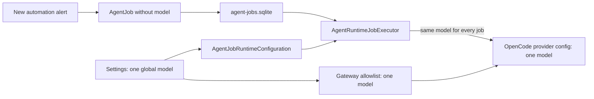
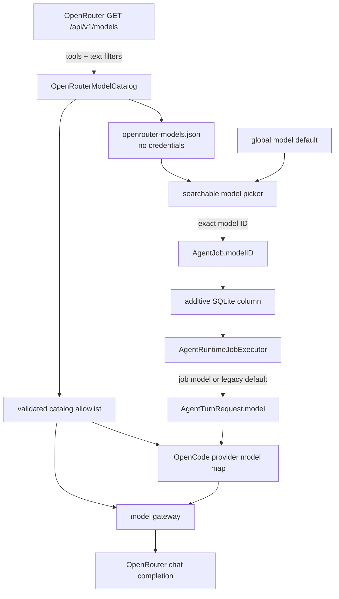
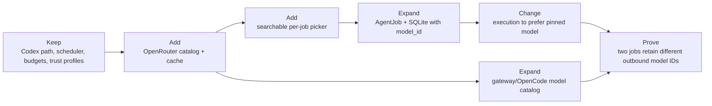

# OpenRouter model picker for OpenCode automations

## Outcome

Each OpenCode automation pins an exact OpenRouter model ID when it is created. The picker is populated from OpenRouter's current model API, limited to text-output models that support tools, and remains usable with a cached catalog or a manually typed model while offline. The global Assistant model becomes the default for new OpenCode automations; changing it later does not rewrite existing jobs. Codex automations keep Codex-managed model selection.

Primary sources: [OpenRouter models API](https://openrouter.ai/docs/api/api-reference/models/get-models), [OpenRouter model metadata](https://openrouter.ai/docs/guides/overview/models), and [OpenCode provider configuration](https://opencode.ai/docs/providers).

## First-principles decision

### Goal and constraints

- Different scheduled agents must be able to run different models concurrently.
- A job must run the same model after relaunch and after the global default changes.
- The catalog must normally be current, but job creation cannot become network-dependent.
- Only tool-capable, text-output models belong in an agent picker.
- OpenRouter credentials remain in Keychain and never enter OpenCode configuration, SQLite, or catalog cache files.
- Existing jobs and databases must migrate without data loss.
- Voice Flow remains the owner of scheduling, model choice, permissions, budget, and audit state.

### Option space and elimination

| Axis | Options considered | Elimination |
|---|---|---|
| Discovery | hard-coded list; OpenCode's Models.dev list; live OpenRouter only; live + local cache + manual fallback | Hard-coded and Models.dev can lag the actual provider. Live-only breaks offline creation. **Survivor: OpenRouter live list with cache and manual fallback.** |
| Selection lifetime | one global model; per conversation; per execution; per durable job | Global cannot represent heterogeneous use cases. Per execution makes scheduled behavior drift. Per conversation couples unrelated automations. **Survivor: exact ID persisted on each job, seeded from the global default.** |
| OpenCode topology | restart one shared server on every choice; one process per model; allow arbitrary model IDs; one process per trust profile configured with the validated catalog | Restarting interrupts work. Per-model processes multiply idle state and memory. Arbitrary IDs weaken the gateway boundary. **Survivor: existing per-trust-profile process, configured from the validated catalog.** |
| Filtering | all models; image-only; tool-capable text models; curated favorites only | All/image-only models can fail the harness contract. Favorites alone go stale. **Survivor: `supported_parameters=tools` and text output, with image capability shown as metadata.** |

The decision is reversible: `model_id` is an additive nullable column. A null legacy value resolves through the existing global default; removing the feature therefore requires no destructive migration.

## Current system

Verified seams:

- `AppDelegate.createAgentJob` currently presents prompt, runtime, trigger, interval, and budget only.
- `AgentJob` and `agent_jobs` have no model field.
- `AgentRuntimeJobExecutor` reads `AgentJobRuntimeConfiguration.shared.model()` at execution time.
- `setupCore` and `OpenCodeSupervisor` configure the gateway and private OpenCode provider with only `UserSettings.agentModel`.

## Target system

### Structural delta

## Vertical slice and file transformation

1. Add `swift/OpenRouterModels.swift` with a small Codable metadata model, API decoder, tool/text filtering, stable sorting, cache age, and a thread-safe catalog service. Fetch `GET <base>/models?supported_parameters=tools&output_modalities=text&sort=most-popular`; on failure return the last valid cache plus the configured default/manual ID.
2. Add a searchable editable `NSComboBox` to `AppDelegate.createAgentJob`. It shows human names and exact IDs, selects the global default initially, disables model choice when Codex is chosen, and persists the chosen ID only for OpenCode.
3. Add nullable `modelID` to `AgentJob` and append nullable `model_id` to `agent_jobs`. Preserve existing positional columns and migrate with `ALTER TABLE`; legacy null values keep the current default behavior.
4. Resolve `job.modelID ?? globalDefault` inside `AgentRuntimeJobExecutor`. Surface the pinned model in the Agents list/detail and QA JSON.
5. Build the private OpenCode provider map and gateway allowlist from the cached validated catalog plus the global default and all persisted job IDs. This preserves one OpenCode server per trust profile while allowing concurrent jobs to choose distinct models.
6. Extend the fake provider with a models response and request-model evidence. Add catalog, migration, persistence, execution, and signed-app QA assertions.

## Validation contract

| ID | Assertion | Evidence |
|---|---|---|
| MOD-01 | A successful OpenRouter response produces only unique tool-capable text-output models and preserves name, context, modalities, and pricing metadata. | deterministic catalog unit fixture |
| MOD-02 | Network/API failure returns cached models; no cache returns the configured/manual default without losing the ability to create a job. | offline/corrupt-cache unit cases |
| MOD-03 | The cache contains no API key or authorization header. | canary scan |
| JOB-15 | A new OpenCode job persists its exact model; changing the global default does not mutate it after reopen. | SQLite round-trip and migration tests |
| JOB-16 | A legacy job with null `model_id` uses the current global default. | legacy-schema migration fixture |
| RUN-15 | Two eligible OpenCode jobs with distinct `modelID` values produce distinct `AgentTurnRequest.model` values without changing Codex jobs. | executor/runtime contract |
| SEC-14 | The gateway rejects IDs outside catalog/default/persisted job allowlist and accepts pinned IDs. | gateway tests |
| UI-09 | The new-automation surface exposes runtime-aware, searchable model choice with accessibility labels and displays the pinned model afterward. | AX/QA state plus screenshot inspection |
| E2E-11 | A signed isolated app creates, relaunches, and runs jobs pinned to two different fake-provider model IDs; request evidence matches each job. | desktop harness |

Release gate: compile the release and QA variants, run the complete unit/live registry, run the focused signed-app flow, inspect the picker screenshot for clipping/focus problems, and scan generated configuration/log/database artifacts for the canary key. Existing dictation, MCP, pill, TTS, watcher, and Codex paths must remain green.

**Rendered and verified:** `design/openrouter-automation-model-picker-plan.html` was rendered at 1440×3600 and inspected in `design/openrouter-automation-model-picker-plan.png`. All three diagrams rendered, every edge lands on a declared node, current/target/delta remain visually distinct, and no label clips or overlaps.

**Implemented and verified:** the 144-capability signed-app E2E gate passed all 22 high-level checks, including distinct concurrent outbound model IDs, relaunch persistence, credential canary containment, and Codex rollback. The focused signed visual retest then verified the final dark dropdown rendering in `design/openrouter-automation-model-picker-ui.png`; prompt, runtime, resolved model, context/pricing metadata, trigger, interval, budget, and live-catalog status are all visible without clipping.
