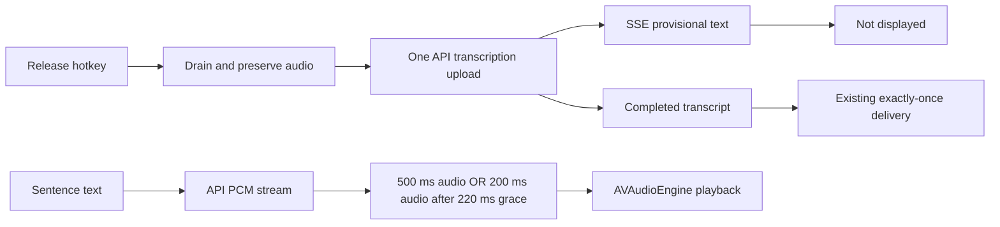

# API speech performance review

**User feedback update:** The brief pre-paste transcript preview was removed. In daily use it appeared too late to be useful and flashed before final paste. SSE and final-only delivery remain; deltas no longer create a visible surface. First-text timings below are historical API measurements, not a claim that the current UI exposes useful text earlier. The measurements retain the original experiment for audit.

The original experiment streamed final-dictation text into a provisional preview. The current build starts TTS with a measured startup policy, and frames subprocess messages correctly even when reads split inside a Unicode character. Final paste and capture delivery still use the completed transcript and frozen capture ID. Models, vocabulary hints, wake-name preservation, trailing-silence trimming, and saved-audio recovery are retained.

## What actually runs

**STT:** hotkey release → recorder drain (up to 200 ms) → conservative silence trim → save recovery WAV → base64 PCM over the Python pipe → OpenAI `gpt-4o-mini-transcribe` → final result → correlated delivery. The old backend waited for a complete JSON response. The backend requests SSE and commits only `transcript.text.done`. Provisional deltas are not displayed; completed text goes directly through the existing paste or conversation delivery path. An interrupted SSE stream clears its provisional text and retries the same saved audio; an incomplete stream cannot become a successful final transcript.

**Important audit correction:** `startPartialTranscriptionTimer()` has no active caller. The old 1.5-second whole-recording preview path is dormant. The bounded two-worker refactor protects that path, but its queue benchmark is **not a claim about today's normal dictation latency**. The active-path improvement is streaming the completed recording's response. Audio is still uploaded after release, once per final request (except bounded retries).

**TTS:** the normal read-aloud entry point is `speakTextThroughPlayer` → `SpeechSentencer` → `beginQueuedSpeech`, making sentence requests sequentially while audio plays ahead. Agent replies feed sentences as text arrives. Each request already uses OpenAI 24 kHz PCM, scheduled into AVAudioEngine in 200 ms buffers. The old startup required 500 ms of received audio. The alternate direct `speak(request:)` path also supports whole-request disk caching and large-input splitting; its ~3,900-character split is not the main player's normal path. Optional heavy assistant-text cleanup is an additional pre-speech request, outside this startup measurement.



## Measured evidence

The JSON files in `evidence/` retain individual measurements, including the rejected experiment. These are small samples from this machine on 2026-09-05, not population p95 estimates. First API text is not identical to physical display latency; the current app logs release-to-terminal time. The removed preview previously logged release-to-preview, which did not establish that users had enough time to read it. AVAudioEngine's playing callback is not microphone-measured acoustic onset.

| Test | Before | After | What it establishes |
| --- | ---: | ---: | --- |
| Live API first text, 3 alternating pairs, same synthetic English audio | 1,601 ms median | 944 ms median | 658 ms / 41% earlier API text; preview was subsequently removed after user feedback |
| Live API complete transcript, same pairs | 1,601 ms median | 1,448 ms median | Final completion did not regress in this small sample; do not infer a guaranteed provider speedup |
| Real Swift TTS controller + URLSession + AVAudioEngine, 5 controlled HTTP streams | 709 ms median | 419 ms median | Reproducible application startup improvement with identical provider timing |
| Replay of 5 identical live TTS byte-arrival traces | 500 ms audio threshold | Guarded startup | 134 ms median earlier eligible start; no predicted starvation with a 20 ms tolerance |
| Dormant preview backlog stress: five 400 ms previews then a 120 ms final | 2,076 ms median | 130 ms median | Final runs independently; only one pending preview is kept; not a normal-path speed claim |

The live STT fixture is 43.6 seconds of synthesized English, with 105 reference words before spoken numbers are normalized. Inspect `live-stt.json` for exact audio duration, all six output transcripts, and timings. All six retain the final code `7429`. After punctuation/name/number normalization, both modes have the same 1.98% mean word error rate: two of three requests in each mode render "final checks pass" as "final check is passed"; one in each mode matches exactly. These are not six verbatim matches. "Voice Flow" vs "Voiceflow" normalization also remains. This does not establish accuracy for Bulgarian, accents, noisy microphones, or real user recordings. The API model and prompt are unchanged.

The live TTS fixture was generated five times and one output was transcribed back through the production STT client; its final code was preserved. No personal recordings, API keys, or credentials are stored in these artifacts.

### The buffer change that failed

A naive 120 ms startup looked 354 ms faster in median byte-arrival timing. But every live response began with approximately 200 ms of audio followed by a 250–393 ms delivery gap. Starting immediately would run out of audio. `live-api.json` retains that failed candidate's predicted starvation counts.

The chosen policy starts when either 500 ms is available, or at least 200 ms is available and 220 ms have elapsed since the first PCM byte. The original fast full-buffer path remains. A completed short response flushes and plays immediately; previously a sub-threshold response could sit scheduled without starting. This is a measured compromise, not a guarantee against arbitrary future network stalls. Pause, stop, and replacement cancel the delayed start. Per-playback generations reject stale buffer completions after pause/reset.

## Options and decision trail

Goal: earlier useful text and continuous speech, with measured improvement, no local inference, no lost final words, and no speculative paste. Axes considered: when audio is uploaded; whether text/audio responses stream; who schedules requests; startup buffer policy; model/provider; connection lifetime; cache/preprocessing placement. Client, server, broker/proxy, push/pull, full replacement, and reuse of existing seams were considered. There is no need for another service or credential boundary to solve the measured local delays.

| Approach | Decision and primary reason |
| --- | --- |
| Do nothing | **Goal-fit:** misses measured first-text/startup delays and the fragmented-pipe correctness bug. |
| Completed-file STT with streamed response | **Selected:** reuses the same model, upload, prompt, retry path, and final-delivery contract; live first-text gain is measured. |
| Full realtime STT audio upload during recording | **Deferred, risk:** likely the largest remaining release-to-final opportunity, but requires connection ownership, explicit commit/cancel, reconnection, final-word and multilingual accuracy evidence. It is not disproven or dominated; it needs its own quality evaluation. |
| Enable repeated whole-recording previews | **Cost:** increases API uploads and retranscribes earlier speech. Leave dormant; bound/coalesce its backend requests if used later. |
| Paste unfinished transcript and fix it later | **Risk:** can corrupt text after focus or user edits; retain final-only paste. The provisional preview was subsequently rejected by the user as too brief to help. |
| Local STT/TTS/cleanup inference | **Hard constraint:** retired by the user. Default MLX dependencies removed; legacy local setting migrates to OpenAI. |
| Faster provider/model, e.g. ElevenLabs Flash or another STT service | **Risk:** provider latency claims do not prove the user's vocabulary, languages, or voice quality. Keep current models; evaluate on a real multilingual corpus before switching. |
| Smaller unguarded TTS buffer | **Goal-fit:** failed continuity on all five live traces. Rejected despite better start timing. |
| Guarded TTS startup and complete short-stream flush | **Selected:** measurable earlier start with continuous replay on collected traces, plus actual-engine regression checks. |
| TTS concurrent next-sentence prefetch / persistent connections | **Deferred, cost:** useful for inter-sentence gaps but adds cancellation/skip/speed-change state. No gap baseline here justifies increasing parallel requests. |
| PCM vs compressed audio | **Already selected:** PCM already avoids decode delay; switching formats does not remove the measured startup wait. |
| More caching / speculative speech generation | **Cost:** the main sentence player has no reusable whole-queue cache, and speculation can spend tokens on speech never played. Needs repeat-read measurements. |
| Skip optional speech cleanup | **Risk:** may speak code/URLs or degrade comprehension. Existing deterministic sanitizer and optional cleanup remain. |
| Dedicated proxy/relay | **Simplicity:** adds a service/network hop without fixing these client-side delays. |

The transport and buffer decisions survive either elimination order. Full realtime STT and provider swaps remain unmeasured alternatives rather than being dismissed as inherently worse.

## What users expect, and source limits

Provider documentation supports measuring the whole path, especially player buffering, rather than quoting server inference time. ElevenLabs explicitly describes the startup-versus-stutter tradeoff. [ElevenLabs latency guide](https://elevenlabs.io/docs/eleven-api/concepts/latency)

OpenAI documents completed-file SSE separately from ongoing realtime audio. File SSE exposes incremental text and a final completion event. PCM is a raw 24 kHz, 16-bit format already used by Voice Flow. [File transcription](https://developers.openai.com/api/docs/guides/speech-to-text), [Speech generation](https://developers.openai.com/api/docs/guides/text-to-speech)

Wispr markets clear writing across apps; its support guidance treats long processing and recoverable audio as user-facing issues. This supports fast usable output and recovery as product requirements, not raw words-per-minute alone. [Wispr Flow](https://wisprflow.ai/), [Processing errors and recovery](https://docs.wisprflow.ai/articles/4984532368-fix-taking-longer-than-usual-and-transcription-errors)

One public user discussion praises contextual accuracy and complains about lost accuracy at dictation beginnings. This is anecdotal evidence, not a representative survey, but reinforces preserving words while tuning speed. [User accuracy discussion](https://www.reddit.com/r/WisprFlow/comments/1uff6n5/accuracy_degradation_over_the_past_couple_of_days/)

## Reproduce and validate

```bash
./scripts/test-speech.sh
.venv/bin/python tests/speech_performance/benchmark.py --regressions --output /tmp/speech-after.json
PYTHONPATH=. .venv/bin/python tests/speech_performance/live_api.py --output /tmp/live-tts.json
PYTHONPATH=. .venv/bin/python tests/speech_performance/live_stt.py --output /tmp/live-stt.json
.venv/bin/python tests/speech_performance/replay.py /tmp/live-tts.json --output /tmp/buffer-replay.json
```

The two live scripts make billed API calls with synthetic fixtures and read the existing key into memory from Keychain. For the baseline, use `--root` with a checkout at the commit in `evidence/baseline-commit.txt`; omit `--regressions`, because short-stream/cancellation assertions intentionally target repaired behavior. The benchmark uses actual app sources, compiled with QA key/URL injection and an isolated config directory. Silent HTTP PCM avoids speaking over the user. Baseline and new controller timings exclude app launch, as the controller is created before its request clock starts.

Correctness coverage includes final/preview correlation, bounded preview work, full final FIFO preservation, overload errors, identical-audio retries after a dropped HTTP connection, SSE reset after disconnect, final-only commit, Unicode framing at every byte split, prompt-echo rejection, short and oddly fragmented PCM, malformed PCM, HTTP errors, pause during startup, cancel before startup, replacement, audio-recorder drain preservation, speed persistence, and speech sanitization. Check `regression-tests.log` and `after.json` for executed results.

Production `app.log` records `speech stt` queue/service and terminal timings, and `speech tts` first-PCM/playback-start timings. The new timing events contain IDs and durations, not transcript content. Existing unrelated transcript logging is unchanged.

The API-only dependency sync reduced this workspace’s virtual environment from 542.5 MiB to 26.6 MiB (515.8 MiB removed); this is a disk/dependency improvement, not an inference-latency claim. See `venv-before-kib.txt`, `venv-after-kib.txt`, and `dependency-sync.log`.

The signed build was installed and relaunched successfully. The API endpoint is healthy, TTS is idle, and the packaged Python files match the measured source. `evidence/provenance.json` records source hashes, the installed binary hash, and signature verification. The focused regression gate passed; the unrelated full agent/release soak was not run.
