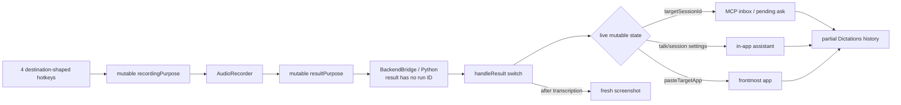
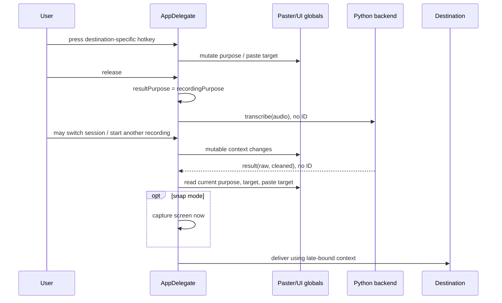
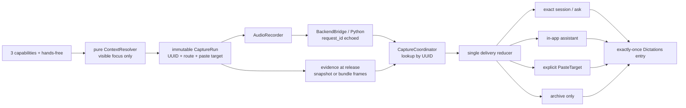
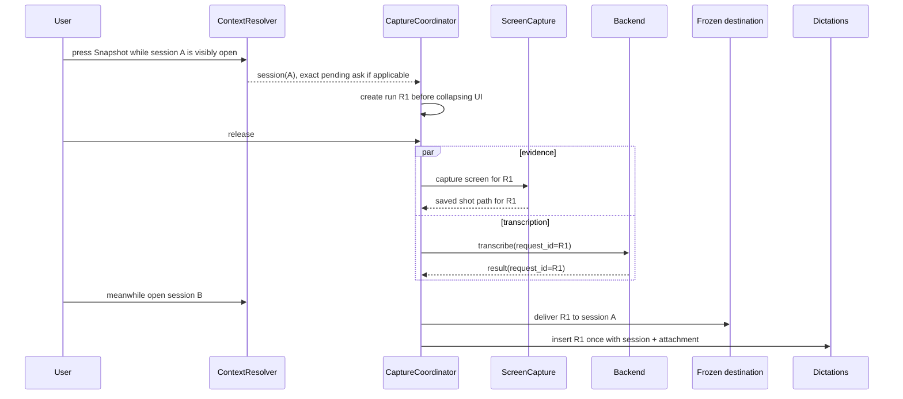

# Ticket #22 — capability-first capture routing

Status: implementation plan (no production code changed)

## Verdict

Replace destination-shaped recording modes with three user capabilities—**dictate**, **dictate + snapshot**, and **continuous dictate + snapshots**—plus the intentionally separate **hands-free archive**. Resolve the visible conversation context once, when the hotkey starts, and carry it in an immutable, UUID-addressed `CaptureRun` through audio stop, screenshot capture, transcription, delivery, and history.

Do not use `targetSessionId`, panel visibility, `pendingInteraction`, `recordingPurpose`, or the frontmost application as late-bound delivery decisions. Those values can legitimately change while transcription is in flight. `targetSessionId` remains the picker/overlay target; it stops being a proxy for “the user is currently talking to this session.”

### Goal

**INFERRED:** every capture capability works whether the user is talking to the in-app assistant, an explicitly open MCP session, or no agent at all; every non-empty result is retained in Dictations; and changing UI/session state after capture begins cannot reroute, overwrite, or drop that capture.

The goal fails if any of these occur:

- a capture begun in session A arrives in session B after the user switches;
- a capture begun with no conversation open is sent to a stale selected session;
- a later recording changes an earlier recording's purpose or paste target;
- the saved screenshot reflects the screen after transcription rather than the screen at capture release;
- a successfully transcribed capture has no Dictations entry.

### Blast radius

Nine modules, seven seams, and four persisted/wire shapes are affected:

- Modules: `swift/App.swift`, `swift/CaptureRouting.swift` (new), `swift/Core.swift`, `swift/UI.swift`, `swift/Panel.swift`, `swift/AgentsView.swift`, `swift/Capture.swift`, `swift/Settings.swift`, `voice_flow/backend.py`.
- Seams: hotkey → run creation; visible UI → conversation focus; recorder stop → transcription request; Python result → run; screen capture → evidence; run → destination; delivery → Dictations.
- Shapes: `CaptureRun`, final-transcription wire event, `PasteTarget`, optional `HistoryEntry` evidence metadata.

## Decision by elimination

The decision axes are (1) whether capability and destination are one enum or separate, (2) whether context is read at start or completion, and (3) whether in-flight work is identified by a scalar, FIFO position, or explicit ID.

| Option | Axis position | Decision |
|---|---|---|
| Do nothing | destination-shaped enum × completion-time state × scalar | Eliminated — **goal-fit**. The ticket's agent-independent capabilities do not exist. |
| Add more branches to `handleResult` | destination-shaped enum × completion-time state × scalar | Eliminated — **failure mode**. It preserves every shared mutable slot that permits rerouting. |
| Rename enum cases to capabilities, resolve context on completion | separated names × completion-time state × scalar | Eliminated — **goal-fit**. UI/session changes during transcription still change the destination. |
| Enforce “no new recording until processing ends” | separated model × start snapshot × scalar | Eliminated — **goal-fit**. It prevents cross-run corruption by removing the existing ability to record while the backend processes, and still does not fix late screenshots or stale session focus. |
| Maintain a Swift FIFO of pending purposes | separated model × start snapshot × queue position | Eliminated — **failure mode**. A backend error, restart, or dropped pipe write can desynchronize queue position from results. |
| Full actor/event-sourced application state machine | separated model × start snapshot × explicit ID | Eliminated — **blast radius**. It can work, but rewrites unrelated pill, TTS, MCP, and annotation state for no ticket value. |
| One capture pipeline per destination | duplicated capability × start snapshot × explicit ID | Eliminated — **second-order effects**. Capability behavior would drift among paste, assistant, and session branches again. |
| **Immutable `CaptureRun` + pure route resolver + ID-correlated callbacks** | **separated model × start snapshot × explicit ID** | **Survivor.** It removes the corruptible globals while fitting the existing main-thread coordinator and serial Python worker. |

Order robustness: hard constraints eliminate late-bound and uncorrelated designs regardless of comparison order. Among the two explicit-ID options, the contained transaction model dominates the full app-state rewrite on blast radius and reversibility.

The structural pattern is **command/transaction with an idempotency key**. Its precondition is that every asynchronous boundary returns the originating run ID. Its defeat condition is any callback that consults “current” UI/session/paste state. The validation contract below contains switch-during-processing and two-runs-in-flight tests that fail if that condition returns.

## Current

### Verified state and behavior

1. `RecordingPurpose` currently mixes capture shape and destination. `dictation` means paste, `talk`/`snapTalk` mean agent delivery, and `session` means continuous bundle (`swift/App.swift:RecordingPurpose@10-17`: “`case dictation // paste into the focused app`” and “`case snapTalk // voice note → agent + one fresh screenshot`”).
2. Four separate hotkey paths construct those destination-specific purposes (`swift/App.swift:setupHotkeys@706-743`): Dictate calls `startRecording`, Talk passes `.talk`, Talk + snap passes `.snapTalk`, and Session calls `toggleSession`.
3. The settings UI exposes the same destination coupling: “Talk to Claude,” “Talk + snap for Claude,” and “Record a capture session” under “Claude & assistant” (`swift/Settings.swift:ShortcutsSettingsView@706-745`). Two additional switches route Talk and Session to the in-app assistant (`swift/Settings.swift:AssistantSettingsView@518-535`).
4. The app attempts to protect asynchronous results with one mutable scalar: `resultPurpose = recordingPurpose` at stop (`swift/App.swift:stopRecording@1567-1577`). A second recording can overwrite this before the first result returns.
5. Final transcription messages carry no request/run ID. Swift sends only command/audio/provider (`swift/Core.swift:BackendBridge.transcribe@1405-1429`) and handles `result` as raw/cleaned text only (`swift/Core.swift:BackendBridge.handleLine@1488-1491`). Python emits the same uncorrelated result shape (`voice_flow/backend.py:main@65-118`).
6. The backend processes JSON lines serially (`voice_flow/backend.py:main@44-53`), but FIFO alone does not repair the Swift scalar: two recordings can stop before the first result, changing `resultPurpose` twice.
7. Paste targeting is also one mutable slot: `Paster.capturePasteTarget()` writes `pasteTargetApp`, later consumed by `paste` (`swift/Core.swift:Paster@1525-1539`, `swift/Core.swift:Paster.paste@1617-1621`). A later capture can replace an earlier target.
8. The normal Dictate path always captures a paste target and labels the run `.dictation` (`swift/App.swift:startRecording@1522-1544`), regardless of which conversation surface is open.
9. Talk delivery reads the live `targetSessionId` only after transcription and optional screenshot capture (`swift/App.swift:deliverTalkMessage@1341-1382`). A selected but no-longer-open target is treated as current intent.
10. The one-shot screenshot is captured inside the post-transcription delivery task (`swift/App.swift:deliverTalkMessage@1347-1353`; invoked from `handleResult` at `swift/App.swift:handleResult@1719-1730`). It can depict a later screen/context.
11. Clicking a panel session row only calls `AgentsView.openThread(id)` (`swift/AgentsView.swift:rowClicked@234-240`). `AgentsDataSource` has no focus-change callback (`swift/AgentsView.swift:AgentsDataSource@31-43`), so the click does not call `setTargetSession`.
12. The assistant-open state is private UI state (`swift/Panel.swift:ChatPanel@47-50`). There is no public conversation-focus value for routing.
13. `setTargetSession` owns picker/overlay state (`swift/App.swift:setTargetSession@1076-1099`). It is persistent selection, not evidence that a conversation surface is currently open.
14. Dictations persist only text, time, destination, and seen state (`swift/UI.swift:HistoryEntry@1522-1542`). Talk text routed to a session/assistant is recorded, but its screenshot path is not (`swift/App.swift:recordVoiceInInbox@1385-1391`). Continuous sessions are not added to Dictations at all (`swift/App.swift:finishSession@941-997`).
15. Continuous capture storage is already suitable for reuse: `CaptureStore` has one active bundle, appends ordered frame metadata, serializes writes, then returns a `CaptureSummary` (`swift/Capture.swift:CaptureStore@53-160`). Cardinality is one active continuous run, matching the recorder's one-active-run constraint.

### Current component view



### Current touched flow



### Current data inventory

| Shape | Owner | Semantics/problem |
|---|---|---|
| `RecordingPurpose` | `AppDelegate`, `FloatingIndicator` | Capability and destination are fused. |
| `recordingPurpose` / `resultPurpose` | `AppDelegate` | Single mutable values shared by all in-flight work. |
| `targetSessionId` | `AppDelegate` | Valid picker/overlay selection, incorrectly reused as conversation intent. |
| `assistantOpen`, `AgentsView.Mode` | panel/views | Visible focus exists but is private and not reported. |
| `pasteTargetApp` | `Paster` | Single mutable application target. |
| final backend result | Swift ↔ Python pipe | No correlation ID. |
| `HistoryEntry` | `DictationsView` | No capability or evidence/capture reference. |

## Target

### User-facing capability matrix

“Open conversation” means a currently visible assistant thread, session thread, or grown notification stack. A stale `targetSessionId`, a panel showing the Agents list/Inbox, or a collapsed pill is **not** an open conversation.

| Capability | No conversation open | Assistant thread open | Session/ask open |
|---|---|---|---|
| Dictate (hold) | Paste into the application captured on press; save to Dictations. | Send text to assistant; save to Dictations. | Resolve the exact visible ask or queue to the exact session ID; save to Dictations. |
| Dictate + snapshot (hold) | Save snapshot at release; paste text + local snapshot reference; save text/evidence in Dictations. | Send text + snapshot; save text/evidence in Dictations. | Resolve/queue text + snapshot to exact session; save text/evidence in Dictations. |
| Continuous dictate + snapshots (toggle) | Save bundle; paste its `claudePrompt` into the application captured on start; save transcript + bundle reference in Dictations. | Save bundle, send transcript + bounded frames to assistant, save in Dictations. | Save bundle, resolve the exact ask or queue the bundle prompt to the exact session, save in Dictations. |
| Hands-free archive (double press) | Always archive-only (`.kept`); never paste or route. | Same. | Same. |

If a frozen destination becomes unavailable, fail safe: retain the Dictations entry and evidence, show a delivery error/queued receipt, and never fall through to a different current destination.

### Target types and contracts

Create `swift/CaptureRouting.swift` with value-only types and a pure resolver:

```swift
enum CaptureCapability: String, Codable, Equatable {
    case dictate
    case snapshot
    case continuous
    case handsFreeArchive
}

enum ConversationFocus: Equatable {
    case none
    case assistant
    case session(String)
}

enum CaptureRoute {
    case paste(PasteTarget)
    case assistant
    case session(id: String, interaction: PendingInteraction?)
    case archiveOnly
}

struct CaptureRun {
    let id: UUID
    let capability: CaptureCapability
    let route: CaptureRoute
    let startedAt: Date
    var phase: Phase
    var evidence: CaptureEvidence
}
```

Contract details:

- `CaptureRun.id` is created on hotkey activation and is the idempotency/correlation key at every callback.
- `ConversationFocus` is read before `indicator.collapseNow()` or any other UI mutation.
- `ChatPanel.conversationFocus` returns `.none` unless the panel is visible and displaying the assistant or a concrete session thread.
- When the panel is closed, `AppDelegate` may derive `.session(currentPushSessionId)` only while the grown stack is actually visible. It never derives route from `targetSessionId` alone.
- A visible session click notifies `AppDelegate`, which also calls `setTargetSession(id, announce: false)` so overlays and visible focus agree; route correctness does not depend on that side effect.
- `PasteTarget` is a value (PID plus diagnostic bundle/name), returned by `Paster.captureTarget()`. `Paster.paste(_:to:)` accepts it explicitly. No caller may mutate a global paste target.
- `.session` freezes both exact session ID and, if this visible surface represents the current blocked ask, that `PendingInteraction` reference. If it resolves before delivery, the existing resolved-check queues to that original session rather than another one.
- Snapshot evidence is captured at hotkey release and stored by run ID before/alongside transcription. Continuous evidence is owned by the one active continuous run and finalized into `CaptureSummary`.
- `HistoryEntry` gains optional, backwards-compatible `capability`, `attachments`, and `captureId` fields. Missing fields decode as legacy Dictate/no evidence. Arrays are copied on insertion and callers do not mutate stored entries.
- Delivery produces a `DeliveryReceipt` and only then marks the run delivered. Repeated/stale callbacks for a delivered/failed run are logged and ignored; history is written once.

### Backend wire contract

Final transcription becomes:

```json
{"cmd":"transcribe","request_id":"<capture-run-uuid>","audio_b64":"…"}
{"event":"result","request_id":"<capture-run-uuid>","raw":"…","cleaned":"…"}
{"event":"error","request_id":"<capture-run-uuid>","message":"…"}
```

`request_id` is required for new Swift calls and echoed verbatim by Python on every terminal path, including empty audio and exceptions. During one compatibility release, Swift may accept an absent ID only when exactly one final transcription is pending; otherwise it logs and retains runs as failed instead of guessing. No “oldest pending” fallback when two runs exist.

Partial transcription uses `(run_id, sequence)` rather than a sequence reset that can collide across recordings. A partial result is displayed only when both IDs match the active run and the sequence increases.

### Target component view



## Transformation

| Current part | Disposition | Future responsibility |
|---|---|---|
| `RecordingPurpose` | Replace | `CaptureCapability`; visuals depend only on capability. |
| `recordingPurpose`, `resultPurpose` | Replace | `activeRunId` plus `[UUID: CaptureRun]`; no routing data in scalars. |
| Hotkey handlers | Replace | Dictate, snapshot, continuous, hands-free all call `beginCapture(capability:)`. |
| `startTalkRecording`, `startRecording`, `startSession` | Merge | Shared begin/stop pipeline; continuous adds scheduler/bundle lifecycle. |
| `handleResult` purpose switch | Replace | `handleTranscription(runId:raw:cleaned:)` updates one run and invokes one delivery reducer. |
| `deliverTalkMessage`, `finishSession` routing branches | Merge | Per-route delivery strategies fed by the same completed run. |
| `targetSessionId` | Unchanged, narrowed | Picker, overlay scope, numbering only; never late-bound capture routing. |
| `ChatPanel` / `AgentsView` navigation | Extend | Expose visible `ConversationFocus` and notify on open/back/hide. Existing thread rendering remains unchanged. |
| `Paster` | Replace signature | Return/accept explicit `PasteTarget`; remove singleton target state. |
| Backend final result | Replace contract | Required run ID in request, result, and error. |
| `CaptureStore` | Extend | Continuous run passes its ID into begin/finalize; storage format remains bundle-per-run. |
| `HistoryEntry` | Extend | Optional capability/evidence fields; existing JSON and mobile sync remain readable. |
| Settings hotkeys | Expand-contract migration | Read new `snapshot_hotkey` / `continuous_capture_hotkey`, fall back to `snap_talk_hotkey` / `session_hotkey`; stop registering the redundant Talk hotkey. |
| Assistant routing toggles | Remove | Context decides destination; legacy keys may be ignored on load for one release. |

### Settings migration

- Keep existing Dictate, Hands-free, Read aloud, and Annotate values.
- New Snapshot defaults/falls back to the old `snap_talk_hotkey` (F9 by default).
- New Continuous defaults/falls back to the old `session_hotkey` (Right Option by default).
- The old Talk/F7 hotkey is no longer registered because Dictate now performs that capability in an open conversation.
- Save canonical new keys; continue reading legacy keys for rollback/upgrade compatibility.
- Remove “Talk hotkeys go to the in-app assistant” and “Sessions go to the in-app assistant.” Destination is visible context, not a setting.

## First slice

Implement **Dictate + snapshot** first because it exercises the most shared surface: capability hotkey, visible-focus resolution, explicit paste target, asynchronous screen evidence, backend ID correlation, all three destinations, and history metadata.



Reusable core from this slice:

- context snapshot and route precedence;
- UUID run registry/reducer;
- backend correlation and stale-callback rules;
- explicit paste target;
- evidence join (deliver only after required transcript/evidence terminal states);
- route delivery and exactly-once history.

Per-instance fill-in:

- Dictate has no evidence requirement;
- Continuous starts/stops `CaptureScheduler` and finalizes `CaptureStore` instead of one shot;
- Hands-free forces `.archiveOnly` and ignores conversation focus.

The first slice does not exercise multi-frame dedupe/final bundle write ordering; Continuous is the next instance and must add tests for final-frame-versus-finalize ordering.

## Feasibility

| Seam | Falsifying observation sought | Read result |
|---|---|---|
| Visible session focus | Panel already exposes a route callback, making a new focus seam unnecessary. | Falsified: row click only opens `AgentsView` locally; the data-source protocol has no focus event (`swift/AgentsView.swift@31-43,234-240`). A small new seam is required. |
| Visible assistant focus | Assistant context is already queryable by `AppDelegate`. | Falsified: `assistantOpen` is private (`swift/Panel.swift@47-50`). Expose a read-only focus value/event. |
| Backend ID echo | Final messages already carry a request ID. | Falsified: only partials do (`swift/Core.swift@1432-1455,1488-1495`; `voice_flow/backend.py@127-158`). Final contract must change. |
| Multiple active audio captures | Recorder can run simultaneous microphones, requiring multiple active capture engines. | Falsified: one `AudioRecorder.isRecording` gate is already enforced at each start (`swift/App.swift@1494-1497,1532`). Only processing runs overlap, so one active recorder plus many pending runs is sufficient. |
| CaptureStore reuse | Store is keyed/cardinalized incompatibly with one continuous run. | Falsified: it owns exactly one active directory and returns one summary (`swift/Capture.swift@71-92,108-160`), matching the single active recorder. Extend it with run identity; do not use it for multiple simultaneous bundles. |
| Session-specific delivery | Existing inbox cannot target an exact session. | Falsified: `InboxMessage.session` is persisted and `add` accepts a session ID (`swift/Inbox.swift@13-20,68-85`). Reuse it. |
| Backward-compatible history | Adding evidence would break existing JSON. | Falsified if fields are optional: current model already uses optionals explicitly for migration (`swift/UI.swift@1531-1541`). Follow the same pattern. |

The single claim that breaks the most of this plan if false is: **all capture lifecycle mutations run on the main thread, apart from already-isolated storage/inbox work**. Verified entry callbacks hop to main (`swift/Core.swift:BackendBridge.handleLine@1480-1505`), hotkey actions dispatch to main (`swift/Core.swift:HotkeyManager@628-655`), and `CaptureStore` explicitly documents active state as main-thread only (`swift/Capture.swift@69-75`). Therefore a main-thread coordinator needs no actor or locks; only its storage/inbox collaborators keep their existing queues.

## Coverage

An independent caller/schema search reconciles the touched surface:

| Symbol/schema | Direct trace | Independent search | Reconciliation |
|---|---|---|---|
| `RecordingPurpose` | App start/stop/result | Also used by `FloatingIndicator` visuals (`swift/UI.swift@1124-1185`) | Include UI replacement. |
| hotkey settings | Core defaults/load/save | Settings store callbacks and shortcuts UI (`swift/Settings.swift@10-15,124-146,706-745`) | Include both model and UI; preserve legacy reads. |
| `HistoryEntry` | delivery history | Sync serializes text/time/destination (`swift/Sync.swift@208-244`) and MCP recent dictations returns text/time (`swift/App.swift@2904-2907`) | Optional new fields do not need to cross mobile/MCP in this ticket; text/destination compatibility stays. |
| `targetSessionId` | talk delivery | Picker, overlays, session switching, Agents data source have many callers | Narrow, do not rename/remove; changing its meaning would expand blast radius. |
| backend result | stop → transcribe | Python has exactly one final transcribe handler and Swift one result handler | Replace both declaration sites in one change. |
| screenshot evidence | snap and sessions | MCP screenshots/overlays also use `CaptureStore.saveShot` | Reuse save function; do not alter geometry or overlay code. |
| session bundle | `startSession`/`finishSession` | MCP list/latest reads bundle format | Keep on-disk `meta.json`/`transcript.md` format stable. |

Trust/cost boundaries:

- No secret ownership changes. OpenAI keys remain in Keychain and are still passed only to the local Python subprocess request.
- MCP tenant/session isolation improves because a captured exact ID replaces late lookup of the current target.
- New writes are bounded by existing caps: 200 Dictations entries, 60 shots, 40 bundles. Evidence metadata contains paths, not image blobs.
- Mobile sync intentionally continues to exchange text/time/destination only; Mac-local attachment paths are meaningless on Android.

Out of scope:

- Changing screenshot geometry, overlay scoping, watcher behavior, TTS, agent model/backend, mobile capture capabilities, or bundle retention.
- Displaying attachment thumbnails in Dictations. The data is retained now; visual treatment can be a separate ticket.
- Allowing simultaneous microphone recordings. Multiple pending transcription runs are supported; only one recording is active.

## Validation contract

The build is accepted only if every assertion passes. The proposed pure resolver/reducer belongs in `swift/CaptureRouting.swift`; add a small executable test target/script so these do not depend on AppKit UI automation.

| Assertion | Pre-change result | Required post-change result | Executable check |
|---|---|---|---|
| Plain Dictate, panel closed, stale `targetSessionId=A` | Talk hotkey routes A; Dictate pastes only because hotkey identity decides. | Dictate resolves `.paste(capturedTarget)`; stale A is never consulted. | Resolver test with `focus=.none`, `target=A` expects paste. |
| Dictate while session A thread visible | Normal Dictate pastes to the external app. | Exact session A receives text and history destination is session. | Resolver + delivery fake test. |
| Dictate while assistant thread visible | Normal Dictate pastes externally. | Assistant receives text and history destination is assistant. | Resolver + agent spy test. |
| Switch A→B while R1 transcribes | Current talk path can read B at delivery. | R1 delivers only to A. | Start R1 with A; mutate focus/target to B; complete R1; assert inbox A=1, B=0. |
| Two runs stop before first result | Scalar `resultPurpose` can swap/reset purposes. | Results keyed R1/R2 update only matching runs, in either completion order. | Feed backend events R2 then R1; assert capability/route/evidence/history per ID. |
| Snapshot context timing | Shot is taken after transcription. | Shot timestamp/call occurs on release before backend result; later UI changes do not change it. | Screen-capture spy records call order `[release, shot, result, deliver]`. |
| Paste target changes between runs | One `pasteTargetApp` can be overwritten. | R1 pastes to target 1 and R2 to target 2. | Two fake `PasteTarget` values, reverse result order, assert calls. |
| Duplicate backend terminal event | Can duplicate delivery/history if re-entered. | Second result for delivered run is ignored and logged. | Send same result twice; assert one destination call and one history insert. |
| Missing request ID with two pending runs | Current callback guesses from global scalar. | No delivery; both retained pending/failed with visible error. | Feed ID-less result with two pending; assert zero delivery. |
| Session closes during processing | Risk of reroute to new target. | No other session receives it; capture remains in Dictations and exact-session queue/error policy is reported. | Close A, select B, complete R1(A); assert B=0 and history=1. |
| Snapshot capture fails | Current path silently sends text without evidence. | Run delivers text with an explicit “snapshot unavailable” receipt and history remains; never substitutes a later shot. | Screen spy throws; assert no second capture call, history=1. |
| Continuous with no conversation | Bundle is saved but not Dictations/pasted. | Bundle prompt is pasted to frozen target and transcript/bundle ID is in Dictations. | Fake `CaptureSummary`; assert paste + history metadata. |
| Hands-free with session visible | Already archive-only. | Still `.archiveOnly`, `.kept`, no session/assistant/paste calls. | Resolver test forces hands-free and all focus variants. |
| Legacy settings/history | Old keys/data load today. | Old `snap_talk_hotkey`/`session_hotkey` and old History JSON decode; new save uses canonical keys and optional fields. | Fixture decode/migration test. |
| Compile contract | Current project type-checks before change. | All Swift sources compile and Python tests pass. | Run the AGENTS.md `swiftc swift/*.swift … -o /tmp/vf` command and `uv run pytest -q` (add backend protocol tests if none exist). |

At least the A→B switch, reverse-order two-run completion, and stale-target/plain-Dictate assertions directly measure the safety goal.

## Equivalence and rollout

Behavior that must remain identical:

- hands-free records to `.kept` and never pastes;
- read-aloud and annotation hotkeys are unchanged;
- audio provider/cleanup/vocabulary selection is unchanged;
- continuous frame dedupe, final frame, bundle format, caps, and MCP list/latest behavior remain unchanged;
- pending ask answers still attach to the ask and fall back to its own session if the blocking call resolved;
- session inbox delivery remains persistent and exact-session scoped;
- no agent message auto-plays.

Implementation order (each step buildable):

1. Add pure routing/run types and tests without wiring them into production.
2. Add final request IDs to Swift/Python with a compatibility fallback for exactly one pending request.
3. Make `Paster` target explicit; adapt existing Dictate with no behavior change.
4. Expose panel/Agents visible focus and add resolver tests.
5. Ship Snapshot as the first vertical slice through all destinations and history.
6. Move plain Dictate onto the shared pipeline.
7. Move Continuous onto the shared pipeline while preserving bundle format.
8. Migrate settings labels/keys, stop registering F7 Talk, and remove assistant-routing toggles/branches.
9. Run the full validation matrix, then remove the one-request compatibility fallback in a later cleanup only after deployed clients are known upgraded.

Rollback is reversible: legacy settings remain readable, bundle/history formats only gain optional fields, and no existing data is rewritten. If delivery routing regresses, revert production wiring to the old handlers while leaving the additive types/request IDs in place. Do not delete legacy settings keys during the first release.

## Open questions resolved by conservative defaults

1. **How long does conversation context last?** Only while the concrete conversation surface is visible. Hiding the panel, backing out to the Agents list/Inbox, closing the grown pill, or showing only the picker resolves to no conversation. A persistent picker target alone does not capture intent.
2. **What happens outside an agent for richer captures?** Snapshot pastes a text prompt with its saved local path. Continuous pastes the bundle's existing `claudePrompt`. Both are also stored in Dictations.
3. **What if context changes while recording?** The context at hotkey start wins. UI changes after start never retarget the run.
4. **What if a session disappears?** Never reroute. Retain history/evidence and queue/report against the frozen exact ID; another current session must receive nothing.
5. **Which old hotkey disappears?** F7 Talk is redundant once normal Dictate becomes context-aware. F9 becomes Snapshot; Right Option remains Continuous.

These defaults are directly implied by “open session” versus “everything is closed,” minimize accidental delivery, and are all reversible settings/UI choices. If product intent differs, change this section before implementation; the transaction architecture remains the same.

## Assumptions

- **ASSUMED:** “opened a session” means a visible session conversation, not merely a persistent picker/overlay target. This is the only product-semantic assumption; the resolver makes it explicit and testable.
- **VERIFIED:** one microphone recording is active at a time; multiple transcription results may be pending.
- **VERIFIED:** all capture orchestration callbacks arrive on the main thread, so a main-thread coordinator is sufficient.
- **VERIFIED:** local screenshot/bundle paths should not sync to Android; existing sync payload already excludes them.
