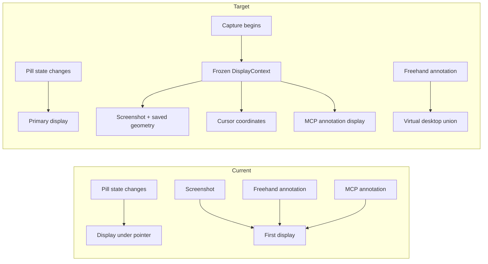

# Ticket #22 — Multi-display QA follow-up

## Problem

Ticket #22 made capture routing immutable, but display selection is still late-bound and inconsistent:

- `FloatingIndicator.recenter()` follows the pointer whenever the pill grows or collapses, so opening a session can move it to another display.
- The interactive annotation canvas is sized to `NSScreen.screens.first`, so the second display cannot receive strokes.
- Screen capture, saved-shot geometry, cursor coordinates, and MCP annotation rendering independently assume the first display. A screenshot taken from one display can therefore be annotated on another.

## Decision

Three display policies are required because the surfaces have different lifetimes:

1. **Pill:** always use the macOS primary display (the display whose global frame contains the menu-bar origin). Shape/state changes must never choose a display.
2. **Interactive whiteboard:** use the union of all attached display frames. One canvas and one undo stack allow a stroke to remain where it was drawn, even across display boundaries. Put the toolbar on the display under the pointer when annotation begins.
3. **Captured evidence:** freeze one display context at capture start (or at an ad-hoc screenshot call). Screenshot pixels, cursor coordinates, saved geometry, and file-backed annotations all use that same display identity.

### Options eliminated

| Option | Why it fails |
|---|---|
| Follow the pointer for the pill | A visual state transition changes location; this is the reported bug. |
| Remember the pill's last display | Adds persisted mutable state and makes “primary” behavior dependent on historical accidents. |
| One annotation canvas on only the active display | Marks disappear or become unreachable after the pointer moves. |
| Capture the entire virtual desktop | Mixed Retina scales create ambiguous coordinates and oversized evidence. |
| Re-read the active display in every async callback | A pointer/window move can reroute an in-flight capture, repeating the state/context bug ticket #22 removed. |

## Current → target

## Code changes

- Add a shared `DisplayContext`/`DisplayTopology` source of truth for primary display, pointer display, display lookup, virtual frame, screenshot geometry, and coordinate conversion.
- Make `FloatingIndicator.recenter()` depend only on `DisplayTopology.primary`.
- Size `AnnotationOverlay` to `DisplayTopology.virtualFrame`; position its toolbar using `DisplayTopology.underMouse`.
- Let `ScreenCapture` target a concrete display ID, including the CLI fallback.
- Save ad-hoc screenshots with the selected display's geometry and calculate cursor coordinates relative to that display.
- Remember the last screenshot display per MCP session and stamp it into annotation documents. Render annotation documents in one click-through window per display; legacy documents without a display ID remain on the primary display.
- Add the frozen display context to `CaptureRun` and use it for Dictate + Snap and continuous-capture frames.

## Invariants and validation contract

- Growing, shrinking, flashing, or selecting a session cannot change the pill's display.
- The pill and ChatPanel open together on the primary display.
- Freehand strokes work anywhere in the virtual desktop and retain one undo/clear history.
- A capture run's display ID is immutable from hotkey-down through transcription and screenshot callbacks.
- `take_screenshot` returns `display_id`; its `cursor` and `annotate_screen` coordinates refer to that exact image.
- Existing overlay files without `display_id` continue rendering on the primary display.
- Unit tests cover primary selection, virtual-frame union, and secondary-display cursor conversion; the full Swift target compiles; the signed app is reinstalled for live QA.
