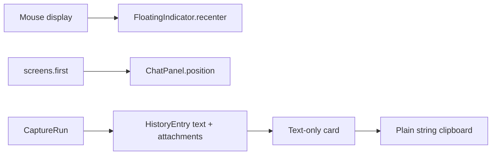
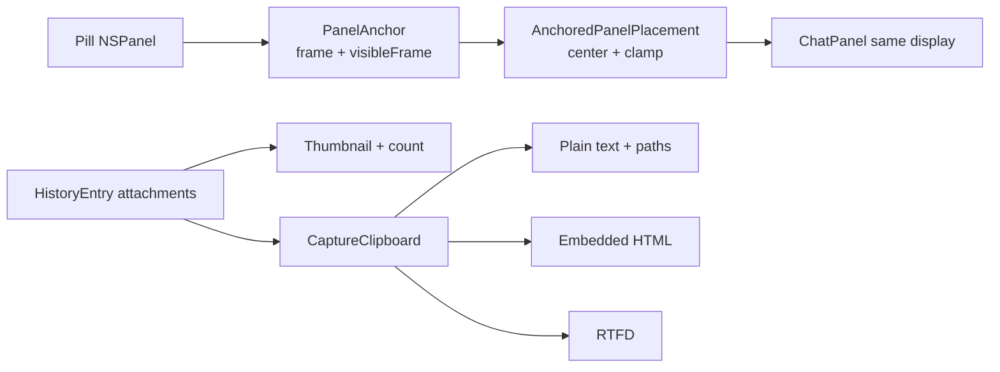

# Ticket 22 QA — display anchoring and rich Snapshot history

## Target

**GIVEN:** clicking the pill must open ChatPanel on the pill's current display,
visually centered above it. A Dictate + snapshot result must show its saved
evidence in Dictations and copy text plus image in the richest format the
receiving application supports, without losing a universal plain-text fallback.

Blast radius: three seams across four production files — indicator→panel
placement, history-card rendering, and history→pasteboard serialization.

## Current

- **VERIFIED** `swift/UI.swift:FloatingIndicator.recenter@1103` chooses the
  screen containing `NSEvent.mouseLocation` and positions the pill there.
- **VERIFIED** `swift/Panel.swift:ChatPanel.position@146` independently chooses
  `NSScreen.screens.first`, so the two windows can use different displays.
- **VERIFIED** `swift/UI.swift:HistoryEntry@1522` already persists optional
  attachment paths.
- **VERIFIED** `swift/UI.swift:DictationsView.makeCard@1813` renders only
  `entry.text`; `cardClicked@1847` copies only `.string`.

## Decision by elimination

| Option | Result | Elimination |
|---|---|---|
| Keep independent screen selection | Eliminated | Goal-fit: reproduces the reported split-display failure. |
| Re-resolve the mouse display when the panel opens | Eliminated | Risk: pointer movement/programmatic opens can disagree with the pill already on screen. |
| Freeze the pill window frame + visible screen frame and pass it to ChatPanel | **Survivor** | Exact source-of-truth reuse; works with negative display coordinates and can be clamped. |
| Copy only text plus image paths | Eliminated | Goal-fit: no visual image in rich destinations. |
| Copy separate text and image pasteboard items | Eliminated | Risk: destination apps may choose one item or reorder them. |
| Copy only an image or only rich data | Eliminated | Hard constraint: plain-text fields must still receive the narration and durable paths. |
| One pasteboard item with plain text, embedded HTML, and RTFD | **Survivor** | The receiver chooses its richest supported representation while all apps retain text/path fallback. |

## Target flow

## Transformation

| Part | Disposition | Contract |
|---|---|---|
| `FloatingIndicator` | Extend | Expose a read-only `PanelAnchor` from its actual window and actual screen. |
| `ChatPanel.position` | Replace | Consume that anchor; center above the pill and clamp inside `visibleFrame`. Mouse-screen fallback is used only if no anchor exists. |
| `DictationsView.makeCard` | Extend | Load the first existing image path into a small aspect-fill thumbnail and show `+N` for further attachments. Missing paths render text-only. |
| Clipboard writer | Net-new | Write one item with `.string` always; add `.html` and `.rtfd` only when at least one attachment decodes. Plain text lists every saved path. |

## First slice

One Dictate + snapshot entry exercises the full shared path: persisted image
path → thumbnail → click → plain/HTML/RTFD pasteboard representations. Continuous
captures reuse the same card/copy seam; their additional frames appear through
the same count and serialization loop.

## Feasibility and coverage

- The pill owns an `NSPanel`, whose `frame` and `screen?.visibleFrame` provide
  the exact placement seam; no new display registry is needed.
- Attachments are absolute paths already stored by ticket 22, and screenshots
  are JPEG/PNG files decodable by `NSImage`.
- Call-site audit: panel placement is invoked only by `ChatPanel.show`; history
  cards are built only by `DictationsView.rebuildContent`; history copy occurs
  only in `cardClicked`.
- Rich paste is destination-controlled. No representation can force an
  arbitrary plain text field to accept an image, so the durable path in
  `.string` is the explicit fallback rather than silent loss.

## Validation contract

1. Anchor on a negative-origin left display → returned ChatPanel frame is
   wholly inside that display and centered over the anchor, never display 0.
2. Anchor near a display edge → panel frame remains inside `visibleFrame`.
3. Entry with a valid JPEG → thumbnail exists and pasteboard item exposes
   `.string`, `.html`, and `.rtfd`.
4. Entry with a missing attachment → no crash; `.string` still includes text
   and the saved path, while rich representations are omitted.
5. Existing text-only entry → card remains text-only and click copies the
   original text.
6. Full optimized Swift compilation and installed two-display smoke test pass.

## Rollback

All changes are additive or local replacements. Reverting the implementation
restores text-only history and independent placement; stored history data is
unchanged.

## Assumptions

- **INFERRED:** thumbnails should show the first attachment and a count rather
  than rendering every continuous-capture frame in the narrow 400 pt panel.
- Mermaid rendering was not performed locally (`mmdc` is unavailable); source
  was checked for closed node sets and every edge maps to a verified seam above.
