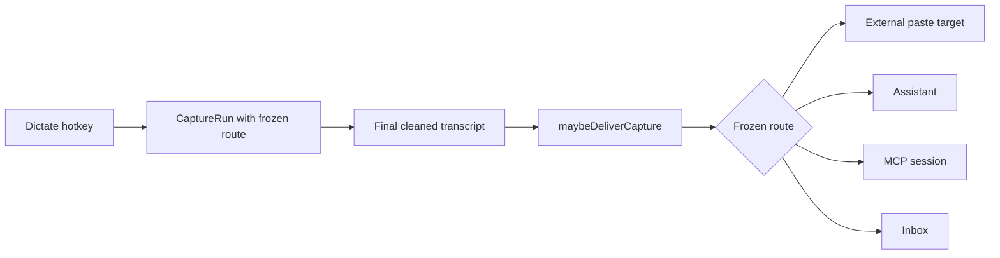
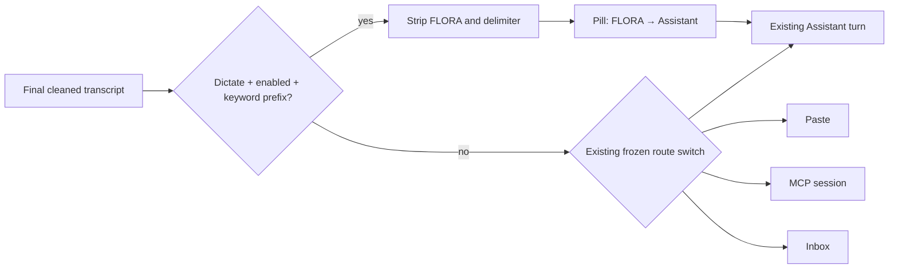

# Ticket #4 — FLORA wake word

Status: implementation plan

## Target

**GIVEN:** saying “FLORA, …” at the start of a normal Dictate capture sends the
remaining transcript to the active in-app Assistant conversation from anywhere,
without pasting it into the frozen external target. A non-match follows the
existing `CaptureRun` route unchanged.

The feature is enabled by default with **FLORA** (“Flow's Listening, Organizing,
Reasoning Assistant”) and is configurable in Settings → Assistant.

Blast radius: four production files, one pure decision seam, and one test
harness. `UserSettings` persists two scalar fields; `SettingsStore` exposes them;
`AppDelegate.maybeDeliverCapture` may override the destination only after a
completed `.dictate` transcript matches; `WakeKeywordMatcher` owns parsing.

## Current

- **VERIFIED** `swift/Core.swift:UserSettings@155` loads and saves Assistant
  scalar settings in `~/.config/voice-flow/settings.json`.
- **VERIFIED** `swift/Settings.swift:SettingsStore@9` mirrors those values through
  `@Published` properties and commits each edit to `UserSettings`.
- **VERIFIED** `swift/App.swift:handleTranscriptionResult@1599` stores the final,
  cleaned transcript on its UUID-correlated `CaptureRun`.
- **VERIFIED** `swift/App.swift:maybeDeliverCapture@1643` is the single delivery
  seam and switches only on the route frozen when capture began.
- **VERIFIED** `swift/App.swift:deliverToAgent@1343` sends a turn to the current
  durable Assistant conversation and already handles a busy Assistant.
- **VERIFIED** partial AX streaming is dormant: `streamingViaAX` is reset to
  `false`, and the repository contains no assignment to `true`, so final-result
  interception occurs before external text is written.

## Transformation

| Part | Disposition | Contract |
|---|---|---|
| `UserSettings` | Extend | Add `assistantWakeEnabled: Bool = true` and `assistantWakeWord: String = "FLORA"`; load absent keys as defaults and save normalized values. |
| `SettingsStore` / Assistant form | Extend | Bind an enable toggle and wake-word field; an empty edited word normalizes back to `FLORA`. |
| `AssistantWakeMatcher` | Net-new pure seam | Compare a trimmed transcript against a trimmed keyword case-insensitively, require a whitespace/punctuation boundary, then strip delimiter punctuation/space and return a non-empty prompt. |
| `maybeDeliverCapture` | Extend | For enabled `.dictate` runs only, evaluate the matcher before the frozen-route switch. A match uses the existing Assistant delivery seam with the stripped prompt and a FLORA receipt; no match preserves the switch byte-for-byte in behavior. |
| Transcription hint | Extend | Send the enabled wake name separately from user vocabulary. Cloud STT receives an exact-spelling/script instruction; local cleanup receives the same invariant. |
| Snapshot, continuous, MCP, paste target, `CaptureRouter` | Unchanged | Ticket scope is normal Dictate only; route creation and correlation remain immutable. |

## First slice

Input `"FLORA, organize these thoughts"` with capability `.dictate`, wake enabled,
and a frozen `.paste(target)` route. The matcher returns
`"organize these thoughts"`; delivery records destination `.assistant`, shows a
pill receipt, appends the stripped user message, and calls `deliverToAgent`.
The external `Paster` is not called.

The reusable core is prefix matching and stripping. Settings merely supply the
enabled flag and keyword. The application seam decides whether the match may
override the frozen route.

## Feasibility

- Falsifier: no single post-transcription/pre-paste seam. Rejected by
  **VERIFIED** `maybeDeliverCapture`, which constructs external text and chooses
  the destination before calling `Paster.paste`.
- Falsifier: Assistant submission requires a visible panel. Rejected by
  **VERIFIED** `.assistant` delivery, which already calls `deliverToAgent` while
  the panel is closed and renders its response through the pill.
- Falsifier: partial dictation has already edited the external app. Rejected by
  the repository-wide assignment inventory: `streamingViaAX` has no `true`
  assignment and partial transcription has no active caller.

## Coverage

Independent importer/caller searches found one settings mirror
(`SettingsStore`), one final delivery caller (`handleTranscriptionResult` →
`maybeDeliverCapture`), and existing standalone routing tests. No wire,
backend, mobile-sync, capture-storage, or session-routing shape is touched.

The highest-risk claim is that unmatched dictations remain identical. The
implementation keeps the existing route switch as the fallback and tests
non-prefix, disabled, prefix-collision, snapshot, and empty-prompt cases.

## Delta

## Validation contract

| Assertion | Before | After | Check |
|---|---|---|---|
| Exact wake prefix | No matcher exists. | `FLORA, organize this` returns `organize this`. | Standalone Swift matcher test. |
| Case and delimiter tolerance | No matcher exists. | `flora: help` and leading whitespace match. | Standalone Swift matcher test. |
| Collision safety | No matcher exists. | `floral arrangement` and `FLORAgraph` do not match. | Standalone Swift matcher test. |
| Empty prompt safety | No matcher exists. | `FLORA` alone does not override delivery. | Standalone Swift matcher test. |
| Capability safety | All capabilities use their frozen route. | Snapshot/continuous never wake; unmatched Dictate keeps its frozen route. | Matcher policy test plus code inspection of the guarded call site. |
| Persistence | Keys absent. | Enabled and keyword values round-trip; old files retain defaults. | Compile plus load/save inspection. |
| Build | Current tree type-checks. | All Swift sources type-check and Python tests pass. | Project `swiftc` command and `uv run pytest -q`. |

Rollback is reversible: disable the setting immediately, or remove the matcher
branch and the two backward-compatible JSON keys. No persisted capture schema or
conversation schema changes.

## Open questions

None. Safet selected FLORA; enabled-by-default follows the requested hands-free
outcome and remains reversible through the toggle.

QA follow-up: multilingual dictation uses a layered policy. The recognizer is
instructed to retain the configured wake name's exact spelling and script, while
the default FLORA matcher also accepts prefix-only `ФЛОРА` as a deterministic
fallback. The Cyrillic noun elsewhere in a dictation is never rewritten.

## Assumptions

- **INFERRED:** the wake command should remain in Dictations history with
  destination `.assistant`, consistent with every other successful capture; “not
  kept” means it must not become an unread Inbox item.
- **RENDER NOT PERFORMED:** no Mermaid renderer is installed. Sources were
  linted manually: node IDs are unique per diagram, all edges land on declared
  nodes, and the delta contains both the unchanged route switch and the new
  override.
