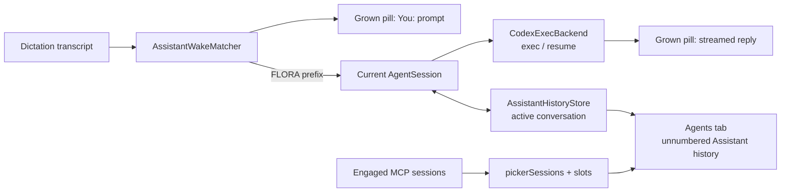
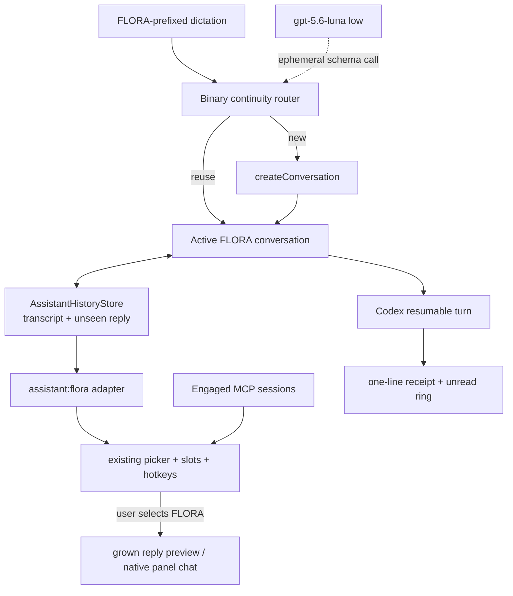
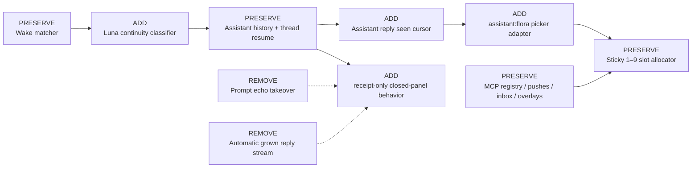

# VF-54 — FLORA continuity and first-class session routing

## Target

**Change shape:** feature plus a narrow session-presentation adapter.

**Goal (given):** a dictation whose leading wake name resolves to FLORA must make exactly one binary continuity decision — continue the current FLORA conversation or create a fresh one — without searching or selecting any older conversation. FLORA's current conversation must then behave like a reported active session: it owns a stable picker slot, is reachable through the existing ⌃⌥1–9 hotkeys and menu, and announces work/replies with receipts and unread state instead of growing the user's prompt or streamed response onto the screen.

The goal fails if an ordinary non-wake dictation invokes the classifier; if the router selects an older session; if a FLORA response takes over the grown pill without the user selecting FLORA; if FLORA cannot be reached through a numbered slot while within the existing nine-slot capacity; or if an MCP session's routing, stack, overlay, or completion behavior changes.

**Blast radius:** 8 seams across 5 production modules plus focused harnesses.

1. Binary continuity classification (net-new `swift/AssistantContinuity.swift`).
2. Codex CLI ephemeral structured invocation (net-new, isolated from resumable turns).
3. Assistant reply consumption state (`swift/AssistantHistory.swift`).
4. Wake delivery orchestration (`swift/App.swift:maybeDeliverCapture`).
5. Stable local-assistant adapter into picker/slot/target selection (`swift/App.swift`).
6. Closed-panel assistant notification behavior (`swift/App.swift:setupAgent`).
7. Active FLORA numbering/unread presentation (`swift/AgentsView.swift` and `swift/App.swift:agentSessionRows`).
8. Existing capture and MCP session paths, preserved by regression tests.

### Architecture decision by elimination

The decision varies across three axes:

- **Continuity mechanism:** none/manual · deterministic heuristic · embedding similarity · lightweight language-model classifier · main FLORA turn decides.
- **Decision scope:** current-vs-new · choose among all histories.
- **Session integration:** panel-only · fake MCP registration · duplicate full conversation into `SessionPush` · stable local adapter over the existing Assistant history · replace all session types with a new generic framework.

Catalog completeness check: compute/state placement was considered in the caller, `AgentSession`, Codex backend, sidecar process, and separate service; data flow was considered as synchronous preflight, speculative parallel work, and post-turn routing; migration was considered in-place, branch-by-abstraction, and wholesale replacement. No credential exchange, broker, proxy, event-sourced state, or separate host helps this local binary decision.

| Option | Axis cell | Result | Elimination |
|---|---|---|---|
| Keep always reusing the active FLORA thread | none × current | Eliminated | **Goal-fit:** unrelated wake requests still inherit the previous thread, which is the defect VF-54 names. |
| Always create a fresh FLORA thread | none × new | Eliminated | **Goal-fit:** follow-ups, corrections, and referential requests lose the exact context the current durable thread exists to preserve. |
| Require an explicit “new FLORA” phrase or panel action | manual × current/new | Eliminated | **Goal-fit:** useful as an override later, but it does not make the requested automatic continuity decision for ordinary FLORA invocations. |
| Hand-written keyword/time-gap heuristics | deterministic × current/new | Eliminated | **Risk:** topical continuity is semantic; time and token overlap fail on pronouns, corrections, same-project subtopics, and two adjacent unrelated requests. The failure is silent misrouting. |
| Embedding similarity against the current title/history | similarity × current/new | Eliminated | **Cost:** it adds an embedding endpoint, threshold calibration, and text-reduction policy yet remains weaker than a binary classifier that can understand references and intent. |
| Ask a lightweight model to choose among every saved conversation | model × all histories | Eliminated | **Hard constraint:** the ticket explicitly permits only “reuse the current one” or “create a new one”; choosing an older session would make routing unpredictable and expand the privacy/context surface. |
| Let the main FLORA turn decide after it starts | main turn × current/new | Eliminated | **Hard constraint:** the Codex thread must be selected before `AgentSession.send`; after the turn starts, user text and images have already crossed into the wrong conversation. |
| Separate classifier service or API-key path | model service × current/new | Eliminated | **Cost:** it introduces another credential/runtime and fails for the default ChatGPT-authenticated Codex backend. |
| Ephemeral `gpt-5.6-luna`, low-reasoning, schema-constrained preflight through the already-authenticated Codex CLI | model preflight × current/new | **Survivor** | Luna is the current Codex model intended for clear repeatable classification; `codex exec` already supports `-m`, low reasoning, `--ephemeral`, `--ignore-user-config`, and `--output-schema`. One bounded subprocess adds no credential or persistent thread. |
| Leave FLORA panel-only | panel-only | Eliminated | **Goal-fit:** no picker slot or hotkey can reach it. |
| Register FLORA as an `MCPSession` | fake MCP | Eliminated | **Hard constraint:** local Assistant conversations have no Streamable-HTTP lifecycle, waiter, MCP inbox, overlay ownership, or remote close/re-adopt semantics. A fake registry entry makes those invariants false. |
| Copy the full FLORA transcript into `sessionPushes` | duplicate store | Eliminated | **Risk:** two durable sources would own reply text and consumption state; deletion, retention, and titles could diverge. |
| Replace MCP and Assistant sessions with a new universal session framework | wholesale abstraction | Eliminated | **Blast radius:** it rewrites stable MCP routing to solve one local-adapter need and is dominated by a typed boundary at the picker. |
| Stable `assistant:flora` picker identity backed by the active `AssistantConversation` | local adapter | **Survivor** | It reuses slots, picker visuals, hotkeys, and the native Assistant transcript while keeping MCP-only operations behind an explicit ID test. |

The survivor is order-robust: hard constraints first remove all-history routing, post-turn routing, and fake MCP registration; goal-fit removes the fixed/manual policies and panel-only UI; cost/risk then leave the ephemeral classifier plus local adapter. No residual value judgment remains. On classifier timeout, malformed output, unavailable model, or confidence below the acceptance threshold, **reuse** is the fail-safe: it preserves today's behavior and avoids manufacturing fragmented sessions from an infrastructure failure.

Official grounding: the current Codex manual documents model selection for non-interactive runs, ephemeral sessions, ignored user/rule configuration, and schema-constrained output; its model guide describes Luna as the efficient choice for classification and other repeatable structured work. See [Codex non-interactive mode](https://learn.chatgpt.com/docs/non-interactive-mode) and [OpenAI's current model guide](https://developers.openai.com/api/docs/guides/latest-model).

## Current

### Verified facts

- **VERIFIED** — wake routing occurs only for `.dictate`, strips the matched name, and overrides the frozen route to `.assistant`: `swift/App.swift:maybeDeliverCapture@1993-2035` contains `run.capability == .dictate`, `AssistantWakeMatcher.resolve`, `effectiveRoute`, and `wakeMatch?.prompt`.
- **VERIFIED** — the wake path currently grows a pill with the user's prompt before the turn: `swift/App.swift:maybeDeliverCapture@2029-2035` calls `replyBubble.showThinking(echo:)`; `swift/ReplyBubble.swift:showThinking@34-39` renders `You: …` with `routesToAssistant: true`.
- **VERIFIED** — closed-panel replies then stream directly into the same grown surface: `swift/App.swift:setupAgent@757-790` calls `replyBubble.beginStreaming`, `appendDelta`, and `finishStreaming`.
- **VERIFIED** — Assistant conversations already have durable UUID identity, messages, title, turn state, and Codex resume ID: `swift/AssistantHistory.swift:AssistantConversation@32-60`; the active ID and sessions live in a versioned atomic store at `AssistantHistoryStore@62-225`.
- **VERIFIED** — `AgentSession.createConversation` makes the fresh thread and `activateConversation` is the only path that selects a saved one: `swift/Agent.swift@138-164`. Therefore the router can obey current-vs-new without gaining an “activate arbitrary history” dependency.
- **VERIFIED** — the main turn persists the user message and `.running` state before launch, then stores the assistant result before `onAssistantDone`: `swift/Agent.swift:send@267-326` and `finish@329-345`.
- **VERIFIED** — the picker admits only engaged MCP sessions and push ghosts: `swift/App.swift:pickerSessions@1047-1088`. Stable numbers are a persisted `[String: Int]` keyed by opaque session ID: `swift/App.swift:slottedSessions@1097-1137`; a collision-free local ID can reuse this key contract.
- **VERIFIED** — selecting a slot currently assumes an MCP thread only when the panel is open; closed-panel selection delegates to `setTargetSession`: `swift/App.swift:userSelectSession@1360-1380`.
- **VERIFIED** — `targetSessionId` does not itself route a capture. Capture routing derives only from the visibly open panel/grown surface: `swift/App.swift:visibleConversationFocus@1628-1634` and `swift/CaptureRouting.swift:CaptureRouter@123-140`.
- **VERIFIED** — Assistant rows already coexist with MCP rows but have no picker number or unread state: `swift/App.swift:agentSessionRows@3252-3267` and `swift/AgentsView.swift:leadingIcon@210-229`.
- **VERIFIED** — Codex CLI support was checked both locally (`codex exec --help`) and in the current official manual: `-m`, `--ephemeral`, `--ignore-user-config`, `--ignore-rules`, `--output-schema`, and `-c model_reasoning_effort="low"` are supported; ChatGPT authentication remains available when user config is ignored.

### Current component view



### Current touched flow

```mermaid
sequenceDiagram
    participant U as User
    participant App as AppDelegate
    participant Agent as AgentSession
    participant Pill as Grown pill
    participant Codex as Codex CLI
    U->>App: "FLORA, follow up" dictation
    App->>Pill: show "You: follow up"
    App->>Agent: send on whichever conversation is active
    Agent->>Codex: exec or resume active thread
    Codex-->>Pill: stream full response
    Agent->>Agent: persist response
    Note over App,Agent: No continuity decision; FLORA has no picker slot
```

### Data-model inventory

| Model | Cardinality/key | Durable? | Target disposition |
|---|---|---:|---|
| `AssistantConversation` | UUID per local conversation | Yes | Extend reply messages with an optional consumption bit; remains the sole transcript. |
| `AssistantHistoryEnvelope.activeSessionId` | exactly one current local conversation | Yes | Reused as the only conversation continuity can reuse; router never scans alternatives. |
| `MCPSessionRegistry` | HTTP `Mcp-Session-Id` per connection | Runtime | Unchanged; FLORA never enters it. |
| `sessionPushes` | MCP ID → notification/thread projection | Yes | Unchanged; FLORA reply text is not duplicated here. |
| `sessionSlots` | opaque eligible ID → 1…9 | Yes | Reused with `assistant:flora`, whose namespace cannot collide with MCP UUIDs. |
| `targetSessionId` | one opaque selected picker ID | Runtime | Extended through adapter helpers; still not a capture route. |

## Transformation

### Per-part disposition

| Part | Disposition | Closed contract |
|---|---|---|
| `AssistantContinuityClassifier` (`swift/AssistantContinuity.swift`) | **NET-NEW** | Input is the current conversation's title plus the last six non-note messages, each clipped and total context capped at 6,000 characters, and the incoming stripped FLORA prompt. Output is `reuse` or `new`, confidence 0…1, and a short reason. User text is delimited as data; the schema permits no extra fields. |
| Classifier Codex invocation | **NET-NEW** | One `codex exec` process with `gpt-5.6-luna`, low reasoning, read-only sandbox, no MCP servers, ignored user config/rules, `--ephemeral`, and a temporary output schema/file. It receives no images, tools, memory files, or resumable thread. Timeout is 15 seconds; cancellation terminates the process and removes temp files. |
| Continuity policy | **NET-NEW** | Empty/draft current conversation reuses without a model call. Otherwise accept `new` only from valid schema output at confidence ≥0.65; every timeout/error/invalid/low-confidence result reuses. The classifier is invoked only when `wakeMatch != nil` for `.dictate`. |
| Wake orchestration (`AppDelegate`) | **REPLACE branch** | Engage stable `assistant:<slug>` first; wait for any interrupted old turn to settle; classify against a frozen current conversation ID; if that ID changed before the result, re-evaluate once. On `new`, call only `agent.createConversation`; never `activateConversation` with a historical ID. Restore the new transcript model off-screen, then call the existing `agent.send`. |
| `AssistantHistoryMessage` | **EXTEND** | Add optional `seen: Bool?`. Legacy missing/nil means historical/neutral; newly appended assistant replies get `false`; user/note messages get nil. `markAssistantRepliesSeen` flips false→true without changing `updatedAt`, so viewing does not reorder history. |
| Local picker adapter (`AppDelegate`) | **NET-NEW boundary** | Stable ID is `assistant:<slug>` and label is the assistant definition's name. It is eligible after first wake while not explicitly dismissed; it maps only to the active Assistant conversation. Helpers branch before any MCP registry, inbox, overlay, completion, or push-store operation. |
| Picker/slot projection | **EXTEND** | Add the local adapter to `pickerSessions`; reuse `sessionSlots` unchanged. Pending/unread derives from unseen assistant replies or an in-flight turn. Selecting it with the panel closed shows the active conversation's newest Assistant reply and marks replies seen; selecting with the panel open restores the native Assistant conversation. Re-selecting the grown FLORA preview uses existing Assistant speech. |
| Closed-panel callbacks | **REPLACE presentation** | Do not call `showThinking`, `beginStreaming`, `appendDelta`, or `finishStreaming` for a hidden panel. Emit only `FLORA · working — ⌃⌥N` and `FLORA · new message — ⌃⌥N` receipts when the surface is free; refresh the unread ring. If the user already selected FLORA's grown preview, update that preview in place. |
| Agents list current FLORA row | **EXTEND** | The active conversation receives the same slot number and unread brightness as its adapter. Historical conversations remain unnumbered waveform rows and are never continuity candidates. |
| MCP registry, pushes, inbox, overlays, asks, captures | **UNCHANGED** | Existing ID paths run only when the selected ID is not local. No FLORA text enters `sessionPushes`; no MCP session is created/closed; no local ID reaches `MessageInbox` or `OverlayManager`. |

The structural pattern is an anti-corruption adapter at the picker boundary. Its precondition is verified: slots key opaque strings while MCP-only operations are centralized in `AppDelegate`. Its defeat condition is allowing `assistant:flora` to reach `mcpServer.sessions`, `inbox`, `sessionPushes`, or `overlayManager`. Focused adapter tests plus the existing MCP/capture regression harnesses catch that.

### Target component view



### Delta overlay



## First slice

First instance: with one completed FLORA conversation active, dictate a clearly referential FLORA follow-up while the panel is closed.

1. Wake matching strips `FLORA` exactly as today and engages `assistant:flora` without growing content.
2. The classifier receives only the active conversation snapshot and the new prompt; schema output is `reuse`.
3. The frozen active ID still matches, so no conversation is created and the existing Codex thread resumes.
4. While the turn runs, FLORA owns a stable numbered slot and only a short working receipt may appear.
5. The assistant reply is persisted with `seen == false`; the ring and FLORA's amber dot light.
6. ⌃⌥N shows that reply and marks it seen; a second press can read it aloud; clicking opens the exact native conversation.

Reusable core: the classifier contract, stable adapter ID, local-ID guard, seen cursor, receipt projection, and stale-classification check. The second instance — a clearly unrelated FLORA request — exercises the only per-decision variation: `new` creates a fresh active conversation before the same notification pipeline runs.

Not exercised by the first slice: classifier timeout/invalid JSON, a wake while a turn is running, panel-visible replies, dismiss/re-engage, a full nine-slot picker, and simultaneous MCP pushes. These are explicit validation cases below.

## Feasibility

| Seam | Falsifying observation sought | Result |
|---|---|---|
| Binary decision can happen before thread selection | Wake routing sends before any async seam exists | Falsified: `maybeDeliverCapture` computes `wakeMatch` before `agent.send`; this branch can await classification before delivery. |
| Fresh thread can be created without selecting history | Only arbitrary activation exists | Falsified: `AgentSession.createConversation` creates/activates a fresh conversation directly. |
| Classifier can use current auth without an API key | Codex CLI lacks bounded structured runs | Falsified locally and in current docs: `codex exec` supports model selection, low reasoning config, ephemeral mode, ignored config/rules, and output schema while retaining auth. |
| Local ID fits the slot key | Slots require a registry object | Falsified: `sessionSlots` and `slottedSessions` key opaque strings from `pickerSessions`; no registry lookup is part of allocation. |
| Reply unread can live in Assistant source of truth | Assistant messages cannot evolve compatibly | Falsified: an optional Codable field decodes absent legacy values as nil; a store mutation can persist consumption without changing the transcript model. |
| Preview can route capture back to Assistant | Grown routing requires MCP ID | Falsified: `GrownSpec.routesToAssistant` and `GrownConversationFocus.resolve` already produce `.assistant` without an MCP ID. |

No new API key, service, daemon, public contract, or external database is added. Classifier content crosses the same OpenAI/ChatGPT trust boundary as the ensuing FLORA turn but in a separate ephemeral call. Input is capped, no files/images/tools are exposed, and the call does not persist a Codex rollout. The only extra per-wake cost is one Luna classification when a meaningful current conversation exists.

## Coverage

Independent caller/state audit:

| Changed surface | Callers/state users found | Plan coverage |
|---|---|---|
| `targetSessionId` | menu provider, picker rendering, selection, session close/prune, MCP first engagement, overlay activation | Local-ID helper must be used by all registry/overlay assumptions; target validity checks use `pickerSessions`, not `MCPSession.engaged`. |
| `pickerSessions` / `slottedSessions` | menu, indicator, switch hotkeys, receipts, Agents rows | Stable adapter participates once; existing ordering and persisted slot mapping stay intact. |
| Assistant closed-panel callbacks | wake delivery, typed panel send, screenshot send, Codex/API streaming callbacks | Receipt-only suppression is keyed to whether the panel or selected FLORA preview is visible, not a global removal of streaming. Panel-visible native streaming remains. |
| Assistant history messages | runtime reconstruction, panel restore, legacy import, tests | Optional `seen` is ignored by runtime/API reconstruction and displayed nowhere; import defaults to nil. |
| MCP-only operations | remove/trash, send, complete, speak, waiter/ask, overlay scope, session prune | Every path either remains fed by `currentPushSessionId` or explicitly rejects local IDs. |
| Wake matching | ordinary dictate, snapshot, continuous, append-to-dictation | Classifier is nested under the existing `.dictate && wakeEnabled && wakeMatch != nil` condition only. |

Highest-risk claim: a stable local ID can inhabit `targetSessionId` without leaking into MCP-only operations. Verification is an exhaustive `rg targetSessionId|currentPushSessionId|pickerSessions|slottedSessions` audit plus tests that inject `assistant:flora` and assert zero MCP/inbox/overlay calls.

Slot capacity remains the existing product constraint: at most nine eligible sessions have hotkeys; excess sessions queue until a number frees. VF-54 does not silently evict an occupied stable MCP slot. Within that documented capacity, FLORA is guaranteed a sticky number.

## Equivalence

Before and after, non-wake dictation follows the same frozen `CaptureRoute`; panel-visible Assistant typing/snap/talk uses the active conversation without a continuity preflight; MCP sessions retain engagement, stable numbering, push persistence, ask/inbox routing, overlay scope, speech consumption, and close/completion semantics. The only removed behavior is closed-panel automatic growth for FLORA wake turns.

Rollback is reversible: remove the local adapter and classifier call, stop writing the optional `seen` field, and restore the three closed-panel `ReplyBubble` streaming calls. Existing history remains decodable because the field is optional; no MCP persistent format changes.

## Validation contract

1. **Router scope (goal-direct).** Feed ordinary dictation, snapshot, continuous capture, and FLORA dictation through the extracted wake-routing seam. Before: no classifier exists. After: exactly the FLORA `.dictate` case calls it once; every other case calls it zero times and preserves its original route.
2. **Reuse decision.** Current context “Pantrella next cohort retention,” incoming “FLORA, and make the follow-up 48 hours later.” Stub schema result `reuse/0.9`. Expected: active conversation ID and Codex thread ID are unchanged.
3. **New decision.** Same current context, incoming “FLORA, plan tomorrow's gym session.” Stub `new/0.9`. Expected: exactly one fresh conversation becomes active; no historical ID is passed to `activateConversation`.
4. **Fail-safe matrix.** Timeout, process exit, missing output, malformed JSON, unknown enum, and confidence 0.64 all return reuse. No case loses the incoming prompt.
5. **Stale result.** Change active conversation while a stub classifier is suspended, then release `new`. Expected: stale result is not applied to the replacement conversation; the router re-evaluates once or reuses safely.
6. **History compatibility.** Decode a version-1 fixture with no `seen`; append a new Assistant reply; reload. Expected: legacy messages remain neutral, the new reply is unseen, `markAssistantRepliesSeen` persists true without changing conversation `updatedAt`.
7. **Stable adapter.** Roll from reused conversation A to fresh conversation B. Expected: picker ID and assigned number stay `assistant:flora`/N while the preview and panel click resolve B only; A remains panel history and is never auto-selected.
8. **No screen takeover (goal-direct).** Hidden panel + FLORA wake. Before: grown surface contains `You: …` then the streamed reply. After: no grown Assistant surface is created by start/delta/done; only working/new-message flash receipts occur. Selecting FLORA explicitly grows the reply.
9. **Already-visible exception.** With FLORA's preview already selected, a completed reply refreshes that same surface in place and marks it seen; with the native panel conversation open, streaming remains visible there and the reply is immediately seen.
10. **Hotkey/panel behavior.** Closed-panel ⌃⌥N shows active FLORA; second select uses Assistant speech; panel-open ⌃⌥N restores the active native conversation rather than opening an MCP thread.
11. **Dismiss/re-engage.** Trash/remove FLORA from the quick surface. Expected: conversation history remains, picker entry retires, and the next FLORA wake re-engages the same stable ID.
12. **MCP non-leak.** Exercise select, trash, close, prune, typed reply, and first MCP engagement with `assistant:flora` active. Expected: no local ID reaches registry close/session lookup as a required object, `MessageInbox`, `sessionPushes`, or overlay ownership; an active FLORA target is not stolen by a newly engaging MCP session.
13. **Existing harnesses.** Run Assistant wake/history/assistant-definition tests, capture-routing tests, picker/session tests, and Python backend protocol tests; then run the full Swift type-check command from `CLAUDE.md`.
14. **Live validation.** Install Voice Flow. With the panel closed, record one follow-up and one unrelated FLORA dictation. Keep screenshots showing: receipt-only arrival, stable FLORA slot, unread ring, explicit hotkey preview, and separate conversation rows. Verify an MCP report still keeps its own slot and never gets overwritten.

## Open questions

None blocking. Conservative defaults are fixed above: only wake dictations classify; only current-vs-new is legal; ambiguity/failure reuses; classifier timeout is 15 seconds; `new` requires confidence ≥0.65; current context is bounded to title plus six recent non-note messages; FLORA uses one stable identity across conversation rollovers; historical conversations stay panel-only; and the existing nine-slot capacity remains unchanged.

## Assumptions

- **INFERRED:** “FLORA session” means the currently active conversation for the base `flora` assistant, not every saved FLORA history row. This is the only interpretation compatible with “current one or create a new one” and a stable hotkey target.
- **INFERRED:** a user explicitly selecting FLORA's grown preview counts as consent to show the reply; “remove the prompt/panel that directly opens” applies to automatic arrival, not explicit selection.
- **VERIFIED DEFAULT:** `gpt-5.6-luna` is the current Codex model positioned for classification. Keep the model string in one constant so retirement is a one-line, test-covered update.

## Diagram verification

**RENDERED AND VERIFIED:** `design/vf54-flora-session-routing-plan.html` was rendered in headless Chrome at 1440×4200 and inspected from `/tmp/vf54-plan-verified.png`. All three diagrams render independently; every edge lands on a declared node; current and target flows are visually distinct; the delta separates preserved/add/remove surfaces; and no label clips or overlaps.
