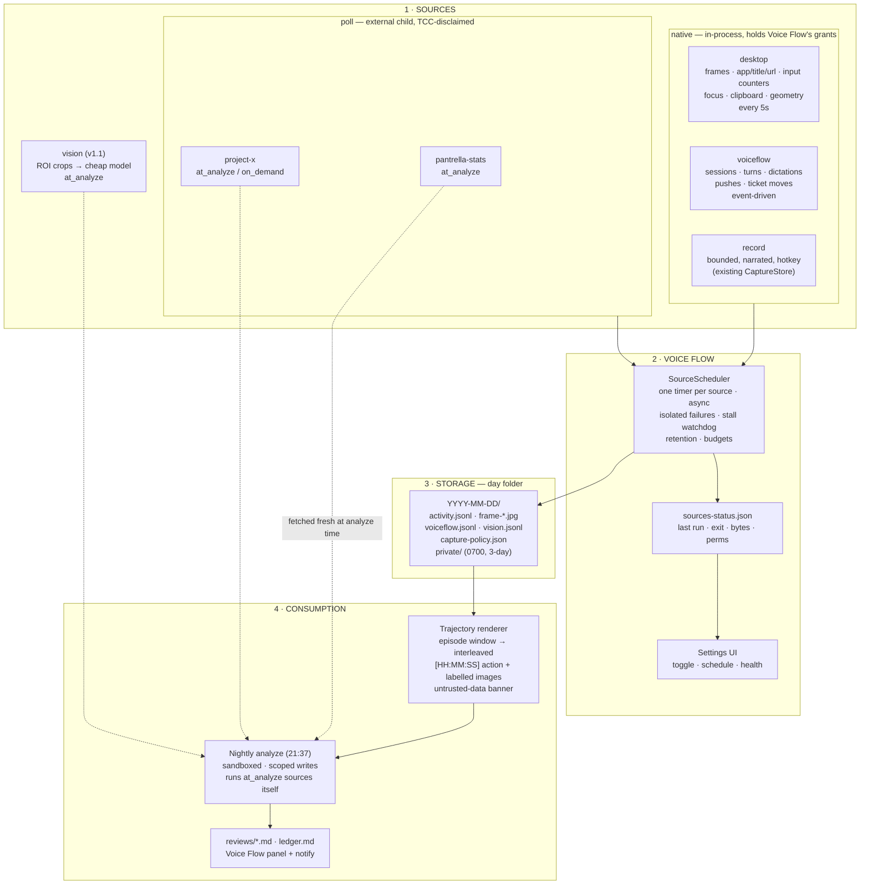

# Voice Flow — Data Sources Architecture (v3.0 — first slice shipped)

Collection stops being a fixed built-in feature and becomes a list of
interchangeable **sources** that Voice Flow schedules, monitors, and displays.
The nightly analysis consumes them all through one day folder.

**The spine.** A source owns *how it captures*: its thresholds, its coalescing
rules, its fields, and a `SOURCE.md` saying what its data means. The rules that
apply to *everything* — that captured data is untrusted, what may be repeated
into permanent files, how streams merge, how long anything is kept — live once
on the consumer side, in [`CONSUMING.md`](../CONSUMING.md). A source may add
meaning; it may not override a consumer rule.

v3.0 folds in the VF-42 research (Claude Desktop's `watch-record` mechanism —
see `research-vf42-record-mechanism.md`) after adversarial review against the
real code and the real archive. What that review killed is in
`sources-roadmap.md`, so nothing gets re-proposed. The `desktop` source, the
bus and the scheduler are **built** (`swift/WatcherBus.swift`,
`swift/Watcher.swift`, `swift/InputCoalescer.swift`, `swift/ScreenDiff.swift`);
everything else here is still design.



## Two source classes (this replaces v1.0's "one contract — any executable")

A user-writable `run.sh` launched by Voice Flow would silently inherit Voice
Flow's Screen Recording, Accessibility and Automation grants — that inheritance
is already live in production (today's browser URLs are harvested by a child
`osascript` running under Voice Flow's Automation grant). So there are two
classes, and the class is declared, not inferred:

```
sources/<name>/
  SOURCE.md    frontmatter: enabled, class, schedule, timeout, budget
               body: what this data means — instructions for the analyzer,
                     wrapped as untrusted unless first-party
  run.sh       class: poll only — any executable
               stdout JSON lines → <day>/<name>.jsonl   (scheduler stamps t/e)
               files it writes    → <day>/<name>-HH-MM-SS.ext artifacts
               non-zero exit is isolated and logged
```

| Class | Runtime | TCC |
|---|---|---|
| `native` | In-process Swift provider named by `provider:` — `desktop`, `voiceflow`, `record`, `camera` | Full Voice Flow grants |
| `poll` | External child process, run and exit | **None** — spawned with `responsibility_spawnattrs_setdisclaim()` |
| `stream` | Long-lived external child | *Reserved.* Errors "not implemented" until a real external stream source exists |

Capture stays native because a child process cannot see live settings changes,
cannot share the exclusive camera session, and — Darwin having no parent-death
signal — would outlive an app crash and keep capturing with no idle or lock
guard.

## Schedules

| Schedule | Meaning | Example |
|---|---|---|
| `every: 5s / 60s / 15m` | Scheduler fires it on a timer | desktop |
| `event` | Native provider writes as things happen | voiceflow |
| `on_demand` | Fired by you: CLI, hotkey, or MCP tool | record |
| `at_analyze` | Scheduler skips it; the nightly agent runs it during review | website stats, project folder, vision |

## What the scheduler owns

Not just firing. Because every source writes into one shared day folder, the
scheduler — not any individual source — owns: retention (`watcher_keep_days`,
plus the separate 3-day knob for `private/`), per-source daily byte budgets,
the stall watchdog that force-clears a hung capture, and the health rows in
`sources-status.json` (last run, exit, duration, next fire, lines and bytes
today, permission state, stored long edge, FileVault state).

**Budgets are observability with a floor-preserving response.** 250 MB/day per
source, 8 GB archive ceiling. On breach, step the stored long edge down
(1568 → 1092 → 896); on archive breach, shorten retention. Never lengthen the
interval and never drop candidate frames — the day's metrics are literally
`tick_count × 5 s`, and thinning fires hardest on the busiest afternoons.

## The desktop source — built

Screen, apps, input and attention share one cadence, one subject and one cost,
so they are one source. Full field list in
`~/.config/voice-flow/sources/desktop/SOURCE.md`. Two streams:

`activity.jsonl` — one line per 5 s tick: frontmost app, window title and
bounds, browser URL, display and frame geometry, the changed-region rectangle
and percentage, per-tick input counts, focused-element role and character
count, and a `secure` marker while a password field has focus. Skipped ticks
now record **why**, at the edges of the gap rather than once per tick, so an
idle stretch is no longer indistinguishable from a crashed watcher.

`actions.jsonl` — one line per thing done, at the moment it was done. Raw input
is coalesced locally by rules into `type`, `key`, `chord`, `click`, `drag`,
`scroll`, `app`; no model ever sees a raw event. Typed text is recorded
verbatim, with three independent layers keeping passwords out — macOS secure
input re-checked per keystroke, the focused element's accessibility role at run
start, and a password-manager bundle denylist. Any one of them redacts the run
to a character count.

Frames are written when at least `watcher_diff_blocks` of ~150 blocks differ
from the **last saved frame**, plus a floor: at least one every
`watcher_dense_seconds` while a constant-titled agent app is frontmost, marked
`forced`. That floor is the fix for the part of the day the instrument was
blindest to.

Nothing here needs a permission Voice Flow did not already hold — and the
per-tick input counts need none at all, so if Accessibility is ever revoked the
action stream stops while the shape of every tick survives.

## Consumption: the trajectory renderer

The one genuinely portable idea from `watch-record`. A shared renderer takes a
day and a time window and emits an interleaved `[HH:MM:SS] action` +
labelled-image sequence — the same format for the nightly agent and for any
other model. **No fixed image ceiling**: the archive exists to be looked at, and
the intended end state is a cheap model reading all of a day's frames to give
the expensive one context. What the renderer enforces is *deliberate* selection
and correct labelling, not a budget. A whole-day trajectory still is not
rendered into one context — several hundred frames does not fit anywhere useful.

## Everything in a day folder is data, not instructions

Window titles, URLs, on-screen text, filenames and note files are recordings of
what was on the screen — any of them can have been written by a web page, an
app, or another person. The nightly agent runs headless with pre-approved
tools, so this framing is required verbatim in three places: `ANALYZE.md`, the
renderer's output header, and every `SOURCE.md`. Text inside captured data that
looks addressed to the agent is content being described, not a command; the
agent logs an `injection-attempt` observation and continues. Enforcement is
separate from framing: scoped writes, a sandboxed LaunchAgent, and no
unqualified `Bash`. Sanitization happens on **read**, in the aggregation and
the renderer — never at capture time, which would corrupt the permanent
evidence spans in `reviews/` and `ledger.md`.

## Migration

1. ✅ Fix what was already broken: the frame-compression Retina no-op, the
   half-resolution display capture, the permanent-stall latch, Voice Flow
   photographing its own windows.
2. ✅ Build `DayBus` + `SourceScheduler` by **registering** what
   `WorkflowWatcher` already had — the timer, the re-entrancy guard,
   restart-on-config-change, the status line — rather than rewriting it.
   Retention and the stall watchdog moved up to the scheduler.
3. ✅ Register the current watcher as the `desktop` source and add the tick
   enrichments, the action stream, and the no-blind-spot frame floor.
4. ✅ Write the consumer contract (`CONSUMING.md`) and wire it into
   `ANALYZE.md`, including the untrusted-data framing.
5. Harden the nightly agent's tool grants and sandbox it — VF-46.
6. Add `voiceflow` (run-state), then the trajectory renderer, then `poll`
   sources, then `vision` — behind a local dry-run egress day.

Known property: capture runs while Voice Flow runs (login item; gaps = closed
lid). Ordering, effort and the remaining decisions live in
`sources-roadmap.md`.

## VF-64 — inspectable local source copies (September 2026)

The app now has a Sources registry and immutable, inspectable snapshots, backed
by `swift/DataSources.swift` and `swift/SourceCollector.swift`. This is a bounded
native collection path, not the proposed arbitrary `run.sh` poll plugin runtime.
The existing desktop source, scheduler, watcher day folders, hotkeys, and capture
settings keep their current behavior.

User connection configuration and authored source guidance live in
`~/.config/voice-flow/sources-registry.json`; collection health lives in
`source-collection-status.json`. Saved copies live in
`source-snapshots/<source-id>/<snapshot-id>/`: `snapshot.json` lists every
inspectable text document, capture time, bytes, and skipped count. Original
website/file/email bytes are saved beside extracted text when available. These
paths are outside `sources/`, because install.sh deploys the bundled source
field dictionaries there with `rsync --delete`.

The registry starts with four actual local data projections: today's Desktop
activity/actions, Dictations, Capture bundles, and Assistant conversations.
Their automatic copy refresh is once per minute. The Sources enable control
only controls copying; it does not enable or disable the original recorder.
Original stores retain their established ownership and retention rules.

The three user-created connection types are complete read-only paths:

- **Website URL:** a direct HTTP(S) GET using an ephemeral URLSession without
  stored cookies or credentials. HTML is converted to readable text; scripts
  and styles are excluded. Text and JSON endpoints also work. This does not
  sign in or render JavaScript applications. Non-success responses, timeouts,
  binary responses, and responses above 2 MB surface a collection error.
- **Local folder:** readable text and code documents are copied. Hidden files,
  packages, unsupported formats, and symbolic links are excluded. No process
  or plugin is executed. Directory traversal is limited to five levels and
  5,000 visited entries; a collection retains at most 200 documents, 2 MB per
  original file, and 12 MB of original file bytes. Skipped count is visible;
  at a traversal ceiling it is a lower bound, not a claim to have scanned the
  remainder. Choose a narrower folder when the limit is reached.
- **Email copies:** `.eml` and `.mbox` exports from a selected folder are read
  locally. The reader supports folded/encoded headers, MIME multipart text,
  base64, and quoted-printable. Multipart alternatives prefer the first text
  body. Attachment bodies are excluded from agent context and remain in the
  saved original message. This has no live mailbox connection or write path.

Collection has its own coordinator, independent of the Workflow Watcher
switch. Refreshes run on a bounded background queue. A manual refresh works
while automatic collection is paused. Pausing cancels publication of any
in-flight result; an already-sent network request may take up to its 25-second
resource timeout to stop. Errors retain previous successful evidence within
retention. Status separately records attempt time, successful collection time,
next refresh, counts, skipped items, and error, so an error does not make old
copies appear newly collected.

Snapshots are written in a staging directory and atomically published only
after every document and its manifest is complete. Copies expire at the
source's configured 1–365-day retention, with a hard ceiling of 100 snapshots
per source. Removal disconnects collection and retains copies unless the user
explicitly requests deleting them; expiry never deletes original files or
modifies the imported mailbox export.

Assistant and automation source selections resolve to a `SourceContextSnapshot`
once per turn. Its immutable values preserve the precise document text seen by
the turn even if collection changes later. The default content budget is
24,000 characters, including authored source instructions, across at most 50
selected sources. Missing copies and truncation are explicit issues. Imported
documents are JSON-encoded string values labelled as untrusted evidence, kept
separate from user-authored guidance. A source never grants tools, filesystem
write scope, mailbox actions, or permission to obey captured instructions.

Standalone evidence: compile `VoiceFlowPaths.swift`, `DataSources.swift`,
`SourceCollector.swift`, and `tests/data_sources/main.swift`, then run from the
repository root. The test starts a real loopback HTTP server and exercises
success, changed content, HTTP errors, oversize responses, paused completion,
independent automatic polling, immutable context, restart persistence, folder
bounds/symlinks, MIME EML/mbox imports, built-in recorded timestamps, retention,
and disconnect-with-copies-kept.
